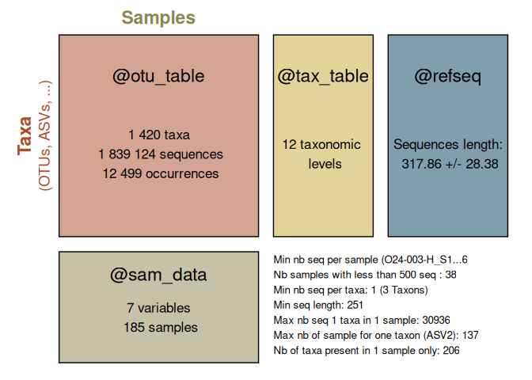
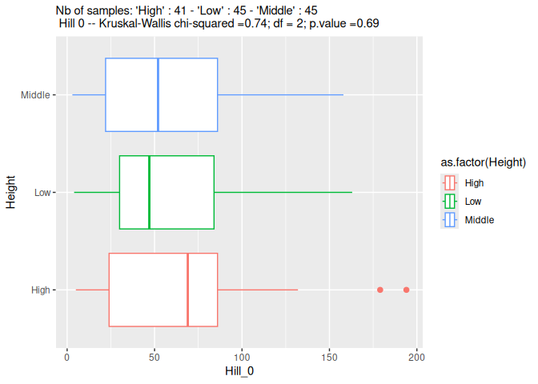
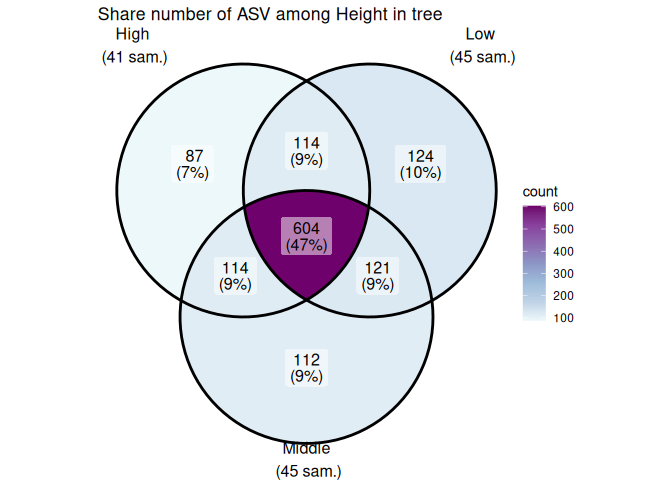

[](https://app.codecov.io/gh/adrientaudiere/MiscMetabar)
[](https://github.com/adrientaudiere/MiscMetabar/blob/main/CODE_OF_CONDUCT.md)
[](https://www.gnu.org/licenses/gpl-3.0)
[](https://www.codefactor.io/repository/github/adrientaudiere/miscmetabar/overview/main)
[](https://github.com/adrientaudiere/MiscMetabar/actions/workflows/R-CMD-check.yaml)
[](https://doi.org/10.21105/joss.06038)

<!-- README.md se genera desde README.Rmd. Por favor, edite ese archivo -->
<!-- devtools::build_readme() -->
<!-- -->

# MiscMetabar <a href="https://adrientaudiere.github.io/MiscMetabar/"></a>

Consulte la documentación del sitio pkgdown [aquí](https://adrientaudiere.github.io/MiscMetabar/) y el [artículo del paquete](https://doi.org/10.21105/joss.06038) en la Journal Of Open Software.

Los estudios biológicos, especialmente en ecología, ciencias de la salud y taxonomía, necesitan describir la composición biológica de las muestras. Durante los últimos veinte años, (i) el desarrollo de la secuenciación de ADN, (ii) las bases de datos de referencia, (iii) la secuenciación de alto rendimiento (HTS) y (iv) los recursos de bioinformática han permitido describir comunidades biológicas a través de la metabarcodificación. La metabarcodificación implica la secuenciación de millones (*meta*-) de regiones cortas de ADN específico (*-barcoding*, Valentini, Pompanon y Taberlet (2009)), a menudo a partir de muestras ambientales (ADNe, Taberlet et al. (2012)), como el contenido estomacal humano, agua de lago, suelo y aire.

`MiscMetabar` tiene como objetivo facilitar la **descripción**, **transformación**, **exploración** y **reproducibilidad** de los análisis de metabarcodificación utilizando R. El desarrollo de `MiscMetabar` se basa en gran medida en los paquetes de R [`dada2`](https://benjjneb.github.io/dada2/index.html) (Callahan et al. 2016), [`phyloseq`](https://joey711.github.io/phyloseq/) (McMurdie y Holmes 2013) y [`targets`](https://books.ropensci.org/targets/) (Landau 2021).

## Instalación

Existe una versión de MiscMetabar en CRAN.

``` r
install.packages("MiscMetabar")
```

Es posible que necesite instalar primero los paquetes requeridos de Bioconductor (dada2 y phyloseq). Consulte sus páginas de instalación. Otra solución es utilizar el paquete [pak](https://pak.r-lib.org/) para instalar MiscMetabar. Esto tiene la ventaja de verificar las dependencias no instaladas en su computadora (requisitos del sistema), ¡gracias [pak](https://pak.r-lib.org/)!

``` r
pak::pkg_install("MiscMetabar")
```

También puede instalar la versión de desarrollo estable desde [GitHub](https://github.com/) con:

``` r
if (!require("devtools", quietly = TRUE)) {
  install.packages("devtools")
}
devtools::install_github("adrientaudiere/MiscMetabar")
```

Puede instalar la versión de desarrollo inestable desde [GitHub](https://github.com/) con:

``` r
if (!require("devtools", quietly = TRUE)) {
  install.packages("devtools")
}
devtools::install_github("adrientaudiere/MiscMetabar", ref = "dev")
```

## Algunos usos de MiscMetabar

Consulte los artículos en el sitio web de [MiscMetabar](https://adrientaudiere.github.io/MiscMetabar/) para ver más ejemplos.

Para una introducción a la metabarcodificación en R, consulte el artículo [estado del campo](https://adrientaudiere.github.io/MiscMetabar/articles/states_of_fields_in_R.html). El artículo [importación, exportación y seguimiento](https://adrientaudiere.github.io/MiscMetabar/articles/import_export_track.html) explica cómo importar y exportar objetos `phyloseq`. También muestra cómo resumir información útil (número de secuencias, muestras y clústeres) a través de pipelines bioinformáticos. El artículo [explorar datos](https://adrientaudiere.github.io/MiscMetabar/articles/explore_data.html) profundiza en diferentes formas de explorar muestras y datos taxonómicos desde un objeto `phyloseq`.

Si le interesan las métricas ecológicas, consulte los artículos que describen el análisis de [diversidad alfa](https://adrientaudiere.github.io/MiscMetabar/articles/alpha-div.html) y [diversidad beta](https://adrientaudiere.github.io/MiscMetabar/articles/beta-div.html). El artículo [filtrar taxones y muestras](https://adrientaudiere.github.io/MiscMetabar/articles/filter.html) describe algunos procesos de filtrado de datos usando MiscMetabar y el tutorial de [reagrupamiento](https://adrientaudiere.github.io/MiscMetabar/articles/Reclustering.html) introduce diferentes formas de agrupar OTU/ASV ya agrupados. El artículo [tengeler](https://adrientaudiere.github.io/MiscMetabar/articles/tengeler.html) explora el conjunto de datos de Tengeler et al. (2020) utilizando algunas funciones de MiscMetabar.

Para desarrolladores, también escribí un artículo que describe algunas [reglas de código](https://adrientaudiere.github.io/MiscMetabar/articles/Rules.html).

### Resumir un objeto physeq

``` r
library("MiscMetabar")
library("phyloseq")
library("magrittr")
data("data_fungi")
summary_plot_pq(data_fungi)
```



### Análisis de diversidad alfa

``` r
p <- MiscMetabar::hill_pq(data_fungi, fact = "Height")
#> Warning: The `modality` argument of `hill_tuckey_pq()` is deprecated as of MiscMetabar
#> 0.17.0.
#> ℹ Please use the `fact` argument instead.
#> ℹ The deprecated feature was likely used in the MiscMetabar package.
#>   Please report the issue at
#>   <https://github.com/adrientaudiere/MiscMetabar/issues>.
#> This warning is displayed once per session.
#> Call `lifecycle::last_lifecycle_warnings()` to see where this warning was
#> generated.
p$plot_Hill_0
```

<div class="figure">


<p class="caption">
Hill number 0
</p>

</div>

``` r
p$plot_tuckey
#> NULL
```

### Análisis de diversidad beta

``` r
if (!require("ggVennDiagram", quietly = TRUE)) {
  install.packages("ggVennDiagram")
}
ggvenn_pq(data_fungi, fact = "Height") +
  ggplot2::scale_fill_distiller(palette = "BuPu", direction = 1) +
  labs(title = "Share number of ASV among Height in tree")
```



## ¡Necesito ayuda, hay un error, quiero una nueva función!

La mayor parte del trabajo de desarrollo de este paquete se ha realizado de forma voluntaria y sin remuneración. Si aprecia este trabajo, siéntase libre de usarlo, citarlo en sus proyectos, informarme sobre cualquier error que encuentre y contribuir con mejoras mediante pull requests. La participación y colaboración comunitaria son lo que hacen que los proyectos de código abierto prosperen. Utilice los issues de GitHub si necesita ayuda. Como freelancer, estoy disponible para trabajar en proyectos relacionados con este paquete de R.

### Nota para usuarios no Linux

Algunas funciones pueden no funcionar en Windows (p. ej., `track_wkflow()`, `cutadapt_remove_primers()`, `krona()`, `vsearch_clustering()`, …). Una solución es utilizar contenedores Docker, por ejemplo, con el excelente [proyecto rocker](https://rocker-project.org/).

A continuación se presenta una lista de funciones con algunas limitaciones o que no funcionan en absoluto en Windows:

- `build_phytree_pq()`
- `count_seq()`
- `cutadapt_remove_primers()`
- `krona()`
- `merge_krona()`
- `multipatt_pq()`
- `plot_tsne_pq()`
- `rotl_pq()`
- `save_pq()`
- `tax_datatable()`
- `track_wkflow()`
- `track_wkflow_samples()`
- `tsne_pq()`
- `venn_pq()`

MiscMetabar se desarrolla en Linux y la gran mayoría de las funciones pueden funcionar en sistemas Unix, pero su funcionamiento no se ha probado en iOS.

### Instalación de otros programas para distribuciones Linux Debian

Si encuentra algún error o tiene preguntas sobre la instalación de estos programas, visite sus sitios web dedicados.

#### [blast+](https://blast.ncbi.nlm.nih.gov/doc/blast-help/downloadblastdata.html#downloadblastdata)

``` sh
sudo apt-get install ncbi-blast+
```

#### [vsearch](https://github.com/torognes/vsearch)

``` sh
sudo apt-get install vsearch
```

Otra posibilidad es [instalar vsearch](https://bioconda.github.io/recipes/vsearch/README.html?highlight=vsearch#package-package%20'vsearch') con `conda`.

#### [swarm](https://github.com/torognes/swarm)

``` sh
git clone https://github.com/torognes/swarm.git
cd swarm/
make
```

Otra posibilidad es [instalar swarm](https://bioconda.github.io/recipes/swarm/README.html?highlight=swarm#package-package%20'swarm') con `conda`.

#### [Mumu](https://github.com/frederic-mahe/mumu)

``` sh
git clone https://github.com/frederic-mahe/mumu.git
cd ./mumu/
make
make check
make install  # as root or sudo
```

#### [cutadapt](https://cutadapt.readthedocs.io/en/stable/)

``` sh
conda create -n cutadaptenv cutadapt
```

<div id="refs" class="references csl-bib-body hanging-indent">

<div id="ref-callahan2016" class="csl-entry">

Callahan, Benjamin J, Paul J McMurdie, Michael J Rosen, Andrew W Han,
Amy Jo A Johnson, and Susan P Holmes. 2016. “DADA2: High-Resolution
Sample Inference from Illumina Amplicon Data.” *Nature Methods* 13 (7):
581–83. <https://doi.org/10.1038/nmeth.3869>.

</div>

<div id="ref-landau2021" class="csl-entry">

Landau, William Michael. 2021. “The Targets r Package: A Dynamic
Make-Like Function-Oriented Pipeline Toolkit for Reproducibility and
High-Performance Computing.” *Journal of Open Source Software* 6 (57):
2959. <https://doi.org/10.21105/joss.02959>.

</div>

<div id="ref-mcmurdie2013" class="csl-entry">

McMurdie, Paul J., and Susan Holmes. 2013. “Phyloseq: An r Package for
Reproducible Interactive Analysis and Graphics of Microbiome Census
Data.” *PLoS ONE* 8 (4): e61217.
<https://doi.org/10.1371/journal.pone.0061217>.

</div>

<div id="ref-taberlet2012" class="csl-entry">

Taberlet, Pierre, Eric Coissac, Mehrdad Hajibabaei, and Loren H
Rieseberg. 2012. “Environmental Dna.” *Molecular Ecology*. Wiley Online
Library. <https://doi.org/10.1111/j.1365-294X.2012.05542.x>.

</div>

<div id="ref-valentini2009" class="csl-entry">

Valentini, Alice, François Pompanon, and Pierre Taberlet. 2009. “DNA
Barcoding for Ecologists.” *Trends in Ecology & Evolution* 24 (2):
110–17. <https://doi.org/10.1016/j.tree.2008.09.011>.

</div>

</div>
