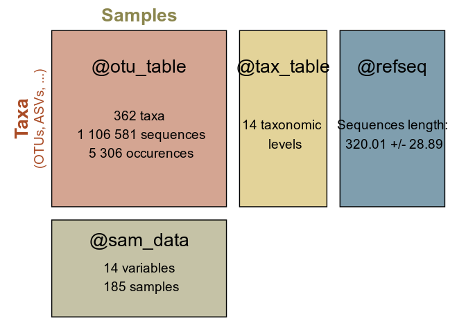
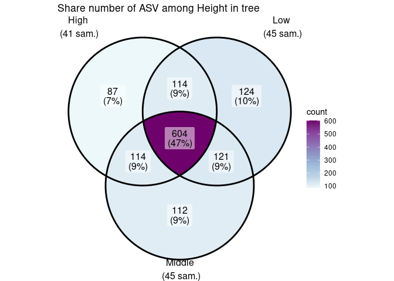

README for MiscMetabar package
================

<!-- README.md is generated from README.Rmd. Please edit that file -->

# MiscMetabar

The goal of MiscMetabar is to complete the great packages
[dada2](https://benjjneb.github.io/dada2/index.html),
[phyloseq](https://joey711.github.io/phyloseq/) and
[targets](https://books.ropensci.org/targets/). See the pkdown site
[here](https://adrientaudiere.github.io/MiscMetabar/).

## Installation

There is no CRAN version of MiscMetabar for now.

You can install the development version from
[GitHub](https://github.com/) with:

``` r
install.packages("devtools")
#> Installation du package dans '/home/adrien/R/x86_64-pc-linux-gnu-library/4.1'
#> (car 'lib' n'est pas spécifié)
devtools::install_github("adrientaudiere/MiscMetabar")
#> Skipping install of 'MiscMetabar' from a github remote, the SHA1 (fc296a84) has not changed since last install.
#>   Use `force = TRUE` to force installation
```

## Some use of MiscMetabar

### Summarize a physeq object

``` r
library("MiscMetabar")
#> Le chargement a nécessité le package : ggplot2
#> Le chargement a nécessité le package : phyloseq
#> Le chargement a nécessité le package : dada2
#> Le chargement a nécessité le package : Rcpp
#> Le chargement a nécessité le package : magrittr
library("phyloseq")
library("magrittr")
data("data_fungi")
summary_plot_phyloseq(data_fungi)
```


### Create an interactive table of the tax_table

``` r
data("GlobalPatterns")
tax_datatable(subset_taxa(GlobalPatterns,
             rowSums(GlobalPatterns@otu_table) > 100000))
```

<div id="htmlwidget-0b857f363bd29ba4279f" style="width:100%;height:auto;" class="datatables html-widget"></div>
<script type="application/json" data-for="htmlwidget-0b857f363bd29ba4279f">{"x":{"filter":"none","vertical":false,"data":[["12812","317658","329744","471141","326977","64396","317182","549656","327536","340216","279599","235567","557211","263681","360229","536311","9514","94166","550960","323845","534609","339261","322235","469778","158660","331820","244304","471122","361496","248140","259569","298875","359171","192573","470973","316732","325407","171551","189047","180658","316587","98605"],["Bacteria","Bacteria","Bacteria","Bacteria","Bacteria","Bacteria","Bacteria","Bacteria","Bacteria","Bacteria","Bacteria","Bacteria","Bacteria","Bacteria","Bacteria","Bacteria","Bacteria","Bacteria","Bacteria","Bacteria","Bacteria","Bacteria","Bacteria","Bacteria","Bacteria","Bacteria","Bacteria","Bacteria","Bacteria","Bacteria","Bacteria","Bacteria","Bacteria","Bacteria","Bacteria","Bacteria","Bacteria","Bacteria","Bacteria","Bacteria","Bacteria","Bacteria"],["Actinobacteria","Actinobacteria","Actinobacteria","Actinobacteria","Actinobacteria","Fusobacteria","Cyanobacteria","Cyanobacteria","Cyanobacteria","Cyanobacteria","Cyanobacteria","Cyanobacteria","Cyanobacteria","Cyanobacteria","Proteobacteria","Proteobacteria","Proteobacteria","Proteobacteria","Proteobacteria","Proteobacteria","Proteobacteria","Bacteroidetes","Bacteroidetes","Bacteroidetes","Bacteroidetes","Bacteroidetes","Bacteroidetes","Bacteroidetes","Bacteroidetes","Bacteroidetes","Bacteroidetes","Firmicutes","Firmicutes","Firmicutes","Firmicutes","Firmicutes","Firmicutes","Firmicutes","Firmicutes","Firmicutes","Firmicutes","Firmicutes"],["Actinobacteria","Actinobacteria","Actinobacteria","Actinobacteria","Actinobacteria","Fusobacteria","Chloroplast","Chloroplast","Chloroplast","Chloroplast","Nostocophycideae","Nostocophycideae","Synechococcophycideae","4C0d-2","Betaproteobacteria","Betaproteobacteria","Gammaproteobacteria","Gammaproteobacteria","Gammaproteobacteria","Gammaproteobacteria","Alphaproteobacteria","Flavobacteria","Bacteroidia","Bacteroidia","Bacteroidia","Bacteroidia","Bacteroidia","Bacteroidia","Bacteroidia","Bacteroidia","Bacteroidia","Clostridia","Clostridia","Clostridia","Clostridia","Clostridia","Clostridia","Clostridia","Clostridia","Clostridia","Bacilli","Bacilli"],["koll13","Actinomycetales","Actinomycetales","Actinomycetales","Bifidobacteriales","Fusobacteriales","Stramenopiles","Stramenopiles","Stramenopiles","Stramenopiles","Nostocales","Nostocales","Synechococcales","YS2","Neisseriales","Neisseriales","Pasteurellales","Pasteurellales","Enterobacteriales","Oceanospirillales","Rhodobacterales",null,"Bacteroidales","Bacteroidales","Bacteroidales","Bacteroidales","Bacteroidales","Bacteroidales","Bacteroidales","Bacteroidales","Bacteroidales","Clostridiales","Clostridiales","Clostridiales","Clostridiales","Clostridiales","Clostridiales","Clostridiales","Clostridiales","Clostridiales","Lactobacillales","Lactobacillales"],[null,"ACK-M1","ACK-M1","Micrococcaceae","Bifidobacteriaceae","Fusobacteriaceae",null,null,null,null,"Nostocaceae","Nostocaceae","Synechococcaceae",null,"Neisseriaceae","Neisseriaceae","Pasteurellaceae","Pasteurellaceae","Enterobacteriaceae","Halomonadaceae","Rhodobacteraceae",null,"Bacteroidaceae","Bacteroidaceae","Bacteroidaceae","Bacteroidaceae","Bacteroidaceae","Prevotellaceae","Bacteroidaceae","Bacteroidaceae","Rikenellaceae","Clostridiaceae","ClostridialesFamilyXI.IncertaeSedis","Ruminococcaceae","Lachnospiraceae","Lachnospiraceae","Ruminococcaceae","Ruminococcaceae","Ruminococcaceae","Ruminococcaceae","Streptococcaceae","Streptococcaceae"],[null,null,null,"Rothia","Bifidobacterium","Fusobacterium",null,null,null,null,"Dolichospermum",null,"Prochlorococcus",null,"Neisseria","Kingella","Actinobacillus","Haemophilus","Providencia","CandidatusPortiera",null,null,"Bacteroides","Bacteroides","Bacteroides","Bacteroides","Bacteroides","Prevotella","Bacteroides","Bacteroides","Alistipes","Clostridium","Anaerococcus",null,"Ruminococcus","Lachnospira","Faecalibacterium","Faecalibacterium",null,null,"Streptococcus","Streptococcus"],[null,null,null,"Rothiamucilaginosa","Bifidobacteriumadolescentis",null,null,null,null,null,null,null,null,null,null,null,"Actinobacillusporcinus","Haemophilusparainfluenzae",null,null,null,null,"Bacteroidesuniformis","Bacteroidescoprophilus",null,null,null,"Prevotellamelaninogenica",null,"Bacteroidescaccae","Alistipesputredinis",null,"Anaerococcushydrogenalis",null,"Ruminococcustorques",null,null,"Faecalibacteriumprausnitzii",null,null,null,"Streptococcussanguinis"],[196550,234024,436539,104260,291577,155864,528629,2481214,143627,104199,927850,122697,169240,212089,556441,196355,158228,444142,384205,139264,177026,124393,169042,133795,443938,1001492,222365,146594,109007,149891,149352,177879,106772,179312,137132,101484,110044,215470,312161,152940,106399,203583]],"container":"<table class=\"display\">\n  <thead>\n    <tr>\n      <th> <\/th>\n      <th>Kingdom<\/th>\n      <th>Phylum<\/th>\n      <th>Class<\/th>\n      <th>Order<\/th>\n      <th>Family<\/th>\n      <th>Genus<\/th>\n      <th>Species<\/th>\n      <th>nb_seq<\/th>\n    <\/tr>\n  <\/thead>\n<\/table>","options":{"columnDefs":[{"className":"dt-right","targets":8},{"orderable":false,"targets":0}],"order":[],"autoWidth":false,"orderClasses":false,"rowCallback":"function(row, data, displayNum, displayIndex, dataIndex) {\nvar value=data[8]; $(this.api().cell(row, 8).node()).css({'background':isNaN(parseFloat(value)) || value <= 101484.000000 ? '' : 'linear-gradient(90.000000deg, transparent ' + Math.max(2481214.000000 - value, 0)/2379730.000000 * 100 + '%, steelblue ' + Math.max(2481214.000000 - value, 0)/2379730.000000 * 100 + '%)','background-size':'100% 90%','background-repeat':'no-repeat','background-position':'center'});\n}"}},"evals":["options.rowCallback"],"jsHooks":[]}</script>

### Sankey diagramme of the tax_table

``` r
gp <- subset_taxa(GlobalPatterns, GlobalPatterns@tax_table[, 1] == "Archaea")
sankey_phyloseq(gp, taxa = c(1:5))
```

<div id="htmlwidget-c1f3ce7a5bc2b4ddd04a" style="width:100%;height:480px;" class="sankeyNetwork html-widget"></div>
<script type="application/json" data-for="htmlwidget-c1f3ce7a5bc2b4ddd04a">{"x":{"links":{"source":[0,0,1,2,2,2,1,1,1,2,1,3,4,5,6,7,8,8,4,9,3,10,11,12,13,13,14,15,16,16,13,14,17,13,11,18,13,14],"target":[1,2,3,6,7,8,19,9,4,5,10,20,11,13,12,14,15,16,17,21,22,18,23,24,25,26,27,28,29,30,31,32,33,34,35,36,37,38],"value":[106,102,27,7,27,24,8,8,57,44,3,7,37,44,7,27,12,12,20,5,18,1,34,7,10,1,25,2,5,6,3,1,20,16,3,1,12,1]},"nodes":{"name":["Archaea","Crenarchaeota","Euryarchaeota","C2","Thaumarchaeota","Thermoplasmata","Halobacteria","Methanobacteria","Methanomicrobia","SdNA","Thermoprotei","Cenarchaeales","Halobacteriales","E2","Methanobacteriales","Methanomicrobiales","Methanosarcinales","Nitrososphaerales","Sulfolobales","pMC2A209","B10","NRPJ","pGrfC26","Cenarchaeaceae","Halobacteriaceae","MarinegroupII","MarinegroupIII","Methanobacteriaceae","Methanocorpusculaceae","Methanosaetaceae","Methanosarcinaceae","MOB79","MSBL1","Nitrososphaeraceae","pMC2A33","SAGMAX","Sulfolobaceae","WCHD302","WSA2"],"group":["Archaea","Crenarchaeota","Euryarchaeota","C2","Thaumarchaeota","Thermoplasmata","Halobacteria","Methanobacteria","Methanomicrobia","SdNA","Thermoprotei","Cenarchaeales","Halobacteriales","E2","Methanobacteriales","Methanomicrobiales","Methanosarcinales","Nitrososphaerales","Sulfolobales","pMC2A209","B10","NRPJ","pGrfC26","Cenarchaeaceae","Halobacteriaceae","MarinegroupII","MarinegroupIII","Methanobacteriaceae","Methanocorpusculaceae","Methanosaetaceae","Methanosarcinaceae","MOB79","MSBL1","Nitrososphaeraceae","pMC2A33","SAGMAX","Sulfolobaceae","WCHD302","WSA2"]},"options":{"NodeID":"name","NodeGroup":"name","LinkGroup":null,"colourScale":"d3.scaleOrdinal(d3.schemeCategory20);","fontSize":7,"fontFamily":null,"nodeWidth":15,"nodePadding":10,"units":"OTUs","margin":{"top":null,"right":null,"bottom":null,"left":null},"iterations":32,"sinksRight":true}},"evals":[],"jsHooks":[]}</script>

### Circle for visualize distribution of taxa in function of samples variables

``` r
otu_circle(gp, "SampleType", taxa = "Class")
#> Only 4 modalities are plot (44.44%). Use 'min_prop_mod' to plot more samples.
#> Only 4 taxa are plot (44.44%). Use 'min_prop_tax' to plot more taxa
```


### Re-clustering ASV

#### Using decipher or Vsearch algorithm

``` r
data(data_fungi_sp_known)
otu <- asv2otu(data_fungi_sp_known, method = "IdClusters")
#> Determining distance matrix based on shared 8-mers:
#> ================================================================================
#> 
#> Time difference of 3.32 secs
#> 
#> Clustering into groups by similarity:
#> ================================================================================
#> 
#> Time difference of 0.12 secs
#> 
#> Aligning Sequences:
#> ================================================================================
#> 
#> Time difference of 3.71 secs
#> 
#> Iteration 1 of 2:
#> 
#> Determining distance matrix based on alignment:
#> ================================================================================
#> 
#> Time difference of 0.41 secs
#> 
#> Reclustering into groups by similarity:
#> ================================================================================
#> 
#> Time difference of 0.12 secs
#> 
#> Realigning Sequences:
#> ================================================================================
#> 
#> Time difference of 2.7 secs
#> 
#> Iteration 2 of 2:
#> 
#> Determining distance matrix based on alignment:
#> ================================================================================
#> 
#> Time difference of 0.4 secs
#> 
#> Reclustering into groups by similarity:
#> ================================================================================
#> 
#> Time difference of 0.11 secs
#> 
#> Realigning Sequences:
#> ================================================================================
#> 
#> Time difference of 1.46 secs
#> 
#> Refining the alignment:
#> ================================================================================
#> 
#> Time difference of 0.72 secs
#> 
#> ================================================================================
#> 
#> Time difference of 0.41 secs
#> 
#> ================================================================================
#> 
#> Time difference of 0.01 secs
otu_vs <- asv2otu(data_fungi_sp_known, method = "vsearch")
```

``` r
summary_plot_phyloseq(data_fungi_sp_known)
```


``` r
summary_plot_phyloseq(otu)
```


``` r
summary_plot_phyloseq(otu_vs)
```



#### Using lulu algorithm (<https://www.nature.com/articles/s41467-017-01312-x>)

``` r
data(data_fungi_sp_known)
lulu_res <- lulu_phyloseq(data_fungi_sp_known)
#> Start Vsearch usearch_global
#> Le chargement a nécessité le package : lulu
#> Lulu algorithm
#> Le chargement a nécessité le package : dplyr
#> 
#> Attachement du package : 'dplyr'
#> Les objets suivants sont masqués depuis 'package:stats':
#> 
#>     filter, lag
#> Les objets suivants sont masqués depuis 'package:base':
#> 
#>     intersect, setdiff, setequal, union
#>   |                                                          |                                                  |   0%  |                                                          |                                                  |   1%  |                                                          |=                                                 |   1%  |                                                          |=                                                 |   2%  |                                                          |=                                                 |   3%  |                                                          |==                                                |   3%  |                                                          |==                                                |   4%  |                                                          |==                                                |   5%  |                                                          |===                                               |   5%  |                                                          |===                                               |   6%  |                                                          |===                                               |   7%  |                                                          |====                                              |   7%  |                                                          |====                                              |   8%  |                                                          |====                                              |   9%  |                                                          |=====                                             |   9%  |                                                          |=====                                             |  10%  |                                                          |=====                                             |  11%  |                                                          |======                                            |  11%  |                                                          |======                                            |  12%  |                                                          |======                                            |  13%  |                                                          |=======                                           |  13%  |                                                          |=======                                           |  14%  |                                                          |=======                                           |  15%  |                                                          |========                                          |  15%  |                                                          |========                                          |  16%  |                                                          |========                                          |  17%  |                                                          |=========                                         |  17%  |                                                          |=========                                         |  18%  |                                                          |=========                                         |  19%  |                                                          |==========                                        |  19%  |                                                          |==========                                        |  20%  |                                                          |==========                                        |  21%  |                                                          |===========                                       |  21%  |                                                          |===========                                       |  22%  |                                                          |===========                                       |  23%  |                                                          |============                                      |  23%  |                                                          |============                                      |  24%  |                                                          |============                                      |  25%  |                                                          |=============                                     |  25%  |                                                          |=============                                     |  26%  |                                                          |=============                                     |  27%  |                                                          |==============                                    |  27%  |                                                          |==============                                    |  28%  |                                                          |==============                                    |  29%  |                                                          |===============                                   |  29%  |                                                          |===============                                   |  30%  |                                                          |===============                                   |  31%  |                                                          |================                                  |  31%  |                                                          |================                                  |  32%  |                                                          |================                                  |  33%  |                                                          |=================                                 |  33%  |                                                          |=================                                 |  34%  |                                                          |=================                                 |  35%  |                                                          |==================                                |  35%  |                                                          |==================                                |  36%  |                                                          |==================                                |  37%  |                                                          |===================                               |  37%  |                                                          |===================                               |  38%  |                                                          |===================                               |  39%  |                                                          |====================                              |  39%  |                                                          |====================                              |  40%  |                                                          |====================                              |  41%  |                                                          |=====================                             |  41%  |                                                          |=====================                             |  42%  |                                                          |=====================                             |  43%  |                                                          |======================                            |  43%  |                                                          |======================                            |  44%  |                                                          |======================                            |  45%  |                                                          |=======================                           |  45%  |                                                          |=======================                           |  46%  |                                                          |=======================                           |  47%  |                                                          |========================                          |  47%  |                                                          |========================                          |  48%  |                                                          |========================                          |  49%  |                                                          |=========================                         |  49%  |                                                          |=========================                         |  50%  |                                                          |=========================                         |  51%  |                                                          |==========================                        |  51%  |                                                          |==========================                        |  52%  |                                                          |==========================                        |  53%  |                                                          |===========================                       |  53%  |                                                          |===========================                       |  54%  |                                                          |===========================                       |  55%  |                                                          |============================                      |  55%  |                                                          |============================                      |  56%  |                                                          |============================                      |  57%  |                                                          |=============================                     |  57%  |                                                          |=============================                     |  58%  |                                                          |=============================                     |  59%  |                                                          |==============================                    |  59%  |                                                          |==============================                    |  60%  |                                                          |==============================                    |  61%  |                                                          |===============================                   |  61%  |                                                          |===============================                   |  62%  |                                                          |===============================                   |  63%  |                                                          |================================                  |  63%  |                                                          |================================                  |  64%  |                                                          |================================                  |  65%  |                                                          |=================================                 |  65%  |                                                          |=================================                 |  66%  |                                                          |=================================                 |  67%  |                                                          |==================================                |  67%  |                                                          |==================================                |  68%  |                                                          |==================================                |  69%  |                                                          |===================================               |  69%  |                                                          |===================================               |  70%  |                                                          |===================================               |  71%  |                                                          |====================================              |  71%  |                                                          |====================================              |  72%  |                                                          |====================================              |  73%  |                                                          |=====================================             |  73%  |                                                          |=====================================             |  74%  |                                                          |=====================================             |  75%  |                                                          |======================================            |  75%  |                                                          |======================================            |  76%  |                                                          |======================================            |  77%  |                                                          |=======================================           |  77%  |                                                          |=======================================           |  78%  |                                                          |=======================================           |  79%  |                                                          |========================================          |  79%  |                                                          |========================================          |  80%  |                                                          |========================================          |  81%  |                                                          |=========================================         |  81%  |                                                          |=========================================         |  82%  |                                                          |=========================================         |  83%  |                                                          |==========================================        |  83%  |                                                          |==========================================        |  84%  |                                                          |==========================================        |  85%  |                                                          |===========================================       |  85%  |                                                          |===========================================       |  86%  |                                                          |===========================================       |  87%  |                                                          |============================================      |  87%  |                                                          |============================================      |  88%  |                                                          |============================================      |  89%  |                                                          |=============================================     |  89%  |                                                          |=============================================     |  90%  |                                                          |=============================================     |  91%  |                                                          |==============================================    |  91%  |                                                          |==============================================    |  92%  |                                                          |==============================================    |  93%  |                                                          |===============================================   |  93%  |                                                          |===============================================   |  94%  |                                                          |===============================================   |  95%  |                                                          |================================================  |  95%  |                                                          |================================================  |  96%  |                                                          |================================================  |  97%  |                                                          |================================================= |  97%  |                                                          |================================================= |  98%  |                                                          |================================================= |  99%  |                                                          |==================================================|  99%  |                                                          |==================================================| 100%
```

``` r
summary_plot_phyloseq(data_fungi_sp_known)
```



``` r
summary_plot_phyloseq(lulu_res$new_physeq)
```


