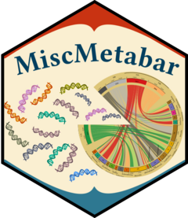
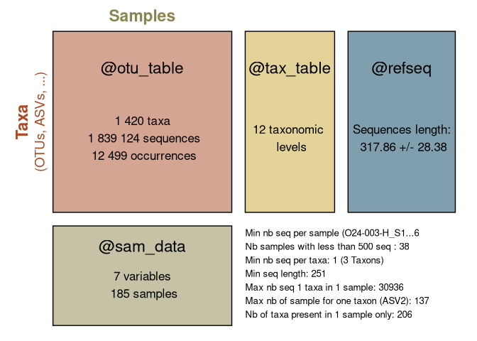
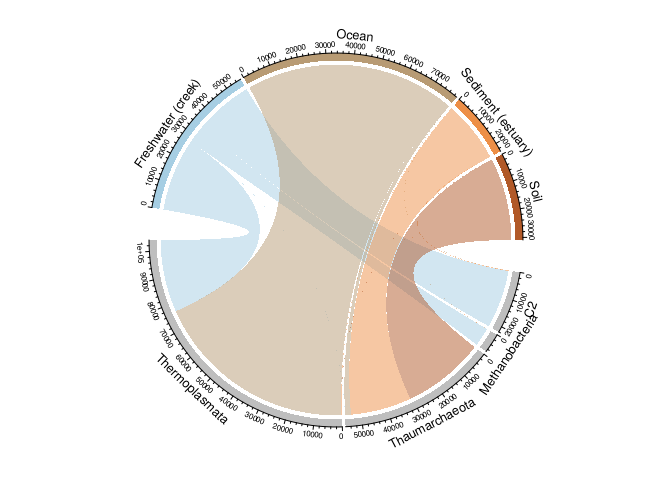
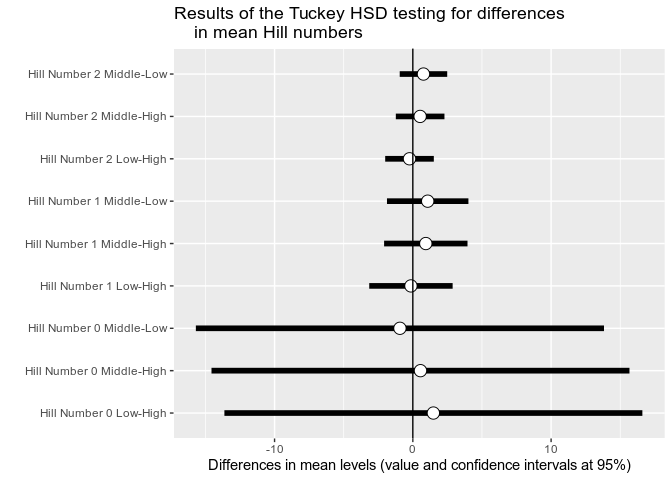
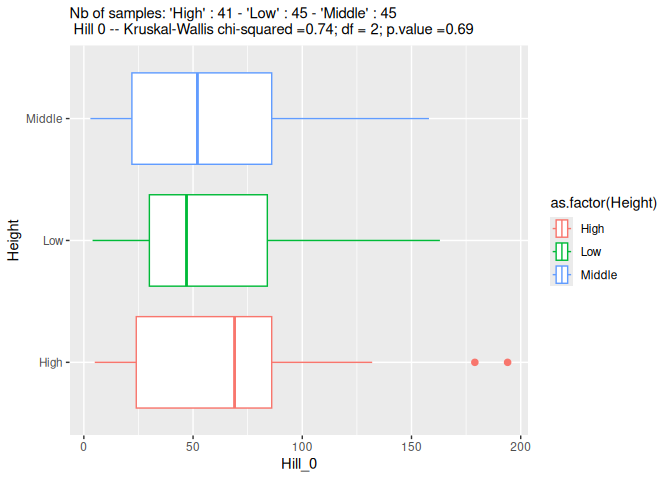

<a href="https://zenodo.org/badge/latestdoi/268765075"></a>
[](https://codecov.io/gh/adrientaudiere/MiscMetabar)
[](code_of_conduct.md)
[](http://www.gnu.org/licenses/gpl-3.0)
[](https://www.codefactor.io/repository/github/adrientaudiere/miscmetabar/overview/master)
[](https://github.com/adrientaudiere/MiscMetabar/actions/workflows/R-CMD-check.yaml)

<!-- README.md is generated from README.Rmd. Please edit that file -->
<!-- devtools::build_readme() -->

# MiscMetabar <a href="https://adrientaudiere.github.io/MiscMetabar/"></a>

See the pkgdown documentation site
[here](https://adrientaudiere.github.io/MiscMetabar/).

Biological studies, especially in ecology, health sciences and taxonomy,
need to describe the biological composition of samples. During the last
twenty years, (i) the development of DNA sequencing, (ii) reference
databases, (iii) high-throughput sequencing (HTS), and (iv)
bioinformatics resources have allowed the description of biological
communities through metabarcoding. Metabarcoding involves the sequencing
of millions (*meta*-) of short regions of specific DNA (*-barcoding*,
Valentini, Pompanon, and Taberlet (2009)) often from environmental
samples (eDNA, Taberlet et al. (2012)) such as human stomach contents,
lake water, soil and air.

`MiscMetabar` aims to facilitate the **description**,
**transformation**, **exploration** and **reproducibility** of
metabarcoding analysis using R. The development of `MiscMetabar` relies
heavily on the R packages
[`dada2`](https://benjjneb.github.io/dada2/index.html) (Callahan et al.
2016), [`phyloseq`](https://joey711.github.io/phyloseq/) (McMurdie and
Holmes 2013) and [`targets`](https://books.ropensci.org/targets/)
(Landau 2021).

## Installation

There is no CRAN version of MiscMetabar for now (work in progress). As
MiscMetabar heavily relies on two bioconductor packages (dada and
phyloseq), we need to first install those 2 packages using BiocManager.

You can install the stable version from [GitHub](https://github.com/)
with:

``` r
if (!require("devtools", quietly = TRUE)) {
  install.packages("devtools")
}
devtools::install_github("adrientaudiere/MiscMetabar")
```

You can install the development version from
[GitHub](https://github.com/) with:

``` r
if (!require("devtools", quietly = TRUE)) {
  install.packages("devtools")
}
devtools::install_github("adrientaudiere/MiscMetabar", ref = "dev")
```

## Some use of MiscMetabar

See vignettes in the
[MiscMetabar](https://adrientaudiere.github.io/MiscMetabar/) website for
more examples.

For an introduction to metabarcoding in R, Please visite the [state of
the
field](https://adrientaudiere.github.io/MiscMetabar/articles/states_of_fields_in_R.html)
vignettes. The [import, export and
track](https://adrientaudiere.github.io/MiscMetabar/articles/import_export_track.html)
vignette explains how import and export `phyloseq` object. Its also show
how to summarize useful information (number of sequences, samples and
clusters) accross bioinformatic pipelines.

If you are interested in ecological metrics, see the vignettes
describing
[alpha-diversity](https://adrientaudiere.github.io/MiscMetabar/articles/alpha-div.html)
and
[beta-diversity](https://adrientaudiere.github.io/MiscMetabar/articles/beta-div.html)
analysis. The vignette [filter taxa and
samples](https://adrientaudiere.github.io/MiscMetabar/articles/filter.html)
describes some data-filtering processes using MiscMetabar and the
[reclustering](https://adrientaudiere.github.io/MiscMetabar/articles/Reclustering.html)
tutorial introduces the different way of clustering already-clustered
OTU/ASV. The vignette [tengeler]() explore the dataset from Tengeler et
al. (2020) using some MiscMetabar functions.

For developers, I also wrote a vignette describing som [rules of
codes](https://adrientaudiere.github.io/MiscMetabar/articles/Rules.html).

### Summarize a physeq object

``` r
library("MiscMetabar")
library("phyloseq")
library("magrittr")
data("data_fungi")
summary_plot_pq(data_fungi)
```



### Alpha-diversity analysis

``` r
p <- MiscMetabar::hill_pq(data_fungi, variable = "Height")
p$plot_Hill_0
```

<div class="figure">


<p class="caption">
Hill number 1
</p>

</div>

``` r
p$plot_tuckey
```

<div class="figure">


<p class="caption">
Result of the Tuckey post-hoc test
</p>

</div>

### Beta-diversity analysis

``` r
if (!require("ggVennDiagram", quietly = TRUE)) {
  install.packages("ggVennDiagramà")
}
ggvenn_pq(data_fungi, fact = "Height") +
  ggplot2::scale_fill_distiller(palette = "BuPu", direction = 1) +
  labs(title = "Share number of ASV among Height in tree")
```



### Installation of other softwares for debian Linux distributions

#### blastn

``` sh
sudo apt-get install ncbi-blast+
```

#### vsearch

``` sh
sudo apt-get install vsearch
```

<div id="refs" class="references csl-bib-body hanging-indent">

<div id="ref-callahan2016" class="csl-entry">

Callahan, Benjamin J, Paul J McMurdie, Michael J Rosen, Andrew W Han,
Amy Jo A Johnson, and Susan P Holmes. 2016. “DADA2: High-Resolution
Sample Inference from Illumina Amplicon Data.” *Nature Methods* 13 (7):
581–83. <https://doi.org/10.1038/nmeth.3869>.

</div>

<div id="ref-landau2021" class="csl-entry">

Landau, William Michael. 2021. “The Targets r Package: A Dynamic
Make-Like Function-Oriented Pipeline Toolkit for Reproducibility and
High-Performance Computing.” *Journal of Open Source Software* 6 (57):
2959. <https://doi.org/10.21105/joss.02959>.

</div>

<div id="ref-mcmurdie2013" class="csl-entry">

McMurdie, Paul J., and Susan Holmes. 2013. “Phyloseq: An r Package for
Reproducible Interactive Analysis and Graphics of Microbiome Census
Data.” *PLoS ONE* 8 (4): e61217.
<https://doi.org/10.1371/journal.pone.0061217>.

</div>

<div id="ref-taberlet2012" class="csl-entry">

Taberlet, Pierre, Eric Coissac, Mehrdad Hajibabaei, and Loren H
Rieseberg. 2012. “Environmental Dna.” *Molecular Ecology*. Wiley Online
Library. <https://doi.org/10.1002/(issn)2637-4943>.

</div>

<div id="ref-valentini2009" class="csl-entry">

Valentini, Alice, François Pompanon, and Pierre Taberlet. 2009. “DNA
Barcoding for Ecologists.” *Trends in Ecology & Evolution* 24 (2):
110–17. <https://doi.org/10.1016/j.tree.2008.09.011>.

</div>

</div>
