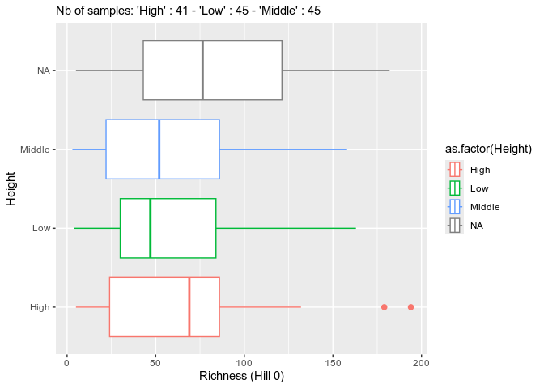

<!-- README.md is generated from README.Rmd. Please edit that file -->

# MiscMetabar

The goal of MiscMetabar is to complete the great package dada2 and
phyloseq.

## Installation

There is no CRAN version of MiscMetabar for now.

You can install the development version from
[GitHub](https://github.com/) with:

``` r
# install.packages("devtools")
devtools::install_github("adrientaudiere/MiscMetabar")
#> Downloading GitHub repo adrientaudiere/MiscMetabar@master
#> Skipping 1 packages not available: phyloseq
#>      checking for file ‘/tmp/RtmpzqxuoJ/remotes6d2c45404455/adrientaudiere-MiscMetabar-ab13a95/DESCRIPTION’ ...  ✓  checking for file ‘/tmp/RtmpzqxuoJ/remotes6d2c45404455/adrientaudiere-MiscMetabar-ab13a95/DESCRIPTION’
#>   ─  preparing ‘MiscMetabar’:
#>      checking DESCRIPTION meta-information ...  ✓  checking DESCRIPTION meta-information
#>   ─  checking for LF line-endings in source and make files and shell scripts
#>   ─  checking for empty or unneeded directories
#>   ─  building ‘MiscMetabar_0.20.tar.gz’
#>      
#> 
#> Installing package into '/home/adrien/R/x86_64-pc-linux-gnu-library/3.6'
#> (as 'lib' is unspecified)
```

## Example

This is a basic example which shows you how to solve a common problem:

### Summarize a physeq object

``` r
library("MiscMetabar")
#> Loading required package: ggplot2
#> Loading required package: phyloseq
#> Loading required package: grid
#> Loading required package: vegan
#> Loading required package: permute
#> Loading required package: lattice
#> This is vegan 2.5-6
#> Loading required package: dada2
#> Loading required package: Rcpp
#> Loading required package: magrittr
#> 
#> Attaching package: 'MiscMetabar'
#> The following object is masked from 'package:phyloseq':
#> 
#>     phyloseq_to_deseq2
library("phyloseq")
data("esophagus")
summary_plot_phyloseq(esophagus)
```


### Create an interactive table of the tax\_table

``` r
data("GlobalPatterns")
tax_datatable(subset_taxa(GlobalPatterns,
             rowSums(GlobalPatterns@otu_table)>100000))
```


### Sankey diagramme of the tax\_table

``` r
GP <- subset_taxa(GlobalPatterns, GlobalPatterns@tax_table[,1] == "Archaea")
sankey_phyloseq(GP, taxa = c(1:5))
```


### Circle for visualise distribution of taxa in function of samples variables

``` r
otu_circle(GP, 'SampleType', taxa = "Class")
#> [1] "Only 4 modalities are plot (44.44%). Use 'min_prop_mod' to plot more samples."
#> [1] "Only 4 taxa are plot (44.44%). Use 'min_prop_tax' to plot more taxa"
```


