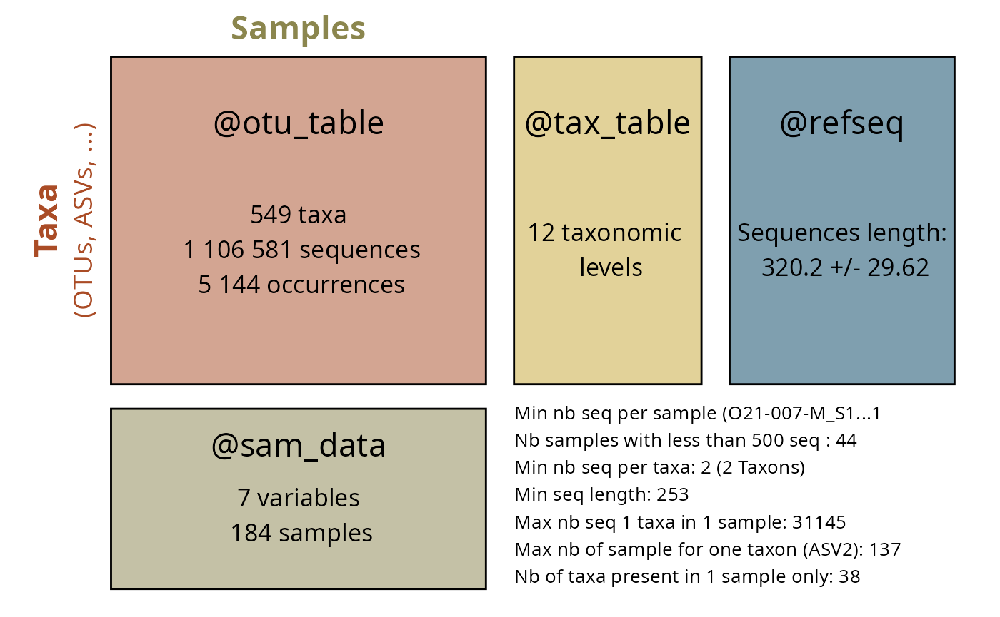

# Reclustering

``` r
library(MiscMetabar)
```

## Re-clustering ASVs

**ASV** (stands for *Amplicon Sequence Variant*; also called **ESV** for
Exact Amplicon Variant) is a DNA sequence obtained from high-throughput
analysis of marker genes. **OTU** (stands for *Operational Taxonomic
Unit*) is a group of closely related individuals created by clustering
sequences based on a threshold of similarity. An ASV is a special case
of an OTU with a similarity threshold of 100%. A third concept is the
zero-radius OTU **zOTU** (Edgar 2016) which is the same concept than ASV
but compute with other softwares than
[dada](https://github.com/benjjneb/dada2)
(e.g. [vsearch](https://github.com/torognes/vsearch)).

The choice between ASV and OTU is important because they lead to
different results (Joos et al. (2020), Box 2 in Tedersoo et al. (2022),
Chiarello et al. (2022)). Most articles recommend making a choice
depending on the question (**mclaren2018?**), For example, ASV may be
better than OTU for describing a group of very closely related species.
In addition, ASV are comparable across different datasets (obtained
using identical marker genes). (**fasolo2024?**) showed that that the
OTUs clustering of 16S rDNA proportionally led to a marked
underestimation of the ecological indicators values for species
diversity and to a distorted behaviour of the dominance and evenness
indexes with respect to the direct use of the ASV data. On the other
hand, Tedersoo et al. (2022) report that ASV approaches overestimate the
richness of common fungal species (due to haplotype variation), but
underestimate the richness of rare species. They recommend the OTUs
approach in metabarcoding analyses of fungal communities. Finally,
Kauserud (2023) argues that the ASV term falls within the original OTU
term and recommends adopting only the OTU terms, but with a concise and
clear report on how the OTUs were generated.

Recent articles (Forster et al. 2019; Antich et al. 2021; Brandt et al.
2021) propose to use both approaches together. They recommend (i) using
ASV to denoise the dataset and (ii) for some questions, clustering the
ASV sequences into OTUs. (García-García et al. 2019) used both concept
to demonstrate that ecotypes (ASV within OTUs) are adapted to different
values of environmental factors favoring the persistence of OTU across
changing environmental conditions.

The goal of the function
[`asv2otu()`](https://adrientaudiere.github.io/MiscMetabar/reference/postcluster_pq.md)
is to facilitate the reclustering of ASV into OTU, using either the
[`DECIPHER::Clusterize`](https://rdrr.io/pkg/DECIPHER/man/Clusterize.html)
function from R or the [vsearch](https://github.com/torognes/vsearch)
software.

As part of the Metabarcoding Data Toolkit
([MDT](https://mdt.gbif.org/)), the Global Biodiversity Information
Facility (GBIF) recommend “sharing unclustered (but denoised) amplicon
sequence variants (ASVs) from e.g. the dada2 pipeline” for Illumina
MiSeq plateform. They args that this approach keeps data maximally
interoperable with data from other studies, compared to clustering into
broader (e.g. 97% similarity) OTUs where the representative sequence of
the same OTU may be picked differently between datasets and algorithms.

### Using decipher or Vsearch algorithm

``` r
data(data_fungi_sp_known)
otu <- asv2otu(data_fungi_sp_known, method = "clusterize")
#> Partitioning sequences by 5-mer similarity:
#> ================================================================================
#> 
#> Time difference of 0.2 secs
#> 
#> Sorting by relatedness within 651 groups:
#> Clustering sequences by 9-mer similarity:
#> ================================================================================
#> 
#> Time difference of 1.74 secs
#> 
#> Clusters via relatedness sorting: 100% (0% exclusively)
#> Clusters via rare 5-mers: 100% (0% exclusively)
#> Estimated clustering effectiveness: 100%
```

``` r
otu_vs <- asv2otu(data_fungi_sp_known, method = "vsearch")
```

The vsearch method requires the installation of
[Vsearch](https://github.com/torognes/vsearch).

``` r
summary_plot_pq(data_fungi_sp_known)
```


``` r
summary_plot_pq(otu)
```


### Using lulu algorithm ([link to LULU article](https://www.nature.com/articles/s41467-017-01312-x))

Another post-clustering transformation method is implemented in
[`lulu_pq()`](https://adrientaudiere.github.io/MiscMetabar/reference/lulu_pq.md),
which uses Frøslev et al. (2017)’s method for curation of DNA amplicon
data. The aim is more to clean non-biological information than to make
explicitly less clusters. For examples, Brandt et al. (2021) clustered
amplicon sequence variants (ASVs) into operational taxonomic units
(OTUs) with swarm and choose to curate ASVs/OTUs using LULU. We
recommend to use [mumu](https://github.com/frederic-mahe/mumu) a C++
re-implementation of LULU by Frédéric Mahé.

``` r
data(data_fungi_sp_known)
lulu_res <- lulu_pq(data_fungi_sp_known)
```

``` r
summary_plot_pq(data_fungi_sp_known)
```


``` r
summary_plot_pq(lulu_res$new_physeq)
```



### Tracking number of samples, sequences and clusters

``` r
track_wkflow(list(
  "Raw data" = data_fungi_sp_known,
  "OTU" = otu,
  "OTU_vsearch" = otu_vs,
  "LULU" = lulu_res[[1]]
))
#>             nb_sequences nb_clusters nb_samples
#> Raw data         1106581         651        185
#> OTU              1106581         363        185
#> OTU_vsearch      1106581         362        185
#> LULU             1106581         549        185
```

## Session information

``` r
sessionInfo()
#> R version 4.5.2 (2025-10-31)
#> Platform: x86_64-pc-linux-gnu
#> Running under: Pop!_OS 24.04 LTS
#> 
#> Matrix products: default
#> BLAS:   /usr/lib/x86_64-linux-gnu/blas/libblas.so.3.12.0 
#> LAPACK: /usr/lib/x86_64-linux-gnu/lapack/liblapack.so.3.12.0  LAPACK version 3.12.0
#> 
#> locale:
#>  [1] LC_CTYPE=fr_FR.UTF-8       LC_NUMERIC=C              
#>  [3] LC_TIME=fr_FR.UTF-8        LC_COLLATE=fr_FR.UTF-8    
#>  [5] LC_MONETARY=fr_FR.UTF-8    LC_MESSAGES=fr_FR.UTF-8   
#>  [7] LC_PAPER=fr_FR.UTF-8       LC_NAME=C                 
#>  [9] LC_ADDRESS=C               LC_TELEPHONE=C            
#> [11] LC_MEASUREMENT=fr_FR.UTF-8 LC_IDENTIFICATION=C       
#> 
#> time zone: Europe/Paris
#> tzcode source: system (glibc)
#> 
#> attached base packages:
#> [1] stats     graphics  grDevices utils     datasets  methods   base     
#> 
#> other attached packages:
#> [1] MiscMetabar_0.14.6 purrr_1.2.1        dplyr_1.2.0        dada2_1.38.0      
#> [5] Rcpp_1.1.1         ggplot2_4.0.2      phyloseq_1.54.0   
#> 
#> loaded via a namespace (and not attached):
#>   [1] DBI_1.2.3                   bitops_1.0-9               
#>   [3] pbapply_1.7-4               deldir_2.0-4               
#>   [5] permute_0.9-10              rlang_1.1.7                
#>   [7] magrittr_2.0.4              ade4_1.7-23                
#>   [9] otel_0.2.0                  matrixStats_1.5.0          
#>  [11] compiler_4.5.2              mgcv_1.9-4                 
#>  [13] png_0.1-8                   systemfonts_1.3.1          
#>  [15] vctrs_0.7.1                 reshape2_1.4.5             
#>  [17] stringr_1.6.0               pwalign_1.6.0              
#>  [19] pkgconfig_2.0.3             crayon_1.5.3               
#>  [21] fastmap_1.2.0               XVector_0.50.0             
#>  [23] labeling_0.4.3              Rsamtools_2.26.0           
#>  [25] rmarkdown_2.30              ragg_1.5.0                 
#>  [27] xfun_0.56                   cachem_1.1.0               
#>  [29] cigarillo_1.0.0             jsonlite_2.0.0             
#>  [31] biomformat_1.38.0           rhdf5filters_1.22.0        
#>  [33] DelayedArray_0.36.0         Rhdf5lib_1.32.0            
#>  [35] BiocParallel_1.44.0         jpeg_0.1-11                
#>  [37] parallel_4.5.2              cluster_2.1.8.2            
#>  [39] R6_2.6.1                    bslib_0.10.0               
#>  [41] stringi_1.8.7               RColorBrewer_1.1-3         
#>  [43] GenomicRanges_1.62.1        jquerylib_0.1.4            
#>  [45] Seqinfo_1.0.0               SummarizedExperiment_1.40.0
#>  [47] iterators_1.0.14            knitr_1.51                 
#>  [49] DECIPHER_3.6.0              IRanges_2.44.0             
#>  [51] Matrix_1.7-4                splines_4.5.2              
#>  [53] igraph_2.2.1                tidyselect_1.2.1           
#>  [55] abind_1.4-8                 yaml_2.3.12                
#>  [57] vegan_2.7-2                 codetools_0.2-20           
#>  [59] hwriter_1.3.2.1             lattice_0.22-9             
#>  [61] tibble_3.3.1                plyr_1.8.9                 
#>  [63] Biobase_2.70.0              withr_3.0.2                
#>  [65] ShortRead_1.68.0            S7_0.2.1                   
#>  [67] evaluate_1.0.5              desc_1.4.3                 
#>  [69] survival_3.8-6              RcppParallel_5.1.11-1      
#>  [71] Biostrings_2.78.0           pillar_1.11.1              
#>  [73] MatrixGenerics_1.22.0       foreach_1.5.2              
#>  [75] stats4_4.5.2                generics_0.1.4             
#>  [77] S4Vectors_0.48.0            scales_1.4.0               
#>  [79] glue_1.8.0                  tools_4.5.2                
#>  [81] interp_1.1-6                data.table_1.18.2.1        
#>  [83] GenomicAlignments_1.46.0    fs_1.6.6                   
#>  [85] rhdf5_2.54.1                grid_4.5.2                 
#>  [87] ape_5.8-1                   latticeExtra_0.6-31        
#>  [89] nlme_3.1-168                cli_3.6.5                  
#>  [91] textshaping_1.0.4           S4Arrays_1.10.1            
#>  [93] gtable_0.3.6                sass_0.4.10                
#>  [95] digest_0.6.39               BiocGenerics_0.56.0        
#>  [97] SparseArray_1.10.8          htmlwidgets_1.6.4          
#>  [99] farver_2.1.2                htmltools_0.5.9            
#> [101] pkgdown_2.2.0               multtest_2.66.0            
#> [103] lifecycle_1.0.5             MASS_7.3-65
```

## References

Antich, Adrià, Creu Palacin, Owen S Wangensteen, and Xavier Turon. 2021.
“To Denoise or to Cluster, That Is Not the Question: Optimizing
Pipelines for COI Metabarcoding and Metaphylogeography.” *BMC
Bioinformatics* 22: 1–24. <https://doi.org/10.1101/2021.01.08.425760>.

Brandt, Miriam I., Blandine Trouche, Laure Quintric, Babett Günther,
Patrick Wincker, Julie Poulain, and Sophie Arnaud-Haond. 2021.
“Bioinformatic Pipelines Combining Denoising and Clustering Tools Allow
for More Comprehensive Prokaryotic and Eukaryotic Metabarcoding.”
*Molecular Ecology Resources* 21 (6): 1904–21.
https://doi.org/<https://doi.org/10.1111/1755-0998.13398>.

Chiarello, Marlène, Mark McCauley, Sébastien Villéger, and Colin R
Jackson. 2022. “Ranking the Biases: The Choice of OTUs Vs. ASVs in 16S
rRNA Amplicon Data Analysis Has Stronger Effects on Diversity Measures
Than Rarefaction and OTU Identity Threshold.” *PLoS One* 17 (2):
e0264443. <https://doi.org/10.1371/journal.pone.0264443>.

Edgar, Robert C. 2016. “UNOISE2: Improved Error-Correction for Illumina
16S and ITS Amplicon Sequencing.” *BioRxiv*, 081257.

Forster, Dominik, Guillaume Lentendu, Sabine Filker, Elyssa Dubois,
Thomas A Wilding, and Thorsten Stoeck. 2019. “Improving eDNA-Based
Protist Diversity Assessments Using Networks of Amplicon Sequence
Variants.” *Environmental Microbiology* 21 (11): 4109–24.
<https://doi.org/10.1111/1462-2920.14764>.

Frøslev, Tobias Guldberg, Rasmus Kjøller, Hans Henrik Bruun, Rasmus
Ejrnæs, Ane Kirstine Brunbjerg, Carlotta Pietroni, and Anders Johannes
Hansen. 2017. “Algorithm for Post-Clustering Curation of DNA Amplicon
Data Yields Reliable Biodiversity Estimates.” *Nature Communications* 8
(1): 1188. <https://doi.org/10.1038/s41467-017-01312-x>.

García-García, Natalia, Javier Tamames, Alexandra M Linz, Carlos
Pedrós-Alió, and Fernando Puente-Sánchez. 2019. “Microdiversity ensures
the maintenance of functional microbial communities under changing
environmental conditions.” *The ISME Journal* 13 (12): 2969–83.
<https://doi.org/10.1038/s41396-019-0487-8>.

Joos, Lisa, Stien Beirinckx, Annelies Haegeman, Jane Debode, Bart
Vandecasteele, Steve Baeyen, Sofie Goormachtig, Lieven Clement, and
Caroline De Tender. 2020. “Daring to Be Differential: Metabarcoding
Analysis of Soil and Plant-Related Microbial Communities Using Amplicon
Sequence Variants and Operational Taxonomical Units.” *BMC Genomics* 21
(1): 1–17. <https://doi.org/10.1186/s12864-020-07126-4>.

Kauserud, Håvard. 2023. “ITS Alchemy: On the Use of ITS as a DNA Marker
in Fungal Ecology.” *Fungal Ecology*, 101274.
<https://doi.org/10.1016/j.funeco.2023.101274>.

Tedersoo, Leho, Mohammad Bahram, Lucie Zinger, R Henrik Nilsson, Peter G
Kennedy, Teng Yang, Sten Anslan, and Vladimir Mikryukov. 2022. “Best
Practices in Metabarcoding of Fungi: From Experimental Design to
Results.” *Molecular Ecology* 31 (10): 2769–95.
<https://doi.org/10.22541/au.163430390.04226544/v1>.
