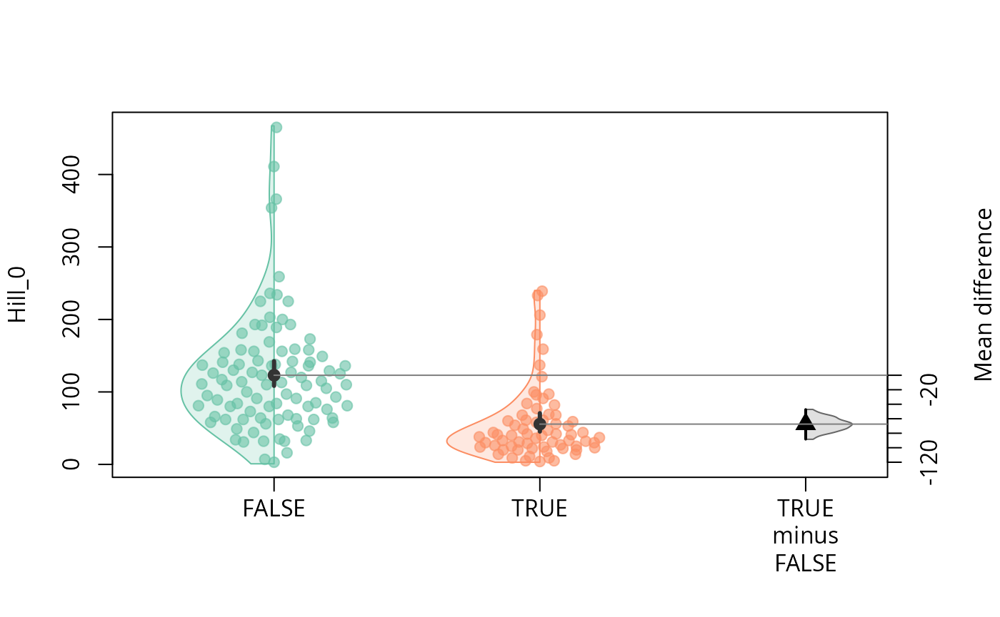
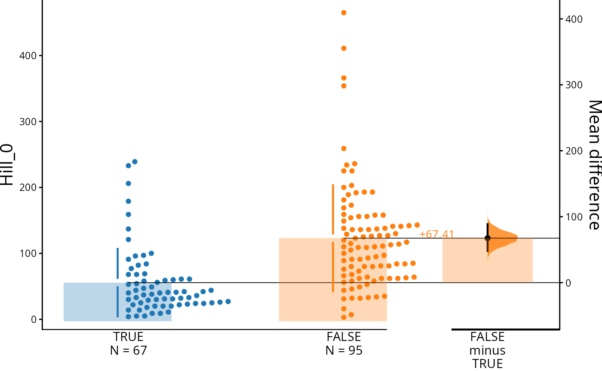
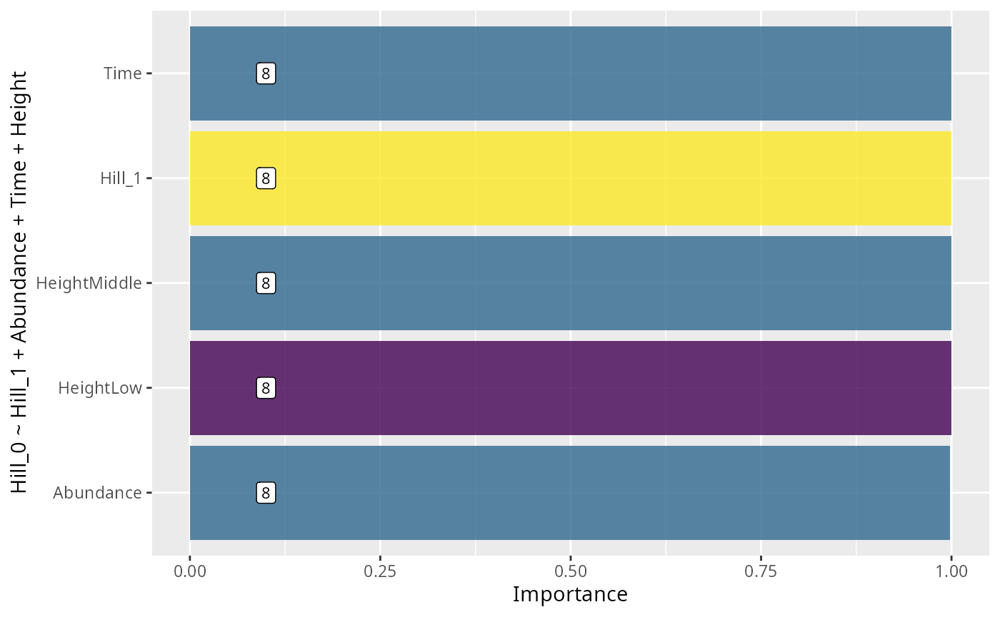

# alpha-div

``` r

library(MiscMetabar)
data(data_fungi)
```

#### Alpha diversity analysis

##### Hill number

Numerous metrics of diversity exist. Hill numbers [^1] is a kind of
general framework for alpha diversity index.

##### Diversity profiles

[`profile_hill_pq()`](https://adrientaudiere.github.io/MiscMetabar/reference/profile_hill_pq.md)
plots the Hill diversity profile (diversity as a function of the order
*q*) for each sample, or for groups of samples merged via
`merge_sample_by`.

``` r
data(data_fungi_mini)
dfm_rarefied <- rarefy_even_depth(data_fungi_mini, rngseed = 1, sample.size=200)
p <-profile_hill_pq(dfm_rarefied) 

p + no_legend()
```


Hill diversity profiles per sample (data_fungi_mini)

``` r

profile_hill_pq(dfm_rarefied, merge_sample_by = "Height")
#> Warning in merge_samples2(physeq, merge_sample_by): `group` has missing values;
#> corresponding samples will be dropped
```


Hill diversity profiles merged by Height

##### Rarefaction curves

[`hill_acc_pq()`](https://adrientaudiere.github.io/MiscMetabar/reference/hill_acc_pq.md)
plots Hill diversity accumulation (rarefaction) curves — one per sample
or per merged group — showing how estimated diversity grows with
sequencing depth.

``` r

hill_acc_pq(dfm_rarefied, q = 1, n_simulations = 5) + no_legend()
#> Warning: This manual palette can handle a maximum of 13 values. You have
#> supplied 89
```


Rarefaction curves per sample (Hill order q = 1)

``` r

hill_acc_pq(dfm_rarefied, q = 0, merge_sample_by = "Height", n_simulations = 5)
#> Warning in merge_samples2(physeq, merge_sample_by): `group` has missing values;
#> corresponding samples will be dropped
```


Rarefaction curves merged by Height (Hill order q = 0)

##### Test for difference in diversity (hill number)

One way to keep into account for difference in the number of sequences
per samples is to use a Tukey test on a linear model with the square
roots of the number of sequence as the first explanatory variable of the
linear model [^2].

``` r

p <- MiscMetabar::hill_pq(data_fungi, fact = "Height")
p$plot_Hill_0
```


Hill number 1

``` r

p$plot_tuckey
#> NULL
```

See also the
[tutorial](https://microbiome.github.io/tutorials/Alphadiversity.html)
of the microbiome package for an alternative using the non-parametric
[Kolmogorov-Smirnov
test](https://www.rdocumentation.org/packages/dgof/versions/1.2/topics/ks.test)
for two-group comparisons when there are no relevant covariates.

### Alpha diversity using package `MicrobiotaProcess`

``` r

library("MicrobiotaProcess")
clean_pq(subset_samples_pq(data_fungi, !is.na(data_fungi@sam_data$Height))) %>%
  as.MPSE() %>%
  mp_cal_alpha() %>%
  mp_plot_alpha(.group = "Height")
#> Warning: `aes_string()` was deprecated in ggplot2 3.0.0.
#> ℹ Please use tidy evaluation idioms with `aes()`.
#> ℹ See also `vignette("ggplot2-in-packages")` for more information.
#> ℹ The deprecated feature was likely used in the MicrobiotaProcess package.
#>   Please report the issue at
#>   <https://github.com/YuLab-SMU/MicrobiotaProcess/issues>.
#> This warning is displayed once per session.
#> Call `lifecycle::last_lifecycle_warnings()` to see where this warning was
#> generated.
#> Warning in wilcox.test.default(c(4, 4, 5, 5, 4, 4, 3, 6, 3, 4, 3, 2, 3, :
#> cannot compute exact p-value with ties
#> Warning in wilcox.test.default(c(3, 4, 3, 5, 4, 6, 3, 5, 4, 4, 3, 3, 3, :
#> cannot compute exact p-value with ties
#> Warning in wilcox.test.default(c(3, 4, 3, 5, 4, 6, 3, 5, 4, 4, 3, 3, 3, :
#> cannot compute exact p-value with ties
#> Warning in wilcox.test.default(c(1.32966134885476, 1.242453324894,
#> 1.56071040904141, : cannot compute exact p-value with ties
#> Warning in wilcox.test.default(c(0.867563228481461, 1.32966134885476,
#> 0.867563228481461, : cannot compute exact p-value with ties
#> Warning in wilcox.test.default(c(0.867563228481461, 1.32966134885476,
#> 0.867563228481461, : cannot compute exact p-value with ties
```


### Estimation statistics framework

” Estimation statistics is a simple framework that avoids the pitfalls
of significance testing. It uses familiar statistical concepts: means,
mean differences, and error bars. More importantly, it focuses on the
effect size of one’s experiment/intervention, as opposed to a false
dichotomy engendered by P values. ” Citation from dabest documentation
[website](https://acclab.github.io/dabestr/index.html).

#### Durga package

``` r

library("Durga")
psm <- psmelt_samples_pq(data_fungi)

durga_res <- DurgaDiff(Hill_0 ~ Time == 0, psm)
DurgaPlot(durga_res)
```


``` r

durga_pq <- function(physeq, formula, plot = FALSE) {
  verify_pq(physeq)
  psm <- psmelt_samples_pq(physeq)
  res_durga <- DurgaDiff(formula, psm)
  if (plot) {
    p <- DurgaPlot(res_durga)
    invisible(p)
  } else {
    return(res_durga)
  }
}

durga_pq(data_fungi, Hill_0 ~ Height, plot = TRUE)
```


``` r

durga_pq(data_fungi, Hill_0 ~ Time + Height, plot = TRUE)
```


``` r


durga_pq(data_fungi, Hill_0 ~ Time == 0, plot = TRUE)
```



``` r

durga_pq(data_fungi, Hill_1 ~ Time == 0, plot = TRUE)
```


``` r

durga_pq(data_fungi, Hill_2 ~ Time == 0, plot = TRUE)
```


#### dabest R package

``` r

library("dabestr")
psm <- psmelt_samples_pq(data_fungi)

load(
  data = psm,
  x = Height,
  y = Hill_2,
  idx = list(c("Low", "Middle", "High"))
) %>%
  mean_diff() |>
  dabest_plot(swarm_label = "Hill_2")
```


``` r

psm |>
  mutate(Time_is_0 = Time == 0) |>
  load(
    x = Time_is_0,
    y = Hill_0,
    idx = list(c("TRUE", "FALSE"))
  ) %>%
  mean_diff() |>
  dabest_plot(swarm_label = "Hill_0")
```



### Effect of samples variables on alpha diversity using automated model selection and multimodel inference with (G)LMs

From the help of glmulti package :

> glmulti finds what are the n best models (the confidence set of
> models) among all possible models (the candidate set, as specified by
> the user). Models are fitted with the specified fitting function
> (default is glm) and are ranked with the specified Information
> Criterion (default is aicc). The best models are found either through
> exhaustive screening of the candidates, or using a genetic algorithm,
> which allows very large candidate sets to be addressed. The output can
> be used for model selection, variable selection, and multimodel
> inference.

``` r

library("glmulti")
formula <- "Hill_0 ~ Hill_1 + Abundance + Time + Height"
res_glmulti <-
  glmutli_pq(data_fungi_mini, formula = formula, level = 1)
#> Initialization...
#> TASK: Exhaustive screening of candidate set.
#> Fitting...
#> Completed.
res_glmulti
#>                  estimates unconditional_interval nb_model importance
#> Abundance     0.0002425004           4.049862e-09        8  0.9976746
#> Hill_1        1.4818202876           1.144356e-01        8  0.9996675
#> Time          0.0202445718           3.271583e-03        8  1.0000000
#> HeightLow    -0.0685647506           6.111797e-01        8  1.0000000
#> HeightMiddle  0.1905543547           6.885434e-01        8  1.0000000
#>                     alpha     variable
#> Abundance    0.0001269354    Abundance
#> Hill_1       0.6748363040       Hill_1
#> Time         0.1141042429         Time
#> HeightLow    1.5596025795    HeightLow
#> HeightMiddle 1.6553735697 HeightMiddle

ggplot(data = res_glmulti, aes(x = estimates, y = variable)) +
  geom_point(
    size = 2,
    alpha = 1,
    show.legend = FALSE
  ) +
  geom_vline(
    xintercept = 0,
    linetype = "dotted",
    linewidth = 1
  ) +
  geom_errorbar(
    aes(xmin = estimates - alpha, xmax = estimates + alpha),
    width = 0.8,
    position = position_dodge(width = 0.8),
    alpha = 0.7,
    show.legend = FALSE
  ) +
  geom_label(aes(label = nb_model), nudge_y = 0.3, size = 3) +
  xlab("Standardized estimates") +
  ylab(formula)
```


``` r


ggplot(data = res_glmulti, aes(
  x = importance,
  y = as.factor(variable),
  fill = estimates
)) +
  geom_bar(
    stat = "identity",
    show.legend = FALSE,
    alpha = 0.8
  ) +
  xlim(c(0, 1)) +
  geom_label(aes(label = nb_model, x = 0.1),
    size = 3,
    fill = "white"
  ) +
  scale_fill_viridis_b() +
  xlab("Importance") +
  ylab(formula)
```



``` r

formula <- "Hill_0 ~ Abundance + Time + Height"
res_glmulti_interaction <-
  glmutli_pq(data_fungi_mini, formula = formula, level = 2)
#> Initialization...
#> TASK: Exhaustive screening of candidate set.
#> Fitting...
#> 
#> After 50 models:
#> Best model: Hill_0~1+Abundance+Time+Time:Abundance+Height:Abundance
#> Crit= 380.266307886255
#> Mean crit= 439.149731147241
#> Completed.
res_glmulti_interaction
#>                            estimates unconditional_interval nb_model
#> HeightHigh:Time         1.021021e-03           4.896053e-06        8
#> Abundance:HeightHigh    1.444574e-06           1.376218e-11        8
#> HeightLow              -2.818502e-01           2.975283e-01       32
#> HeightMiddle           -2.284000e-01           2.804621e-01       32
#> HeightLow:Time         -4.802362e-02           7.037018e-03       32
#> HeightMiddle:Time      -5.451488e-02           8.777216e-03       32
#> Abundance:HeightLow     9.952410e-05           2.196739e-08       32
#> Abundance:HeightMiddle  1.942462e-04           3.617651e-08       32
#> Time                    1.927954e-01           1.152254e-02       32
#> Abundance               4.367041e-04           3.508660e-08       32
#> Abundance:Time         -3.131657e-05           1.596068e-10       32
#>                         importance        alpha               variable
#> HeightHigh:Time        0.006596239 4.348738e-03        HeightHigh:Time
#> Abundance:HeightHigh   0.014891518 7.317402e-06   Abundance:HeightHigh
#> HeightLow              0.293275977 1.076681e+00              HeightLow
#> HeightMiddle           0.293275977 1.046605e+00           HeightMiddle
#> HeightLow:Time         0.409654935 1.655170e-01         HeightLow:Time
#> HeightMiddle:Time      0.409654935 1.848108e-01      HeightMiddle:Time
#> Abundance:HeightLow    0.671985280 2.935384e-04    Abundance:HeightLow
#> Abundance:HeightMiddle 0.671985280 3.755994e-04 Abundance:HeightMiddle
#> Time                   0.900282159 2.125915e-01                   Time
#> Abundance              0.933935731 3.708996e-04              Abundance
#> Abundance:Time         0.967098115 2.508155e-05         Abundance:Time

ggplot(data = res_glmulti_interaction, aes(x = estimates, y = variable)) +
  geom_point(
    size = 2,
    alpha = 1,
    show.legend = FALSE
  ) +
  geom_vline(
    xintercept = 0,
    linetype = "dotted",
    linewidth = 1
  ) +
  geom_errorbar(
    aes(xmin = estimates - alpha, xmax = estimates + alpha),
    width = 0.8,
    position = position_dodge(width = 0.8),
    alpha = 0.7,
    show.legend = FALSE
  ) +
  geom_label(aes(label = nb_model), nudge_y = 0.3, size = 3) +
  xlab("Standardized estimates") +
  ylab(formula)
```


``` r


ggplot(data = res_glmulti_interaction, aes(
  x = importance,
  y = as.factor(variable),
  fill = estimates
)) +
  geom_bar(
    stat = "identity",
    show.legend = FALSE,
    alpha = 0.8
  ) +
  xlim(c(0, 1)) +
  geom_label(aes(label = nb_model, x = 0.1),
    size = 3,
    fill = "white"
  ) +
  scale_fill_viridis_b() +
  xlab("Importance") +
  ylab(formula)
```


## Session information

``` r

sessionInfo()
#> R version 4.5.2 (2025-10-31)
#> Platform: x86_64-pc-linux-gnu
#> Running under: Pop!_OS 24.04 LTS
#> 
#> Matrix products: default
#> BLAS:   /usr/lib/x86_64-linux-gnu/blas/libblas.so.3.12.0 
#> LAPACK: /usr/lib/x86_64-linux-gnu/lapack/liblapack.so.3.12.0  LAPACK version 3.12.0
#> 
#> locale:
#>  [1] LC_CTYPE=en_US.UTF-8          LC_NUMERIC=C                 
#>  [3] LC_TIME=en_US.UTF-8           LC_COLLATE=en_US.UTF-8       
#>  [5] LC_MONETARY=en_US.UTF-8       LC_MESSAGES=en_US.UTF-8      
#>  [7] LC_PAPER=en_US.UTF-8          LC_NAME=en_US.UTF-8          
#>  [9] LC_ADDRESS=en_US.UTF-8        LC_TELEPHONE=en_US.UTF-8     
#> [11] LC_MEASUREMENT=en_US.UTF-8    LC_IDENTIFICATION=en_US.UTF-8
#> 
#> time zone: Europe/Paris
#> tzcode source: system (glibc)
#> 
#> attached base packages:
#> [1] stats     graphics  grDevices utils     datasets  methods   base     
#> 
#> other attached packages:
#>  [1] glmulti_1.0.8            leaps_3.2                rJava_1.0-18            
#>  [4] dabestr_2025.3.15        Durga_2.1.0              MicrobiotaProcess_1.22.1
#>  [7] MiscMetabar_0.16.6       divent_0.5-3             purrr_1.2.2             
#> [10] dplyr_1.2.1              dada2_1.38.0             Rcpp_1.1.1-1.1          
#> [13] ggplot2_4.0.3            phyloseq_1.54.2         
#> 
#> loaded via a namespace (and not attached):
#>   [1] splines_4.5.2               bitops_1.0-9               
#>   [3] ggplotify_0.1.3             tibble_3.3.1               
#>   [5] lifecycle_1.0.5             pwalign_1.6.0              
#>   [7] Rdpack_2.6.6                lattice_0.22-9             
#>   [9] MASS_7.3-65                 magrittr_2.0.5             
#>  [11] sass_0.4.10                 rmarkdown_2.31             
#>  [13] jquerylib_0.1.4             yaml_2.3.12                
#>  [15] otel_0.2.0                  cowplot_1.2.0              
#>  [17] RColorBrewer_1.1-3          ade4_1.7-24                
#>  [19] multcomp_1.4-30             abind_1.4-8                
#>  [21] ShortRead_1.68.0            GenomicRanges_1.62.1       
#>  [23] BiocGenerics_0.56.0         yulab.utils_0.2.4          
#>  [25] TH.data_1.1-5               rappdirs_0.3.4             
#>  [27] sandwich_3.1-1              gdtools_0.5.0              
#>  [29] IRanges_2.44.0              S4Vectors_0.48.1           
#>  [31] ggrepel_0.9.8               tidytree_0.4.7             
#>  [33] vegan_2.7-3                 pkgdown_2.2.0              
#>  [35] permute_0.9-10              codetools_0.2-20           
#>  [37] coin_1.4-3                  DelayedArray_0.36.1        
#>  [39] tidyselect_1.2.1            aplot_0.2.9                
#>  [41] farver_2.1.2                matrixStats_1.5.0          
#>  [43] stats4_4.5.2                Seqinfo_1.0.0              
#>  [45] GenomicAlignments_1.46.0    jsonlite_2.0.0             
#>  [47] ggtreeExtra_1.21.0          multtest_2.66.0            
#>  [49] survival_3.8-6              iterators_1.0.14           
#>  [51] systemfonts_1.3.2           foreach_1.5.2              
#>  [53] tools_4.5.2                 ggnewscale_0.5.2           
#>  [55] treeio_1.34.0               ragg_1.5.2                 
#>  [57] ggstar_1.0.6                glue_1.8.1                 
#>  [59] gridExtra_2.3               SparseArray_1.10.10        
#>  [61] xfun_0.57                   mgcv_1.9-4                 
#>  [63] MatrixGenerics_1.22.0       withr_3.0.2                
#>  [65] fastmap_1.2.0               ggh4x_0.3.1                
#>  [67] latticeExtra_0.6-31         boot_1.3-32                
#>  [69] rhdf5filters_1.22.0         digest_0.6.39              
#>  [71] R6_2.6.1                    gridGraphics_0.5-1         
#>  [73] textshaping_1.0.5           effsize_0.8.1              
#>  [75] jpeg_0.1-11                 cigarillo_1.0.0            
#>  [77] tidyr_1.3.2                 generics_0.1.4             
#>  [79] ggsci_4.3.0                 fontLiberation_0.1.0       
#>  [81] data.table_1.18.2.1         htmlwidgets_1.6.4          
#>  [83] S4Arrays_1.10.1             pkgconfig_2.0.3            
#>  [85] gtable_0.3.6                modeltools_0.2-24          
#>  [87] S7_0.2.2                    hwriter_1.3.2.1            
#>  [89] XVector_0.50.0              htmltools_0.5.9            
#>  [91] fontBitstreamVera_0.1.1     biomformat_1.38.3          
#>  [93] scales_1.4.0                Biobase_2.70.0             
#>  [95] png_0.1-9                   ggfun_0.2.0                
#>  [97] knitr_1.51                  reshape2_1.4.5             
#>  [99] nlme_3.1-168                cachem_1.1.0               
#> [101] zoo_1.8-15                  rhdf5_2.54.1               
#> [103] stringr_1.6.0               parallel_4.5.2             
#> [105] vipor_0.4.7                 libcoin_1.0-12             
#> [107] desc_1.4.3                  pillar_1.11.1              
#> [109] grid_4.5.2                  vctrs_0.7.3                
#> [111] cluster_2.1.8.2             beeswarm_0.4.0             
#> [113] evaluate_1.0.5              mvtnorm_1.3-6              
#> [115] cli_3.6.6                   compiler_4.5.2             
#> [117] Rsamtools_2.26.0            rlang_1.2.0                
#> [119] crayon_1.5.3                ggsignif_0.6.4             
#> [121] labeling_0.4.3              interp_1.1-6               
#> [123] plyr_1.8.9                  fs_2.0.1                   
#> [125] ggbeeswarm_0.7.3            ggiraph_0.9.6              
#> [127] stringi_1.8.7               viridisLite_0.4.3          
#> [129] deldir_2.0-4                BiocParallel_1.44.0        
#> [131] Biostrings_2.78.0           lazyeval_0.2.3             
#> [133] fontquiver_0.2.1            Matrix_1.7-4               
#> [135] patchwork_1.3.2             Rhdf5lib_1.32.0            
#> [137] SummarizedExperiment_1.40.0 rbibutils_2.4.1            
#> [139] igraph_2.2.3                RcppParallel_5.1.11-2      
#> [141] bslib_0.10.0                ggtree_4.0.5               
#> [143] ape_5.8-1
```

[^1]: Hill MO. 1973. Diversity and evenness: a unifying notation and its
    consequences. Ecology 54, 427-473.

[^2]: Bálint M et al. 2015. Relocation, high-latitude warming and host
    genetic identity shape the foliar fungal microbiome of poplars.
    Molecular Ecology 24, 235-248. <https://doi.org/10.1111/mec.13018>
