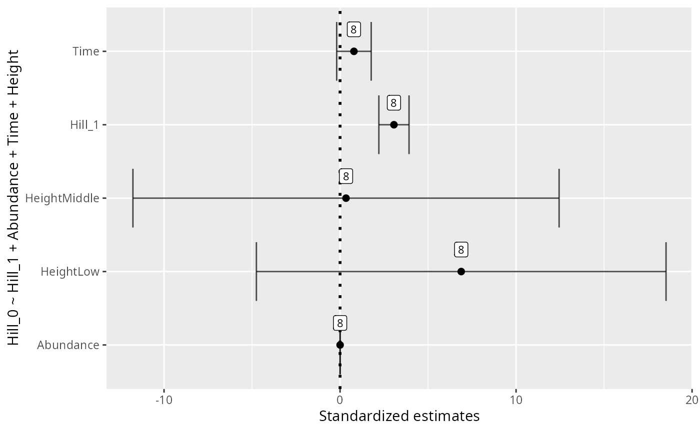

# alpha-div

``` r
library(MiscMetabar)
data(data_fungi)
```

#### Alpha diversity analysis

##### Hill number

Numerous metrics of diversity exist. Hill numbers [¹](#fn1) is a kind of
general framework for alpha diversity index.

``` r
renyi_res <- vegan::renyi(data_fungi@otu_table)
head(renyi_res)
#>                                       0     0.25      0.5         1         2
#> A10-005-B_S188_MERGED.fastq.gz 4.204693 3.615323 3.044244 2.0754183 1.1561862
#> A10-005-H_S189_MERGED.fastq.gz 4.248495 3.150337 2.063712 0.9938545 0.6464533
#> A10-005-M_S190_MERGED.fastq.gz 3.988984 3.607773 3.308361 2.9304156 2.5781603
#> A12-007_S191_MERGED.fastq.gz   5.036953 4.423283 3.751946 2.6309045 1.8468497
#> A12-007-B_S2_MERGED.fastq.gz   3.850148 3.349461 2.874269 2.1881145 1.6533262
#> A15-004_S3_MERGED.fastq.gz     4.025352 3.890614 3.747555 3.4533352 2.9618789
#>                                        4         8        16        32
#> A10-005-B_S188_MERGED.fastq.gz 0.8007816 0.6864775 0.6407124 0.6200442
#> A10-005-H_S189_MERGED.fastq.gz 0.5146170 0.4469617 0.4172228 0.4037640
#> A10-005-M_S190_MERGED.fastq.gz 2.3022639 2.1015018 1.9744485 1.9110311
#> A12-007_S191_MERGED.fastq.gz   1.5920328 1.4947479 1.4421368 1.4109287
#> A12-007-B_S2_MERGED.fastq.gz   1.3979355 1.2774402 1.2106906 1.1733049
#> A15-004_S3_MERGED.fastq.gz     2.4997916 2.2378349 2.1045646 2.0377518
#>                                       64       Inf
#> A10-005-B_S188_MERGED.fastq.gz 0.6102022 0.6006678
#> A10-005-H_S189_MERGED.fastq.gz 0.3973550 0.3911464
#> A10-005-M_S190_MERGED.fastq.gz 1.8806976 1.8513117
#> A12-007_S191_MERGED.fastq.gz   1.3916365 1.3700776
#> A12-007-B_S2_MERGED.fastq.gz   1.1547034 1.1366612
#> A15-004_S3_MERGED.fastq.gz     2.0054156 1.9740810
```

##### Test for difference in diversity (hill number)

One way to keep into account for difference in the number of sequences
per samples is to use a Tukey test on a linear model with the square
roots of the number of sequence as the first explanatory variable of the
linear model [²](#fn2).

``` r
p <- MiscMetabar::hill_pq(data_fungi, fact = "Height")
p$plot_Hill_0
#> NULL
```

``` r
p$plot_tuckey
#> NULL
```

See also the
[tutorial](https://microbiome.github.io/tutorials/Alphadiversity.html)
of the microbiome package for an alternative using the non-parametric
[Kolmogorov-Smirnov
test](https://www.rdocumentation.org/packages/dgof/versions/1.2/topics/ks.test)
for two-group comparisons when there are no relevant covariates.

### Alpha diversity using package `MicrobiotaProcess`

``` r
library("MicrobiotaProcess")
clean_pq(subset_samples_pq(data_fungi, !is.na(data_fungi@sam_data$Height))) %>%
  as.MPSE() %>%
  mp_cal_alpha() %>%
  mp_plot_alpha(.group = "Height")
#> Warning: `aes_string()` was deprecated in ggplot2 3.0.0.
#> ℹ Please use tidy evaluation idioms with `aes()`.
#> ℹ See also `vignette("ggplot2-in-packages")` for more information.
#> ℹ The deprecated feature was likely used in the MicrobiotaProcess package.
#>   Please report the issue at
#>   <https://github.com/YuLab-SMU/MicrobiotaProcess/issues>.
#> This warning is displayed once every 8 hours.
#> Call `lifecycle::last_lifecycle_warnings()` to see where this warning was
#> generated.
#> Warning in wilcox.test.default(c(4, 4, 5, 5, 4, 4, 3, 6, 3, 4, 3, 2, 3, :
#> cannot compute exact p-value with ties
#> Warning in wilcox.test.default(c(3, 4, 3, 5, 4, 6, 3, 5, 4, 4, 3, 3, 3, :
#> cannot compute exact p-value with ties
#> Warning in wilcox.test.default(c(3, 4, 3, 5, 4, 6, 3, 5, 4, 4, 3, 3, 3, :
#> cannot compute exact p-value with ties
#> Warning in wilcox.test.default(c(1.32966134885476, 1.242453324894,
#> 1.56071040904141, : cannot compute exact p-value with ties
#> Warning in wilcox.test.default(c(0.867563228481461, 1.32966134885476,
#> 0.867563228481461, : cannot compute exact p-value with ties
#> Warning in wilcox.test.default(c(0.867563228481461, 1.32966134885476,
#> 0.867563228481461, : cannot compute exact p-value with ties
```


### Durga package to represent and compute effect size of difference in alpha diversity

``` r
library("Durga")
psm <- psmelt_samples_pq(data_fungi) 

d <- DurgaDiff(Hill_0 ~ Height, psm)
DurgaPlot(d)
```



``` r
d <- DurgaDiff(Hill_0 ~ Time==0, psm)
DurgaPlot(d)
```


``` r
durga_pq <- function(physeq, formula, plot=FALSE) {
  verify_pq(physeq)
  psm <- psmelt_samples_pq(physeq)
  res_durga <- DurgaDiff(formula, psm)
  if(plot){
    p <-DurgaPlot(res_durga)
    invisible(p)
  } else{
    return(res_durga)
  }
  
}

durga_pq(data_fungi, Hill_0 ~ Height, plot=TRUE)
```


``` r
durga_pq(data_fungi, Hill_0 ~ Time + Height, plot=TRUE)
```


``` r

durga_pq(data_fungi, Hill_0 ~ Time==0, plot=TRUE)
```


``` r
durga_pq(data_fungi,  Hill_1 ~ Time==0, plot=TRUE)
```


``` r
durga_pq(data_fungi,  Hill_2 ~ Time==0, plot=TRUE)
```


### Effect of samples variables on alpha diversity using automated model selection and multimodel inference with (G)LMs

From the help of glmulti package :

> glmulti finds what are the n best models (the confidence set of
> models) among all possible models (the candidate set, as specified by
> the user). Models are fitted with the specified fitting function
> (default is glm) and are ranked with the specified Information
> Criterion (default is aicc). The best models are found either through
> exhaustive screening of the candidates, or using a genetic algorithm,
> which allows very large candidate sets to be addressed. The output can
> be used for model selection, variable selection, and multimodel
> inference.

``` r
library("glmulti")
formula <- "Hill_0 ~ Hill_1 + Abundance + Time + Height"
res_glmulti <-
  glmutli_pq(data_fungi, formula = formula, level = 1)
#> Initialization...
#> TASK: Exhaustive screening of candidate set.
#> Fitting...
#> Completed.
res_glmulti
#>                estimates unconditional_interval nb_model importance
#> Hill_1       3.062117997           1.868174e-01        8          1
#> Abundance    0.002959644           8.478374e-08        8          1
#> Time         0.789091999           2.443263e-01        8          1
#> HeightLow    6.884340946           3.444196e+01        8          1
#> HeightMiddle 0.339123798           3.727962e+01        8          1
#>                     alpha     variable
#> Hill_1       8.570200e-01       Hill_1
#> Abundance    5.773492e-04    Abundance
#> Time         9.800932e-01         Time
#> HeightLow    1.163660e+01    HeightLow
#> HeightMiddle 1.210648e+01 HeightMiddle

ggplot(data = res_glmulti, aes(x = estimates, y = variable)) +
  geom_point(
    size = 2,
    alpha = 1,
    show.legend = FALSE
  ) +
  geom_vline(
    xintercept = 0,
    linetype = "dotted",
    linewidth = 1
  ) +
  geom_errorbar(
    aes(xmin = estimates - alpha, xmax = estimates + alpha),
    width = 0.8,
    position = position_dodge(width = 0.8),
    alpha = 0.7,
    show.legend = FALSE
  ) +
  geom_label(aes(label = nb_model), nudge_y = 0.3, size = 3) +
  xlab("Standardized estimates") +
  ylab(formula)
```


``` r

ggplot(data = res_glmulti, aes(
  x = importance,
  y = as.factor(variable),
  fill = estimates
)) +
  geom_bar(
    stat = "identity",
    show.legend = FALSE,
    alpha = 0.8
  ) +
  xlim(c(0, 1)) +
  geom_label(aes(label = nb_model, x = 0.1),
    size = 3,
    fill = "white"
  ) +
  scale_fill_viridis_b() +
  xlab("Importance") +
  ylab(formula)
```


``` r
formula <- "Hill_0 ~ Abundance + Time + Height"
res_glmulti_interaction <-
  glmutli_pq(data_fungi, formula = formula, level = 2)
#> Initialization...
#> TASK: Exhaustive screening of candidate set.
#> Fitting...
#> 
#> After 50 models:
#> Best model: Hill_0~1+Abundance+Time+Time:Abundance+Height:Abundance+Height:Time
#> Crit= 1069.11608982306
#> Mean crit= 1218.19009955263
#> Completed.
res_glmulti_interaction
#>                            estimates unconditional_interval nb_model importance
#> HeightHigh:Time         0.1004073616           4.167750e-02        8 0.04216251
#> Abundance:HeightHigh    0.0001609310           8.984023e-08        8 0.09020701
#> HeightLow              -0.7865687564           9.769200e+00       32 0.24714664
#> HeightMiddle           -2.6419930721           2.789953e+01       32 0.24714664
#> HeightLow:Time         -0.6511123699           1.599292e+00       32 0.55051517
#> HeightMiddle:Time      -1.3322473025           3.078720e+00       32 0.55051517
#> Abundance:Time         -0.0001068559           4.586032e-09       32 0.81587143
#> Abundance:HeightLow     0.0011137659           7.957713e-07       32 0.86967993
#> Abundance:HeightMiddle  0.0017155970           1.245718e-06       32 0.86967993
#> Abundance               0.0024839088           8.790126e-07       32 0.90902176
#> Time                    2.7869220741           2.663548e+00       32 0.92512111
#>                               alpha               variable
#> HeightHigh:Time        4.006348e-01        HeightHigh:Time
#> Abundance:HeightHigh   5.877776e-04   Abundance:HeightHigh
#> HeightLow              6.171172e+00              HeightLow
#> HeightMiddle           1.038989e+01           HeightMiddle
#> HeightLow:Time         2.491898e+00         HeightLow:Time
#> HeightMiddle:Time      3.449710e+00      HeightMiddle:Time
#> Abundance:Time         1.335247e-04         Abundance:Time
#> Abundance:HeightLow    1.759641e-03    Abundance:HeightLow
#> Abundance:HeightMiddle 2.198334e-03 Abundance:HeightMiddle
#> Abundance              1.847287e-03              Abundance
#> Time                   3.214276e+00                   Time

ggplot(data = res_glmulti_interaction, aes(x = estimates, y = variable)) +
  geom_point(
    size = 2,
    alpha = 1,
    show.legend = FALSE
  ) +
  geom_vline(
    xintercept = 0,
    linetype = "dotted",
    linewidth = 1
  ) +
  geom_errorbar(
    aes(xmin = estimates - alpha, xmax = estimates + alpha),
    width = 0.8,
    position = position_dodge(width = 0.8),
    alpha = 0.7,
    show.legend = FALSE
  ) +
  geom_label(aes(label = nb_model), nudge_y = 0.3, size = 3) +
  xlab("Standardized estimates") +
  ylab(formula)
```


``` r

ggplot(data = res_glmulti_interaction, aes(
  x = importance,
  y = as.factor(variable),
  fill = estimates
)) +
  geom_bar(
    stat = "identity",
    show.legend = FALSE,
    alpha = 0.8
  ) +
  xlim(c(0, 1)) +
  geom_label(aes(label = nb_model, x = 0.1),
    size = 3,
    fill = "white"
  ) +
  scale_fill_viridis_b() +
  xlab("Importance") +
  ylab(formula)
```


## Session information

``` r
sessionInfo()
#> R version 4.5.2 (2025-10-31)
#> Platform: x86_64-pc-linux-gnu
#> Running under: Kali GNU/Linux Rolling
#> 
#> Matrix products: default
#> BLAS:   /usr/lib/x86_64-linux-gnu/openblas-pthread/libblas.so.3 
#> LAPACK: /usr/lib/x86_64-linux-gnu/openblas-pthread/libopenblasp-r0.3.29.so;  LAPACK version 3.12.0
#> 
#> locale:
#>  [1] LC_CTYPE=fr_FR.UTF-8          LC_NUMERIC=C                 
#>  [3] LC_TIME=fr_FR.UTF-8           LC_COLLATE=fr_FR.UTF-8       
#>  [5] LC_MONETARY=fr_FR.UTF-8       LC_MESSAGES=fr_FR.UTF-8      
#>  [7] LC_PAPER=fr_FR.UTF-8          LC_NAME=fr_FR.UTF-8          
#>  [9] LC_ADDRESS=fr_FR.UTF-8        LC_TELEPHONE=fr_FR.UTF-8     
#> [11] LC_MEASUREMENT=fr_FR.UTF-8    LC_IDENTIFICATION=fr_FR.UTF-8
#> 
#> time zone: Europe/Paris
#> tzcode source: system (glibc)
#> 
#> attached base packages:
#> [1] stats     graphics  grDevices utils     datasets  methods   base     
#> 
#> other attached packages:
#>  [1] glmulti_1.0.8            leaps_3.2                rJava_1.0-11            
#>  [4] Durga_2.1.0              MicrobiotaProcess_1.22.0 MiscMetabar_0.14.5      
#>  [7] purrr_1.2.0              dplyr_1.1.4              dada2_1.38.0            
#> [10] Rcpp_1.1.0               ggplot2_4.0.1            phyloseq_1.54.0         
#> 
#> loaded via a namespace (and not attached):
#>   [1] libcoin_1.0-10              RColorBrewer_1.1-3         
#>   [3] jsonlite_2.0.0              magrittr_2.0.4             
#>   [5] TH.data_1.1-5               modeltools_0.2-24          
#>   [7] farver_2.1.2                rmarkdown_2.30             
#>   [9] fs_1.6.6                    ragg_1.5.0                 
#>  [11] vctrs_0.6.5                 multtest_2.66.0            
#>  [13] Rsamtools_2.26.0            ggtree_4.0.1               
#>  [15] htmltools_0.5.9             S4Arrays_1.10.1            
#>  [17] Rhdf5lib_1.32.0             gridGraphics_0.5-1         
#>  [19] SparseArray_1.10.7          rhdf5_2.54.1               
#>  [21] sass_0.4.10                 bslib_0.9.0                
#>  [23] htmlwidgets_1.6.4           desc_1.4.3                 
#>  [25] plyr_1.8.9                  sandwich_3.1-1             
#>  [27] zoo_1.8-15                  cachem_1.1.0               
#>  [29] GenomicAlignments_1.46.0    igraph_2.2.1               
#>  [31] lifecycle_1.0.4             iterators_1.0.14           
#>  [33] pkgconfig_2.0.3             Matrix_1.7-4               
#>  [35] R6_2.6.1                    fastmap_1.2.0              
#>  [37] MatrixGenerics_1.22.0       digest_0.6.39              
#>  [39] aplot_0.2.9                 ggnewscale_0.5.2           
#>  [41] ShortRead_1.68.0            patchwork_1.3.2            
#>  [43] S4Vectors_0.48.0            textshaping_1.0.4          
#>  [45] GenomicRanges_1.62.1        hwriter_1.3.2.1            
#>  [47] vegan_2.7-2                 labeling_0.4.3             
#>  [49] abind_1.4-8                 mgcv_1.9-4                 
#>  [51] compiler_4.5.2              fontquiver_0.2.1           
#>  [53] withr_3.0.2                 S7_0.2.1                   
#>  [55] BiocParallel_1.44.0         ggsignif_0.6.4             
#>  [57] MASS_7.3-65                 rappdirs_0.3.3             
#>  [59] DelayedArray_0.36.0         biomformat_1.38.0          
#>  [61] permute_0.9-8               tools_4.5.2                
#>  [63] vipor_0.4.7                 ape_5.8-1                  
#>  [65] glue_1.8.0                  nlme_3.1-168               
#>  [67] rhdf5filters_1.22.0         grid_4.5.2                 
#>  [69] cluster_2.1.8.1             reshape2_1.4.5             
#>  [71] ade4_1.7-23                 generics_0.1.4             
#>  [73] gtable_0.3.6                tidyr_1.3.1                
#>  [75] data.table_1.17.8           coin_1.4-3                 
#>  [77] XVector_0.50.0              BiocGenerics_0.56.0        
#>  [79] ggrepel_0.9.6               foreach_1.5.2              
#>  [81] pillar_1.11.1               stringr_1.6.0              
#>  [83] yulab.utils_0.2.3           splines_4.5.2              
#>  [85] treeio_1.34.0               lattice_0.22-7             
#>  [87] survival_3.8-3              deldir_2.0-4               
#>  [89] tidyselect_1.2.1            fontLiberation_0.1.0       
#>  [91] Biostrings_2.78.0           knitr_1.50                 
#>  [93] fontBitstreamVera_0.1.1     gridExtra_2.3              
#>  [95] IRanges_2.44.0              Seqinfo_1.0.0              
#>  [97] SummarizedExperiment_1.40.0 ggtreeExtra_1.20.0         
#>  [99] stats4_4.5.2                xfun_0.55                  
#> [101] Biobase_2.70.0              matrixStats_1.5.0          
#> [103] stringi_1.8.7               boot_1.3-32                
#> [105] lazyeval_0.2.2              ggfun_0.2.0                
#> [107] yaml_2.3.12                 evaluate_1.0.5             
#> [109] codetools_0.2-20            cigarillo_1.0.0            
#> [111] interp_1.1-6                gdtools_0.4.4              
#> [113] tibble_3.3.0                ggplotify_0.1.3            
#> [115] cli_3.6.5                   RcppParallel_5.1.11-1      
#> [117] systemfonts_1.3.1           jquerylib_0.1.4            
#> [119] png_0.1-8                   parallel_4.5.2             
#> [121] ggh4x_0.3.1                 pkgdown_2.2.0              
#> [123] latticeExtra_0.6-31         jpeg_0.1-11                
#> [125] bitops_1.0-9                ggstar_1.0.6               
#> [127] pwalign_1.6.0               viridisLite_0.4.2          
#> [129] mvtnorm_1.3-3               tidytree_0.4.6             
#> [131] ggiraph_0.9.2               scales_1.4.0               
#> [133] crayon_1.5.3                rlang_1.1.6                
#> [135] multcomp_1.4-29
```

------------------------------------------------------------------------

1.  Hill MO. 1973. Diversity and evenness: a unifying notation and its
    consequences. Ecology 54, 427-473.

2.  Bálint M et al. 2015. Relocation, high-latitude warming and host
    genetic identity shape the foliar fungal microbiome of poplars.
    Molecular Ecology 24, 235-248. <https://doi.org/10.1111/mec.13018>
