# beta-div

``` r
library(MiscMetabar)
library(lefser)
library(ALDEx2)
data(data_fungi)
```

### Permanova

``` r
data_fungi_woNA4height <- subset_samples(data_fungi, !is.na(data_fungi@sam_data$Height))
res_ado <- adonis_pq(data_fungi_woNA4height, "Tree_name+Height")
knitr::kable(res_ado)
```

|          |  Df | SumOfSqs |        R2 |        F | Pr(\>F) |
|:---------|----:|---------:|----------:|---------:|--------:|
| Model    |  63 | 36.92559 | 0.5881754 | 1.518899 |   0.001 |
| Residual |  67 | 25.85431 | 0.4118246 |       NA |      NA |
| Total    | 130 | 62.77990 | 1.0000000 |       NA |      NA |

### Graph Test

``` r
data_fungi_woNA4height <- subset_samples(data_fungi, !is.na(data_fungi@sam_data$Height))
graph_test_pq(data_fungi_woNA4height, "Height")
```


### Circle of ASVs

``` r
circle_pq(data_fungi_woNA4height, "Height")
```

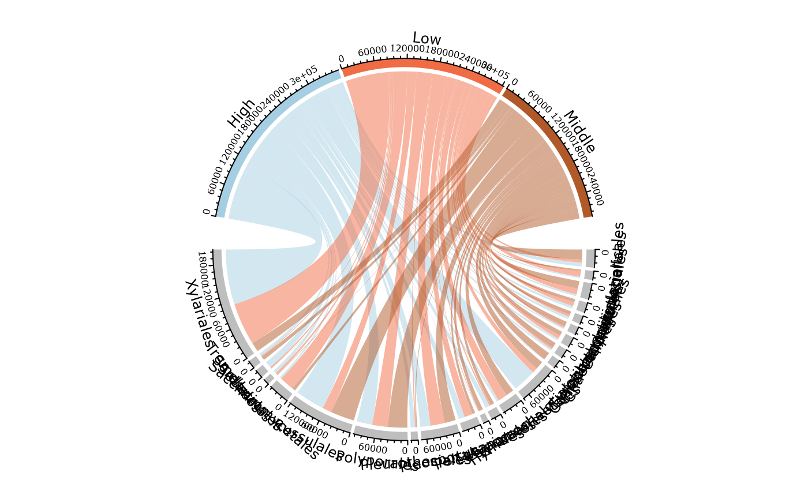

### Ordination

#### PCoA

``` r
plot_ordination_pq(data_fungi, method = "robust.aitchison", ordination_method = "PCoA", color = "Height")
#> Warning: `aes_string()` was deprecated in ggplot2 3.0.0.
#> ℹ Please use tidy evaluation idioms with `aes()`.
#> ℹ See also `vignette("ggplot2-in-packages")` for more information.
#> ℹ The deprecated feature was likely used in the phyloseq package.
#>   Please report the issue at <https://github.com/joey711/phyloseq/issues>.
#> This warning is displayed once per session.
#> Call `lifecycle::last_lifecycle_warnings()` to see where this warning was
#> generated.
```

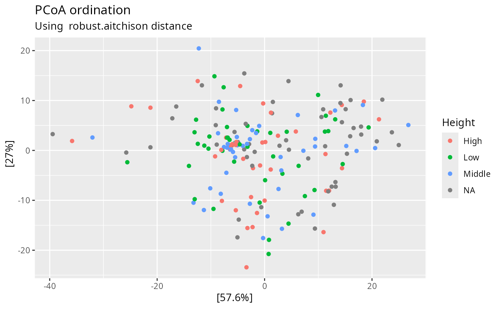

``` r
plot_ordination(data_fungi,
  ordination =
    ordinate(data_fungi, method = "PCoA", distance = "bray"), color = "Height"
)
```

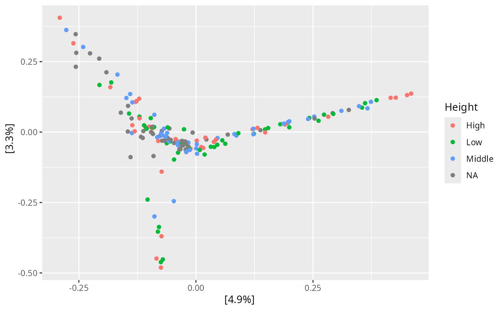

#### NMDS

``` r
plot_ordination_pq(data_fungi, method = "robust.aitchison", color = "Height") +
  plot_ordination_pq(data_fungi, method = "bray", color = "Height")
#> Run 0 stress 0.1133285 
#> Run 1 stress 0.2031998 
#> Run 2 stress 0.1425415 
#> Run 3 stress 0.1273063 
#> Run 4 stress 0.1950973 
#> Run 5 stress 0.1620808 
#> Run 6 stress 0.1595056 
#> Run 7 stress 0.1796361 
#> Run 8 stress 0.1721042 
#> Run 9 stress 0.1980584 
#> Run 10 stress 0.1284201 
#> Run 11 stress 0.1971293 
#> Run 12 stress 0.2005546 
#> Run 13 stress 0.168934 
#> Run 14 stress 0.1812448 
#> Run 15 stress 0.1881208 
#> Run 16 stress 0.1575817 
#> Run 17 stress 0.162739 
#> Run 18 stress 0.132636 
#> Run 19 stress 0.152047 
#> Run 20 stress 0.2041781 
#> *** Best solution was not repeated -- monoMDS stopping criteria:
#>     13: stress ratio > sratmax
#>      7: scale factor of the gradient < sfgrmin
#> Run 0 stress 0.2437839 
#> Run 1 stress 0.2485997 
#> Run 2 stress 0.2472849 
#> Run 3 stress 0.2450257 
#> Run 4 stress 0.2394284 
#> ... New best solution
#> ... Procrustes: rmse 0.0454059  max resid 0.1926736 
#> Run 5 stress 0.2471695 
#> Run 6 stress 0.2513681 
#> Run 7 stress 0.2429278 
#> Run 8 stress 0.2489632 
#> Run 9 stress 0.2489441 
#> Run 10 stress 0.2453355 
#> Run 11 stress 0.2466278 
#> Run 12 stress 0.2455799 
#> Run 13 stress 0.2483674 
#> Run 14 stress 0.2460726 
#> Run 15 stress 0.2460076 
#> Run 16 stress 0.246254 
#> Run 17 stress 0.2453415 
#> Run 18 stress 0.2471357 
#> Run 19 stress 0.2432681 
#> Run 20 stress 0.2522929 
#> *** Best solution was not repeated -- monoMDS stopping criteria:
#>      3: no. of iterations >= maxit
#>     17: stress ratio > sratmax
```


#### TSNE

``` r
plot_tsne_pq(data_fungi, fact = "Height")
```

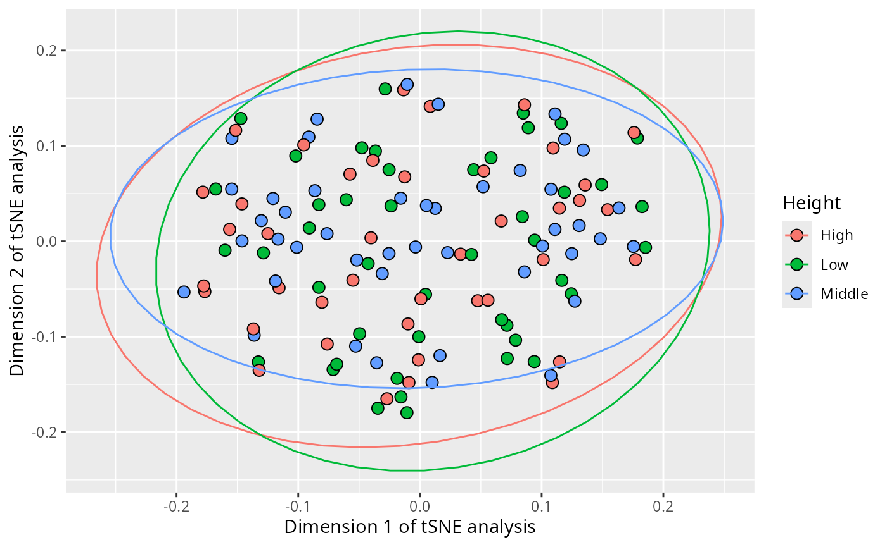

#### UMAP

``` r
df_umap <- umap_pq(data_fungi)
#> Warning: The `x` argument of `as_tibble.matrix()` must have unique column names if
#> `.name_repair` is omitted as of tibble 2.0.0.
#> ℹ Using compatibility `.name_repair`.
#> ℹ The deprecated feature was likely used in the MiscMetabar package.
#>   Please report the issue at
#>   <https://github.com/adrientaudiere/MiscMetabar/issues>.
#> This warning is displayed once per session.
#> Call `lifecycle::last_lifecycle_warnings()` to see where this warning was
#> generated.
ggplot(df_umap, aes(x = x_umap, y = y_umap, col = Height)) +
  geom_point(size = 2)
```

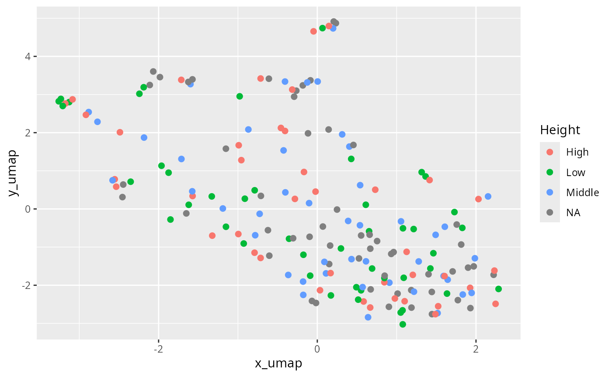

### Compare two (group of) samples

#### Biplot

``` r
data_fungi_low_high <- subset_samples(
  data_fungi,
  data_fungi@sam_data$Height %in%
    c("Low", "High")
)
data_fungi_low_high <- subset_taxa_pq(
  data_fungi_low_high,
  taxa_sums(data_fungi_low_high) > 5000
)
biplot_pq(data_fungi_low_high, fact = "Height", merge_sample_by = "Height")
```

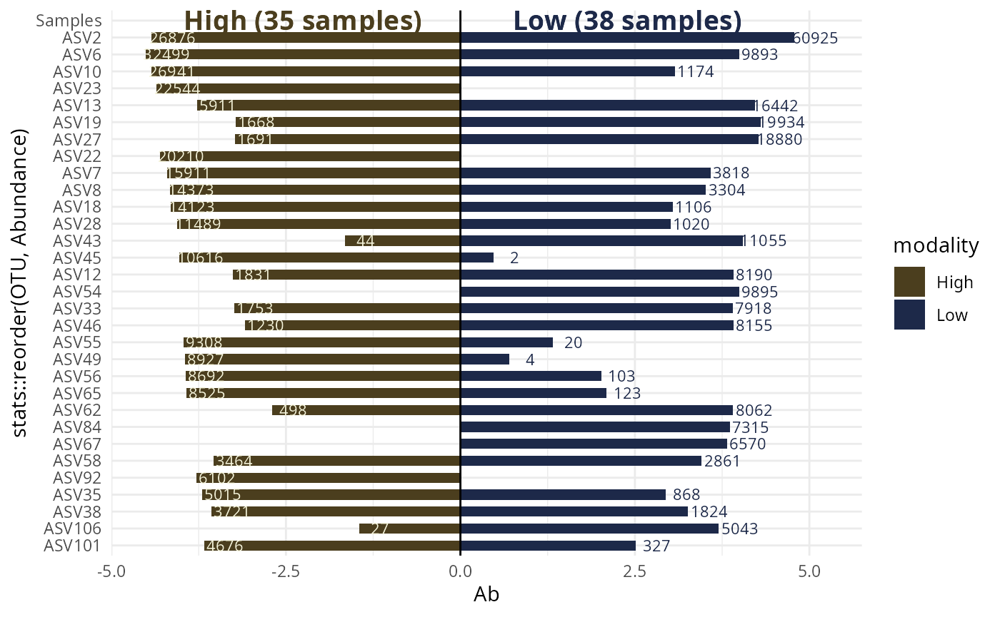

#### Compare two (group of) samples with a table

``` r
compare_pairs_pq(data_fungi_low_high,
  bifactor = "Height",
  merge_sample_by = "Height",
  modality = "Time"
)
#> # A tibble: 4 × 13
#>   modality nb_ASV_High nb_ASV_Low nb_shared_ASV div_High div_Low nb_shared_seq
#>   <chr>          <dbl>      <dbl>         <dbl>    <dbl>   <dbl>         <dbl>
#> 1 0                 12         16             9     1.8     1.37         57639
#> 2 5                 20         18            14     1.95    1.98         76006
#> 3 10                11         13            10     1.18    1.25         47042
#> 4 15                17         19            12     2       2.04        161348
#> # ℹ 6 more variables: percent_shared_seq_High <dbl>,
#> #   percent_shared_seq_Low <dbl>, percent_shared_ASV_High <dbl>,
#> #   percent_shared_ASV_Low <dbl>, ratio_nb_High_Low <dbl>,
#> #   ratio_div_High_Low <dbl>
```

### Venn diagram

``` r
library("grid")
venn_pq(data_fungi, fact = "Height")
```

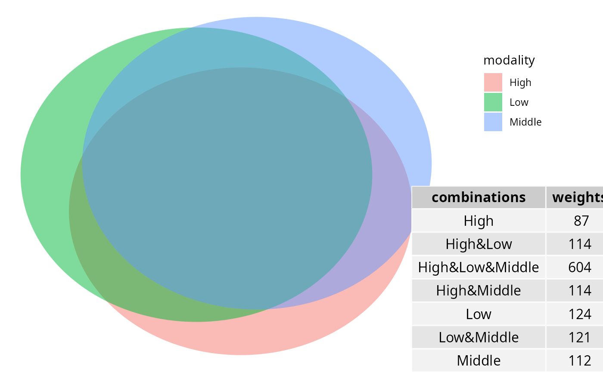

``` r
ggvenn_pq(data_fungi, fact = "Height") +
  ggplot2::scale_fill_distiller(palette = "BuPu", direction = 1) +
  labs(title = "Share number of ASV among Height in tree")
```


``` r
ggvenn_pq(data_fungi, fact = "Height", min_nb_seq = 5000) +
  ggplot2::scale_fill_distiller(palette = "BuPu", direction = 1) +
  labs(title = "Share number of ASV with more than 5000 seqs")
```


``` r
ggvenn_pq(data_fungi,
  fact = "Height", taxonomic_rank = "Genus",
  min_nb_seq = 100
) +
  ggplot2::scale_fill_distiller(palette = "BuPu", direction = 1) +
  labs(title = "Share number of Genus represented by at least one ASV with more than 100 seqs")
```

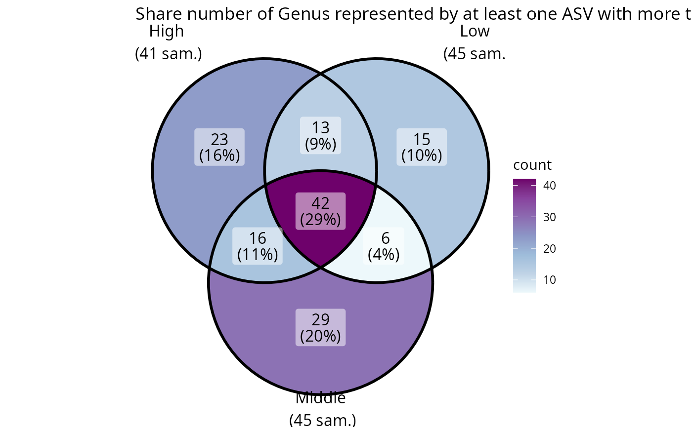

### Upset plot

Venn diagram can quickly become complex to read when the number of
modalities increase. One graphical solution is upset plot. MiscMetabar
propose a solution based on the package
[ComplexUpset](https://krassowski.github.io/complex-upset/).

``` r
upset_pq(data_fungi, fact = "Height")
#> Warning: Using `size` aesthetic for lines was deprecated in ggplot2 3.4.0.
#> ℹ Please use `linewidth` instead.
#> ℹ The deprecated feature was likely used in the ComplexUpset package.
#>   Please report the issue at
#>   <https://github.com/krassowski/complex-upset/issues>.
#> This warning is displayed once per session.
#> Call `lifecycle::last_lifecycle_warnings()` to see where this warning was
#> generated.
```


``` r
upset_pq(data_fungi, fact = "Time")
```

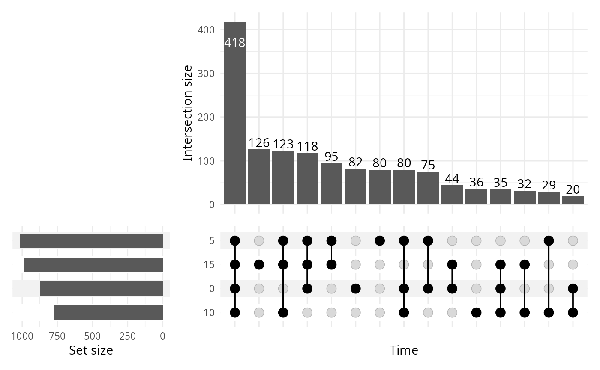

`ComplexUpset` package allow powerful configuration of you plot as you
can see in the following figure.

``` r
upset_pq(
  data_fungi,
  fact = "Time",
  width_ratio = 0.2,
  annotations = list(
    "Sequences per ASV \n (log10)" = (
      ggplot(mapping = aes(y = log10(Abundance)))
      +
        geom_jitter(aes(
          color =
            Abundance
        ), na.rm = TRUE)
        +
        geom_violin(alpha = 0.5, na.rm = TRUE) +
        theme(legend.key.size = unit(0.2, "cm")) +
        theme(axis.text = element_text(size = 12))
    ),
    "ASV per phylum" = (
      ggplot(mapping = aes(fill = Phylum))
      +
        geom_bar() +
        ylab("ASV per phylum") +
        theme(legend.key.size = unit(0.2, "cm")) +
        theme(axis.text = element_text(size = 12))
    )
  )
)
```

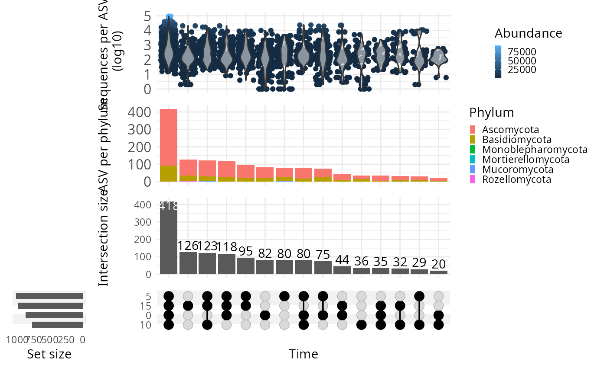

### Change in abundance across a factor

#### Benchdamic

There is a lot of available methods. Please refer to R package
[benchdamic](https://github.com/mcalgaro93/benchdamic) for a list of
method and a implementation of a benchmark for your data.

See also [Gamboa-Tuz et
al.](https://www.biorxiv.org/content/biorxiv/early/2025/02/17/2025.02.13.638109.full.pdf)
who claimed that “\[…\] compositional DA methods are not beneficial but
rather lack sensitivity, show increased variability in
constant-abundance spike-ins, and, most surprisingly, more frequently
produce paradoxical results with DA in the wrong direction for the
low-diversity microbiome. Conversely, commonly used methods in
microbiome literature, such as LEfSe, the Wilcoxon test, and
RNA-seq-derived methods, performed best.”

#### Library requirement for Debian Linux OS

``` sh
sudo apt-get install libgsl-dev libmpfr-dev
```

#### Using Deseq2 package

``` r
data("GlobalPatterns", package = "phyloseq")
GP <- subset_samples(
  GlobalPatterns,
  GlobalPatterns@sam_data$SampleType %in% c("Soil", "Skin")
)

plot_deseq2_pq(GP, c("SampleType", "Soil", "Skin"), pval = 0.001)
```

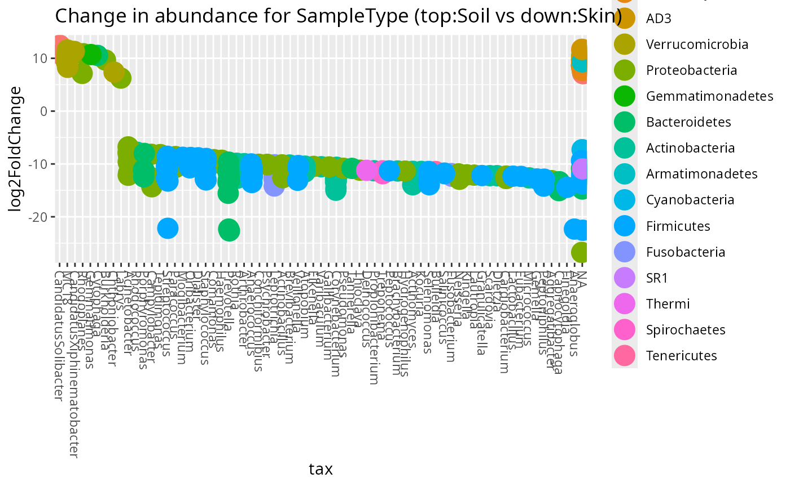

#### Using Linear discriminant analysis (LDA) Effect Size (LEfSe)

``` r
res_lefse <- lefser_pq(data_fungi, bifactor = "Height", modalities = c("Low", "High"))
lefser::lefserPlot(res_lefse)
#> Warning in geom_bar(stat = "identity", aes(fill = class), color = "black", :
#> Ignoring unknown parameters: `size`
```

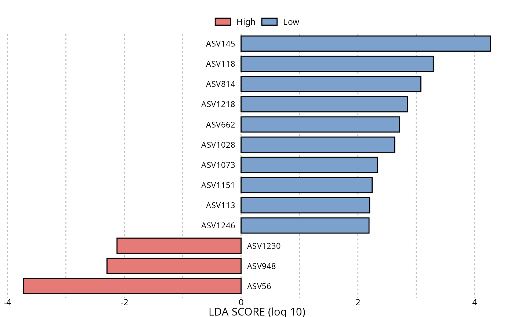

``` r

res_lefse_clade <- lefser_pq(data_fungi, bifactor = "Height", modalities = c("Low", "High"), by_clade = TRUE)
lefser::lefserPlot(res_lefse_clade)
#> Warning in geom_bar(stat = "identity", aes(fill = class), color = "black", :
#> Ignoring unknown parameters: `size`
```

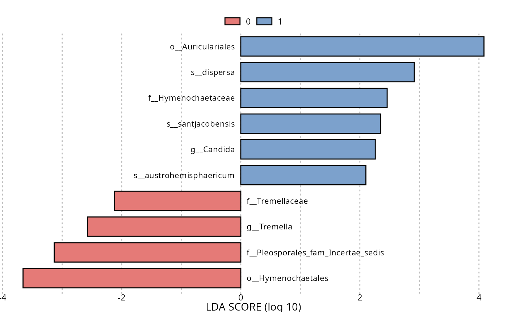

#### Using ALDEx2 package

``` r
res_aldex <- aldex_pq(data_fungi_mini, bifactor = "Height", modalities = c("Low", "High"))

ALDEx2::aldex.plot(res_aldex, type = "volcano")
```


#### Using ancombc

``` r
res_ancombc <- ancombc_pq(
  data_fungi_mini,
  fact = "Height",
  levels_fact = c("Low", "High"),
  verbose = TRUE
)
#> Warning: The group variable has < 3 categories 
#> The multi-group comparisons (global/pairwise/dunnet/trend) will be deactivated
#> Warning: The number of taxa used for estimating sample-specific biases is: 11
#> A large number of taxa (>50) is required for the consistent estimation of biases
#> Warning: Estimation of sampling fractions failed for the following samples:
#> B18-006-B_S19_MERGED.fastq.gz, DY5-004-B_S96_MERGED.fastq.gz, W26-001-B_S165_MERGED.fastq.gz, X24-009-B_S170_MERGED.fastq.gz, X29-004-B_S174_MERGED.fastq.gz, Y28-002-B_S178_MERGED.fastq.gz, Z29-001-H_S185_MERGED.fastq.gz
#> These samples may have an excessive number of zero values
```

## Session information

``` r
sessionInfo()
#> R version 4.5.2 (2025-10-31)
#> Platform: x86_64-pc-linux-gnu
#> Running under: Pop!_OS 24.04 LTS
#> 
#> Matrix products: default
#> BLAS:   /usr/lib/x86_64-linux-gnu/blas/libblas.so.3.12.0 
#> LAPACK: /usr/lib/x86_64-linux-gnu/lapack/liblapack.so.3.12.0  LAPACK version 3.12.0
#> 
#> locale:
#>  [1] LC_CTYPE=fr_FR.UTF-8          LC_NUMERIC=C                 
#>  [3] LC_TIME=fr_FR.UTF-8           LC_COLLATE=fr_FR.UTF-8       
#>  [5] LC_MONETARY=fr_FR.UTF-8       LC_MESSAGES=fr_FR.UTF-8      
#>  [7] LC_PAPER=fr_FR.UTF-8          LC_NAME=fr_FR.UTF-8          
#>  [9] LC_ADDRESS=fr_FR.UTF-8        LC_TELEPHONE=fr_FR.UTF-8     
#> [11] LC_MEASUREMENT=fr_FR.UTF-8    LC_IDENTIFICATION=fr_FR.UTF-8
#> 
#> time zone: Europe/Paris
#> tzcode source: system (glibc)
#> 
#> attached base packages:
#> [1] grid      stats4    stats     graphics  grDevices utils     datasets 
#> [8] methods   base     
#> 
#> other attached packages:
#>  [1] doRNG_1.8.6.3               rngtools_1.5.2             
#>  [3] foreach_1.5.2               ALDEx2_1.42.0              
#>  [5] latticeExtra_0.6-31         lattice_0.22-9             
#>  [7] zCompositions_1.6.0         survival_3.8-6             
#>  [9] truncnorm_1.0-9             MASS_7.3-65                
#> [11] lefser_1.20.2               SummarizedExperiment_1.40.0
#> [13] Biobase_2.70.0              GenomicRanges_1.62.1       
#> [15] Seqinfo_1.0.0               IRanges_2.44.0             
#> [17] S4Vectors_0.48.0            BiocGenerics_0.56.0        
#> [19] generics_0.1.4              MatrixGenerics_1.22.0      
#> [21] matrixStats_1.5.0           MiscMetabar_0.14.6         
#> [23] purrr_1.2.1                 dplyr_1.2.0                
#> [25] dada2_1.38.0                Rcpp_1.1.1                 
#> [27] ggplot2_4.0.2               phyloseq_1.54.0            
#> 
#> loaded via a namespace (and not attached):
#>   [1] coin_1.4-3                      gld_2.6.8                      
#>   [3] nnet_7.3-20                     Biostrings_2.78.0              
#>   [5] TH.data_1.1-5                   vctrs_0.7.1                    
#>   [7] energy_1.7-12                   digest_0.6.39                  
#>   [9] png_0.1-8                       shape_1.4.6.1                  
#>  [11] proxy_0.4-29                    Exact_3.3                      
#>  [13] BiocBaseUtils_1.12.0            rbiom_2.2.1                    
#>  [15] ggrepel_0.9.6                   deldir_2.0-4                   
#>  [17] parallelly_1.46.1               permute_0.9-10                 
#>  [19] fontLiberation_0.1.0            pkgdown_2.2.0                  
#>  [21] reshape2_1.4.5                  withr_3.0.2                    
#>  [23] xfun_0.56                       ggfun_0.2.0                    
#>  [25] ggbeeswarm_0.7.3                emmeans_2.0.1                  
#>  [27] gmp_0.7-5.1                     systemfonts_1.3.1              
#>  [29] gtools_3.9.5                    ragg_1.5.0                     
#>  [31] tidytree_0.4.7                  zoo_1.8-15                     
#>  [33] GlobalOptions_0.1.3             pbapply_1.7-4                  
#>  [35] Formula_1.2-5                   otel_0.2.0                     
#>  [37] httr_1.4.7                      rhdf5filters_1.22.0            
#>  [39] rhdf5_2.54.1                    rstudioapi_0.18.0              
#>  [41] ggVennDiagram_1.5.7             base64enc_0.1-6                
#>  [43] ScaledMatrix_1.18.0             quadprog_1.5-8                 
#>  [45] SparseArray_1.10.8              doParallel_1.0.17              
#>  [47] xtable_1.8-4                    stringr_1.6.0                  
#>  [49] desc_1.4.3                      ade4_1.7-23                    
#>  [51] evaluate_1.0.5                  S4Arrays_1.10.1                
#>  [53] Rfast_2.1.5.2                   hms_1.1.4                      
#>  [55] irlba_2.3.7                     colorspace_2.1-2               
#>  [57] ggnetwork_0.5.14                reticulate_1.44.1              
#>  [59] phyloseqGraphTest_0.1.1         readxl_1.4.5                   
#>  [61] magrittr_2.0.4                  readr_2.1.6                    
#>  [63] viridis_0.6.5                   modeltools_0.2-24              
#>  [65] ggtree_4.0.4                    DECIPHER_3.6.0                 
#>  [67] scuttle_1.20.0                  class_7.3-23                   
#>  [69] Hmisc_5.2-5                     pillar_1.11.1                  
#>  [71] nlme_3.1-168                    iterators_1.0.14               
#>  [73] sna_2.8                         pwalign_1.6.0                  
#>  [75] decontam_1.30.0                 compiler_4.5.2                 
#>  [77] beachmat_2.26.0                 RSpectra_0.16-2                
#>  [79] stringi_1.8.7                   biomformat_1.38.0              
#>  [81] DescTools_0.99.60               minqa_1.2.8                    
#>  [83] GenomicAlignments_1.46.0        plyr_1.8.9                     
#>  [85] crayon_1.5.3                    abind_1.4-8                    
#>  [87] scater_1.38.0                   gridGraphics_0.5-1             
#>  [89] ggtext_0.1.2                    locfit_1.5-9.12                
#>  [91] haven_2.5.5                     bit_4.6.0                      
#>  [93] mia_1.18.0                      rootSolve_1.8.2.4              
#>  [95] sandwich_3.1-1                  libcoin_1.0-10                 
#>  [97] codetools_0.2-20                multcomp_1.4-29                
#>  [99] textshaping_1.0.4               directlabels_2025.6.24         
#> [101] BiocSingular_1.26.1             openssl_2.3.4                  
#> [103] bslib_0.10.0                    slam_0.1-55                    
#> [105] e1071_1.7-17                    lmom_3.2                       
#> [107] multtest_2.66.0                 MultiAssayExperiment_1.36.1    
#> [109] splines_4.5.2                   circlize_0.4.17                
#> [111] sparseMatrixStats_1.22.0        cellranger_1.1.0               
#> [113] interp_1.1-6                    gridtext_0.1.5                 
#> [115] knitr_1.51                      utf8_1.2.6                     
#> [117] lme4_1.1-38                     fs_1.6.6                       
#> [119] checkmate_2.3.4                 DelayedMatrixStats_1.32.0      
#> [121] Rdpack_2.6.6                    expm_1.0-0                     
#> [123] gsl_2.1-9                       ggplotify_0.1.3                
#> [125] estimability_1.5.1              tibble_3.3.1                   
#> [127] Matrix_1.7-4                    tzdb_0.5.0                     
#> [129] pkgconfig_2.0.3                 network_1.20.0                 
#> [131] tools_4.5.2                     cachem_1.1.0                   
#> [133] rbibutils_2.4.1                 cigarillo_1.0.0                
#> [135] numDeriv_2016.8-1.1             viridisLite_0.4.3              
#> [137] DBI_1.2.3                       zigg_0.0.2                     
#> [139] venneuler_1.1-4                 fastmap_1.2.0                  
#> [141] rmarkdown_2.30                  scales_1.4.0                   
#> [143] fillpattern_1.0.2               Rsamtools_2.26.0               
#> [145] sass_0.4.10                     patchwork_1.3.2                
#> [147] coda_0.19-4.1                   rpart_4.1.24                   
#> [149] reformulas_0.4.4                farver_2.1.2                   
#> [151] mgcv_1.9-4                      yaml_2.3.12                    
#> [153] foreign_0.8-91                  cli_3.6.5                      
#> [155] lifecycle_1.0.5                 askpass_1.2.1                  
#> [157] mvtnorm_1.3-3                   bluster_1.20.0                 
#> [159] backports_1.5.0                 BiocParallel_1.44.0            
#> [161] gtable_0.3.6                    umap_0.2.10.0                  
#> [163] ANCOMBC_2.12.0                  parallel_4.5.2                 
#> [165] ape_5.8-1                       testthat_3.3.2                 
#> [167] CVXR_1.0-15                     jsonlite_2.0.0                 
#> [169] bitops_1.0-9                    bit64_4.6.0-1                  
#> [171] brio_1.1.5                      Rtsne_0.17                     
#> [173] yulab.utils_0.2.4               vegan_2.7-2                    
#> [175] BiocNeighbors_2.4.0             TreeSummarizedExperiment_2.18.0
#> [177] RcppParallel_5.1.11-1           jquerylib_0.1.4                
#> [179] lazyeval_0.2.2                  htmltools_0.5.9                
#> [181] rJava_1.0-14                    rappdirs_0.3.4                 
#> [183] glue_1.8.0                      XVector_0.50.0                 
#> [185] gdtools_0.5.0                   treeio_1.34.0                  
#> [187] ComplexUpset_1.3.3              jpeg_0.1-11                    
#> [189] gridExtra_2.3                   boot_1.3-32                    
#> [191] igraph_2.2.1                    R6_2.6.1                       
#> [193] tidyr_1.3.2                     DESeq2_1.50.2                  
#> [195] SingleCellExperiment_1.32.0     ggiraph_0.9.4                  
#> [197] Rmpfr_1.1-2                     forcats_1.0.1                  
#> [199] labeling_0.4.3                  cluster_2.1.8.2                
#> [201] Rhdf5lib_1.32.0                 aplot_0.2.9                    
#> [203] nloptr_2.2.1                    statnet.common_4.13.0          
#> [205] DirichletMultinomial_1.52.0     DelayedArray_0.36.0            
#> [207] tidyselect_1.2.1                vipor_0.4.7                    
#> [209] microbiome_1.32.0               htmlTable_2.4.3                
#> [211] xml2_1.5.2                      fontBitstreamVera_0.1.1        
#> [213] rsvd_1.0.5                      S7_0.2.1                       
#> [215] fontquiver_0.2.1                data.table_1.18.2.1            
#> [217] htmlwidgets_1.6.4               RColorBrewer_1.1-3             
#> [219] hwriter_1.3.2.1                 rlang_1.1.7                    
#> [221] lmerTest_3.2-0                  ShortRead_1.68.0               
#> [223] ggnewscale_0.5.2                beeswarm_0.4.0
```
