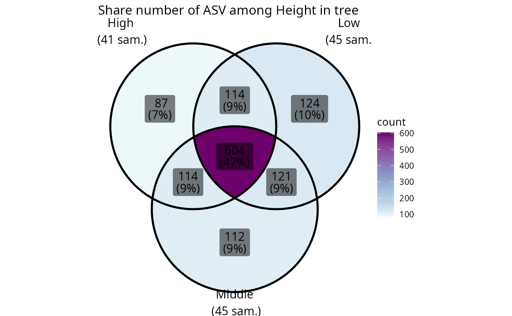
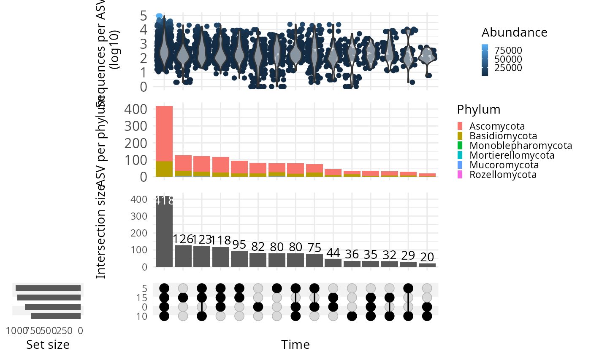

# Beta-diversity analysis

``` r
library(MiscMetabar)
data(data_fungi)
```

### Permanova

``` r
data_fungi_woNA4height <- subset_samples(data_fungi, !is.na(data_fungi@sam_data$Height))
res_ado <- adonis_pq(data_fungi_woNA4height, "Tree_name+Height")
knitr::kable(res_ado)
```

|          |  Df | SumOfSqs |        R2 |        F | Pr(\>F) |
|:---------|----:|---------:|----------:|---------:|--------:|
| Model    |  63 | 36.92559 | 0.5881754 | 1.518899 |   0.001 |
| Residual |  67 | 25.85431 | 0.4118246 |       NA |      NA |
| Total    | 130 | 62.77990 | 1.0000000 |       NA |      NA |

### Graph Test

``` r
data_fungi_woNA4height <- subset_samples(data_fungi, !is.na(data_fungi@sam_data$Height))
graph_test_pq(data_fungi_woNA4height, "Height")
```


### Circle of ASVs

``` r
circle_pq(data_fungi_woNA4height, "Height")
```


### Compare two (group of) samples

#### Biplot

``` r
data_fungi_low_high <- subset_samples(
  data_fungi,
  data_fungi@sam_data$Height %in%
    c("Low", "High")
)
data_fungi_low_high <- subset_taxa_pq(
  data_fungi_low_high,
  taxa_sums(data_fungi_low_high) > 5000
)
biplot_pq(data_fungi_low_high, fact = "Height", merge_sample_by = "Height")
```


#### Compare two (group of) samples with a table

``` r
compare_pairs_pq(data_fungi_low_high,
  bifactor = "Height",
  merge_sample_by = "Height",
  modality = "Time"
)
#> # A tibble: 4 × 13
#>   modality nb_ASV_High nb_ASV_Low nb_shared_ASV div_High div_Low nb_shared_seq
#>   <chr>          <dbl>      <dbl>         <dbl>    <dbl>   <dbl>         <dbl>
#> 1 0                 12         16             9     1.8     1.37         57639
#> 2 5                 20         18            14     1.95    1.98         76006
#> 3 10                11         13            10     1.18    1.25         47042
#> 4 15                17         19            12     2       2.04        161348
#> # ℹ 6 more variables: percent_shared_seq_High <dbl>,
#> #   percent_shared_seq_Low <dbl>, percent_shared_ASV_High <dbl>,
#> #   percent_shared_ASV_Low <dbl>, ratio_nb_High_Low <dbl>,
#> #   ratio_div_High_Low <dbl>
```

### Venn diagram

``` r
library("grid")
venn_pq(data_fungi, fact = "Height")
```


``` r
ggvenn_pq(data_fungi, fact = "Height") +
  ggplot2::scale_fill_distiller(palette = "BuPu", direction = 1) +
  labs(title = "Share number of ASV among Height in tree")
```



``` r
ggvenn_pq(data_fungi, fact = "Height", min_nb_seq = 5000) +
  ggplot2::scale_fill_distiller(palette = "BuPu", direction = 1) +
  labs(title = "Share number of ASV with more than 5000 seqs")
```


``` r
ggvenn_pq(data_fungi,
  fact = "Height", taxonomic_rank = "Genus",
  min_nb_seq = 100
) +
  ggplot2::scale_fill_distiller(palette = "BuPu", direction = 1) +
  labs(title = "Share number of Genus represented by at least one ASV with more than 100 seqs")
```


### Upset plot

Venn diagram can quickly become complex to read when the number of
modalities increase. One graphical solution is upset plot. MiscMetabar
propose a solution based on the package
[ComplexUpset](https://krassowski.github.io/complex-upset/).

``` r
upset_pq(data_fungi, fact = "Height")
#> Warning: Using `size` aesthetic for lines was deprecated in ggplot2 3.4.0.
#> ℹ Please use `linewidth` instead.
#> ℹ The deprecated feature was likely used in the ComplexUpset package.
#>   Please report the issue at
#>   <https://github.com/krassowski/complex-upset/issues>.
#> This warning is displayed once every 8 hours.
#> Call `lifecycle::last_lifecycle_warnings()` to see where this warning was
#> generated.
```


``` r
upset_pq(data_fungi, fact = "Time")
```


`ComplexUpset` package allow powerful configuration of you plot as you
can see in the following figure.

``` r
upset_pq(
  data_fungi,
  fact = "Time",
  width_ratio = 0.2,
  annotations = list(
    "Sequences per ASV \n (log10)" = (
      ggplot(mapping = aes(y = log10(Abundance)))
      +
        geom_jitter(aes(
          color =
            Abundance
        ), na.rm = TRUE)
        +
        geom_violin(alpha = 0.5, na.rm = TRUE) +
        theme(legend.key.size = unit(0.2, "cm")) +
        theme(axis.text = element_text(size = 12))
    ),
    "ASV per phylum" = (
      ggplot(mapping = aes(fill = Phylum))
      +
        geom_bar() +
        ylab("ASV per phylum") +
        theme(legend.key.size = unit(0.2, "cm")) +
        theme(axis.text = element_text(size = 12))
    )
  )
)
```



### Change in abundance across a factor

#### Benchdamic

There is a lot of available methods. Please refer to R package
[benchdamic](https://github.com/mcalgaro93/benchdamic) for a list of
method and a implementation of a benchmark for your data.

#### Library requirement for Debian Linux OS

``` sh
sudo apt-get install libgsl-dev libmpfr-dev
```

#### Using Deseq2 package

``` r
data("GlobalPatterns", package = "phyloseq")
GP <- subset_samples(
  GlobalPatterns,
  GlobalPatterns@sam_data$SampleType %in% c("Soil", "Skin")
)

plot_deseq2_pq(GP, c("SampleType", "Soil", "Skin"), pval = 0.001)
```


## Session information

``` r
sessionInfo()
#> R version 4.5.1 (2025-06-13)
#> Platform: x86_64-pc-linux-gnu
#> Running under: Kali GNU/Linux Rolling
#> 
#> Matrix products: default
#> BLAS:   /usr/lib/x86_64-linux-gnu/openblas-pthread/libblas.so.3 
#> LAPACK: /usr/lib/x86_64-linux-gnu/openblas-pthread/libopenblasp-r0.3.29.so;  LAPACK version 3.12.0
#> 
#> locale:
#>  [1] LC_CTYPE=fr_FR.UTF-8          LC_NUMERIC=C                 
#>  [3] LC_TIME=fr_FR.UTF-8           LC_COLLATE=fr_FR.UTF-8       
#>  [5] LC_MONETARY=fr_FR.UTF-8       LC_MESSAGES=fr_FR.UTF-8      
#>  [7] LC_PAPER=fr_FR.UTF-8          LC_NAME=fr_FR.UTF-8          
#>  [9] LC_ADDRESS=fr_FR.UTF-8        LC_TELEPHONE=fr_FR.UTF-8     
#> [11] LC_MEASUREMENT=fr_FR.UTF-8    LC_IDENTIFICATION=fr_FR.UTF-8
#> 
#> time zone: Europe/Paris
#> tzcode source: system (glibc)
#> 
#> attached base packages:
#> [1] grid      stats     graphics  grDevices utils     datasets  methods  
#> [8] base     
#> 
#> other attached packages:
#> [1] MiscMetabar_0.14.4 purrr_1.1.0        dplyr_1.1.4        dada2_1.36.0      
#> [5] Rcpp_1.1.0         ggplot2_4.0.0      phyloseq_1.52.0   
#> 
#> loaded via a namespace (and not attached):
#>   [1] bitops_1.0-9                pbapply_1.7-4              
#>   [3] deldir_2.0-4                gridExtra_2.3              
#>   [5] permute_0.9-8               rlang_1.1.6                
#>   [7] magrittr_2.0.4              ade4_1.7-23                
#>   [9] matrixStats_1.5.0           compiler_4.5.1             
#>  [11] mgcv_1.9-3                  png_0.1-8                  
#>  [13] systemfonts_1.2.3           vctrs_0.6.5                
#>  [15] reshape2_1.4.4              phyloseqGraphTest_0.1.1    
#>  [17] stringr_1.5.2               pwalign_1.4.0              
#>  [19] shape_1.4.6.1               pkgconfig_2.0.3            
#>  [21] crayon_1.5.3                fastmap_1.2.0              
#>  [23] XVector_0.48.0              labeling_0.4.3             
#>  [25] utf8_1.2.6                  Rsamtools_2.24.1           
#>  [27] rmarkdown_2.29              UCSC.utils_1.4.0           
#>  [29] ragg_1.5.0                  network_1.19.0             
#>  [31] xfun_0.53                   cachem_1.1.0               
#>  [33] GenomeInfoDb_1.44.3         jsonlite_2.0.0             
#>  [35] biomformat_1.36.0           rhdf5filters_1.20.0        
#>  [37] DelayedArray_0.34.1         Rhdf5lib_1.30.0            
#>  [39] BiocParallel_1.42.2         jpeg_0.1-11                
#>  [41] parallel_4.5.1              cluster_2.1.8.1            
#>  [43] R6_2.6.1                    bslib_0.9.0                
#>  [45] stringi_1.8.7               RColorBrewer_1.1-3         
#>  [47] ComplexUpset_1.3.3          GenomicRanges_1.60.0       
#>  [49] jquerylib_0.1.4             SummarizedExperiment_1.38.1
#>  [51] iterators_1.0.14            knitr_1.50                 
#>  [53] IRanges_2.42.0              Matrix_1.7-4               
#>  [55] splines_4.5.1               igraph_2.1.4               
#>  [57] tidyselect_1.2.1            abind_1.4-8                
#>  [59] yaml_2.3.10                 ggVennDiagram_1.5.4        
#>  [61] vegan_2.7-1                 codetools_0.2-20           
#>  [63] hwriter_1.3.2.1             lattice_0.22-7             
#>  [65] tibble_3.3.0                plyr_1.8.9                 
#>  [67] Biobase_2.68.0              withr_3.0.2                
#>  [69] ShortRead_1.66.0            S7_0.2.0                   
#>  [71] coda_0.19-4.1               evaluate_1.0.5             
#>  [73] desc_1.4.3                  survival_3.8-3             
#>  [75] rJava_1.0-11                RcppParallel_5.1.11-1      
#>  [77] circlize_0.4.16             Biostrings_2.76.0          
#>  [79] pillar_1.11.1               MatrixGenerics_1.20.0      
#>  [81] foreach_1.5.2               stats4_4.5.1               
#>  [83] generics_0.1.4              S4Vectors_0.46.0           
#>  [85] scales_1.4.0                ggnetwork_0.5.14           
#>  [87] glue_1.8.0                  tools_4.5.1                
#>  [89] interp_1.1-6                data.table_1.17.8          
#>  [91] locfit_1.5-9.12             GenomicAlignments_1.44.0   
#>  [93] fs_1.6.6                    rhdf5_2.52.1               
#>  [95] tidyr_1.3.1                 ape_5.8-1                  
#>  [97] latticeExtra_0.6-31         colorspace_2.1-2           
#>  [99] patchwork_1.3.2             nlme_3.1-168               
#> [101] GenomeInfoDbData_1.2.14     cli_3.6.5                  
#> [103] textshaping_1.0.3           S4Arrays_1.8.1             
#> [105] gtable_0.3.6                DESeq2_1.48.2              
#> [107] sass_0.4.10                 digest_0.6.37              
#> [109] BiocGenerics_0.54.0         SparseArray_1.8.1          
#> [111] sna_2.8                     htmlwidgets_1.6.4          
#> [113] farver_2.1.2                venneuler_1.1-4            
#> [115] htmltools_0.5.8.1           pkgdown_2.1.3              
#> [117] multtest_2.64.0             lifecycle_1.0.4            
#> [119] httr_1.4.7                  GlobalOptions_0.1.2        
#> [121] statnet.common_4.12.0       MASS_7.3-65
```
