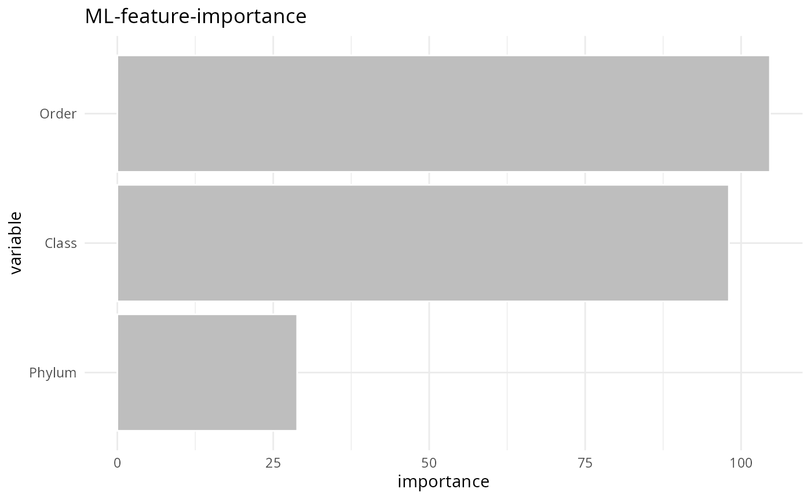

# explore_data

## Explore phyloseq data

``` r
library(MiscMetabar)
data(data_fungi)
```

``` r
summary_plot_pq(data_fungi)
```


### Explore samples metadata

``` r
sam_tab <- tibble::as_tibble(unclass(data_fungi@sam_data))
```

``` r
summarytools::dfSummary(sam_tab)
summarytools::descr(sam_tab)
summarytools::freq(sam_tab)
```

``` r
summarytools::ctable(sam_tab$Height, sam_tab$Time, chisq = TRUE)
#> Warning in chisq.test(freq_table_min): Chi-squared approximation may be
#> incorrect
```

``` r
sam_tab |>
  explore::describe()

sam_tab |>
  explore::explore_all(target = Height)
```


``` r
sam_tab |>
  explore::explain_tree(target = Height)
```


``` r
datawizard::data_codebook(sam_tab)
```

``` r
pillar::glimpse(sam_tab)
#> Warning in class(x) <- tibble_class: Setting class(x) to multiple strings
#> ("tbl_df", "tbl", ...); result will no longer be an S4 object
```

``` r
report::report_sample(data_fungi@sam_data, select = c("Height", "Time"), by = "Tree_name")
```

``` r
pointblank::scan_data(sam_tab, sections = "OVSCMI")
#> Warning in class(x) <- tibble_class: Setting class(x) to multiple strings
#> ("tbl_df", "tbl", ...); result will no longer be an S4 object

pointblank::create_informant(
  tbl = sam_tab,
  tbl_name = "Sample data",
  label = "data_fungi"
)
```

``` r
gtExtras::gt_plt_summary(sam_tab)
```

### Explore taxonomic data

``` r
tax_tab <- tibble::as_tibble(unclass(data_fungi@tax_table))
```

``` r
summarytools::dfSummary(tax_tab)
```

``` r
summarytools::ctable(grepl("Ectomycorrhizal", tax_tab$Guild), tax_tab$Class, chisq = TRUE)
#> Warning in chisq.test(freq_table_min): Chi-squared approximation may be
#> incorrect
```

``` r
tax_tab |>
  select(Guild, Phylum, Class, Order) |>
  tidyr::drop_na() |>
  explore::explain_forest(target = Guild)
```



``` r
datawizard::data_codebook(tax_tab)
#> Warning: The table contains very wide columns that don't fit into the available
#>   display-width of the console. Splitting tables into multiple parts did
#>   not have the desired effect.
```

``` r
pillar::glimpse(tax_tab)
```

``` r
pointblank::scan_data(tax_tab, sections = "OVSCM")

pointblank::create_informant(
  tbl = tax_tab,
  tbl_name = "Taxonomic table",
  label = "data_fungi"
)
```

``` r
gtExtras::gt_plt_summary(tax_tab)
```

``` r
fungi_order <- tax_glom(data_fungi, taxrank = "Order")
taxa_names(fungi_order) <- fungi_order@tax_table[, "Order"]
heatmap(fungi_order@otu_table)
```


### Report Session information

``` r
report::report(sessionInfo())
#> Warning in utils::citation(pkg_name): could not determine year for
#> 'MiscMetabar' from package DESCRIPTION file
```

## Session information

``` r
sessionInfo()
```
