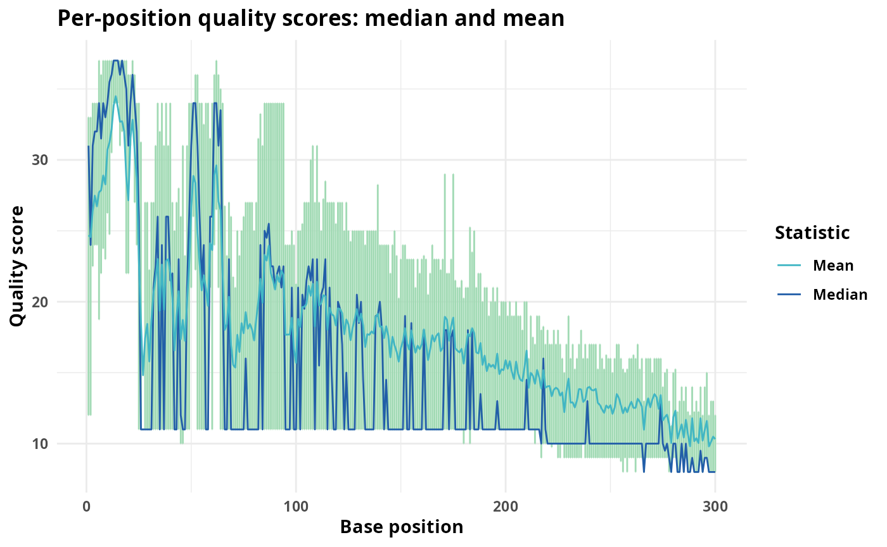

# fastq_quality_check

The [fastqcr](https://github.com/kassambara/fastqcr) package allow to
check fastq quality and build reports about multiple fastq files. We
also present here how to plot base quality using the
[Rsearch](https://cassandrahjo.github.io/Rsearch/reference/plot_base_quality.html)
package.

## Load the necessary packages

``` r
library(fastqcr)
library(MiscMetabar)
```

    ## Loading required package: phyloseq

    ## Loading required package: ggplot2

    ## Loading required package: dada2

    ## Loading required package: Rcpp

    ## Loading required package: dplyr

    ## 
    ## Attaching package: 'dplyr'

    ## The following objects are masked from 'package:stats':
    ## 
    ##     filter, lag

    ## The following objects are masked from 'package:base':
    ## 
    ##     intersect, setdiff, setequal, union

    ## Loading required package: purrr

## Install the latest version of FastQC tool on Unix systems (MAC OSX and Linux)

``` r
fastqc_install()
```

## Run the analysis

``` r
qc.dir <- "fastqc_results"

# Demo QC directory containing zipped FASTQC reports
fastq_dir <- list_fastq_files(system.file("/extdata", package = "MiscMetabar"))
fastqcr::fastqc(dirname(fastq_dir[[1]]), qc.dir = qc.dir)
qc <- fastqcr::qc_aggregate(qc.dir)
```

``` r
fastqcr::qc_problems(qc)
fastqcr::qc_stats(qc)
summary(qc)
```

## Plot base quality with Rsearch package

``` r
library(Rsearch)

fastq_dir <- list_fastq_files(system.file("/extdata", package = "MiscMetabar"))

qual_plots <- plot_base_quality(
  fastq_input = fastq_dir$fnfs,
  reverse = fastq_dir$reverse
)
print(qual_plots)
```



## Build reports

``` r
# Building Multi QC Reports
fastqcr::qc_report(qc.dir, result.file = "multi-qc-report")

# Building One-Sample QC Reports (+ Interpretation)
qc.file <- system.file("fastqc_results", "S1_fastqc.zip", package = "fastqcr")
fastqcr::qc_report(qc.file, result.file = "one-sample-report", interpret = TRUE)
```
