# Examples with published dataset: Tengeler

This tutorial explore a phyloseq version of the dataset from Tengeler et
al. (2020) available in the `mia` package.

## Load library

``` r
library("MicrobiotaProcess")
library("MiscMetabar")
library("ggplot2")
library("patchwork")
library("iNEXT")
```

``` r
?Tengeler2020
```

## Import dataset in phyloseq format

``` r
data(Tengeler2020_pq)
ten <- Tengeler2020_pq
summary_plot_pq(ten)
```

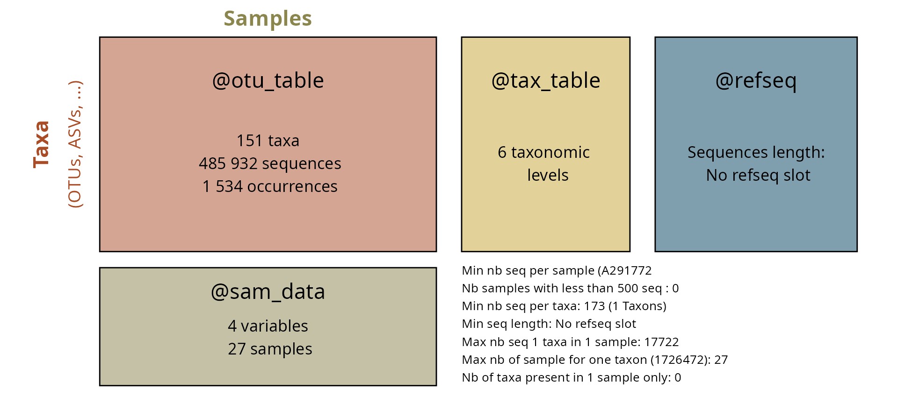

## Alpha-diversity analysis

``` r
hill_pq(ten, "patient_status", one_plot = TRUE)
```

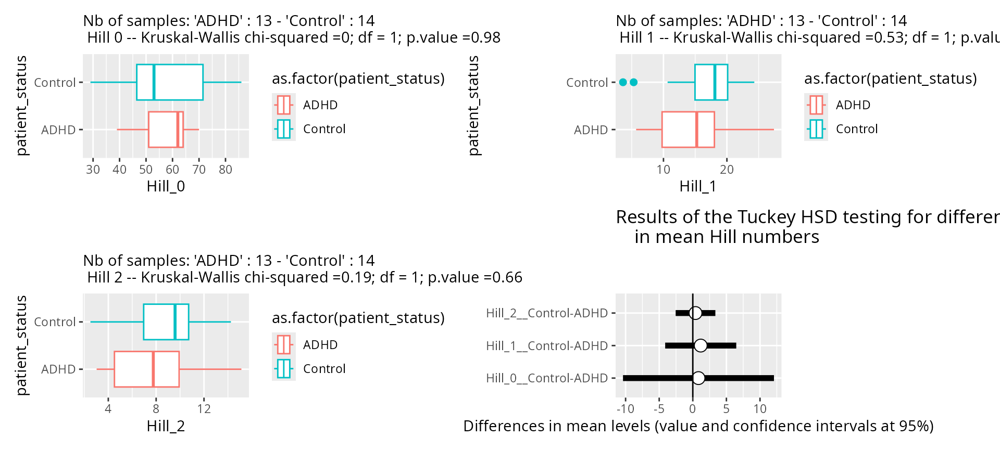

``` r
res_inext <-
  iNEXT_pq(ten,
    datatype = "abundance",
    merge_sample_by = "patient_status_vs_cohort",
    nboot = 5
  )
ggiNEXT(res_inext)
#> Warning: `aes_string()` was deprecated in ggplot2 3.0.0.
#> ℹ Please use tidy evaluation idioms with `aes()`.
#> ℹ See also `vignette("ggplot2-in-packages")` for more information.
#> ℹ The deprecated feature was likely used in the iNEXT package.
#>   Please report the issue at <https://github.com/AnneChao/iNEXT/issues>.
#> This warning is displayed once per session.
#> Call `lifecycle::last_lifecycle_warnings()` to see where this warning was
#> generated.
```

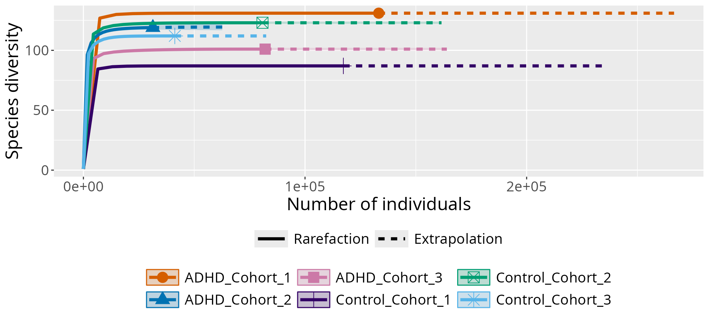

``` r
accu_plot(
  ten,
  fact = "sample_name",
  add_nb_seq = TRUE,
  by.fact = TRUE,
  step = 100
) + theme(legend.position = c(0.8, 0.6))
#> Warning in vegan::rarefy(as.matrix(unclass(x[i, ])), n, se = TRUE): most
#> observed count data have counts 1, but smallest count is 9
#> Warning in vegan::rarefy(as.matrix(unclass(x[i, ])), n, se = TRUE): most
#> observed count data have counts 1, but smallest count is 17
#> Warning in vegan::rarefy(as.matrix(unclass(x[i, ])), n, se = TRUE): most
#> observed count data have counts 1, but smallest count is 25
#> Warning in vegan::rarefy(as.matrix(unclass(x[i, ])), n, se = TRUE): most
#> observed count data have counts 1, but smallest count is 7
#> Warning in vegan::rarefy(as.matrix(unclass(x[i, ])), n, se = TRUE): most
#> observed count data have counts 1, but smallest count is 8
#> Warning in vegan::rarefy(as.matrix(unclass(x[i, ])), n, se = TRUE): most
#> observed count data have counts 1, but smallest count is 6
#> Warning in vegan::rarefy(as.matrix(unclass(x[i, ])), n, se = TRUE): most
#> observed count data have counts 1, but smallest count is 14
#> Warning in vegan::rarefy(as.matrix(unclass(x[i, ])), n, se = TRUE): most
#> observed count data have counts 1, but smallest count is 28
#> Warning in vegan::rarefy(as.matrix(unclass(x[i, ])), n, se = TRUE): most
#> observed count data have counts 1, but smallest count is 3
#> Warning in vegan::rarefy(as.matrix(unclass(x[i, ])), n, se = TRUE): most
#> observed count data have counts 1, but smallest count is 7
#> Warning in vegan::rarefy(as.matrix(unclass(x[i, ])), n, se = TRUE): most
#> observed count data have counts 1, but smallest count is 2
#> Warning in vegan::rarefy(as.matrix(unclass(x[i, ])), n, se = TRUE): most
#> observed count data have counts 1, but smallest count is 15
#> Warning in vegan::rarefy(as.matrix(unclass(x[i, ])), n, se = TRUE): most
#> observed count data have counts 1, but smallest count is 5
#> Warning in vegan::rarefy(as.matrix(unclass(x[i, ])), n, se = TRUE): most
#> observed count data have counts 1, but smallest count is 5
#> Warning in vegan::rarefy(as.matrix(unclass(x[i, ])), n, se = TRUE): most
#> observed count data have counts 1, but smallest count is 3
#> Warning in vegan::rarefy(as.matrix(unclass(x[i, ])), n, se = TRUE): most
#> observed count data have counts 1, but smallest count is 6
#> Warning in vegan::rarefy(as.matrix(unclass(x[i, ])), n, se = TRUE): most
#> observed count data have counts 1, but smallest count is 3
#> Warning in vegan::rarefy(as.matrix(unclass(x[i, ])), n, se = TRUE): most
#> observed count data have counts 1, but smallest count is 4
#> Warning in vegan::rarefy(as.matrix(unclass(x[i, ])), n, se = TRUE): most
#> observed count data have counts 1, but smallest count is 6
#> Warning in vegan::rarefy(as.matrix(unclass(x[i, ])), n, se = TRUE): most
#> observed count data have counts 1, but smallest count is 3
#> Warning in vegan::rarefy(as.matrix(unclass(x[i, ])), n, se = TRUE): most
#> observed count data have counts 1, but smallest count is 3
#> Warning in vegan::rarefy(as.matrix(unclass(x[i, ])), n, se = TRUE): most
#> observed count data have counts 1, but smallest count is 21
#> Warning in vegan::rarefy(as.matrix(unclass(x[i, ])), n, se = TRUE): most
#> observed count data have counts 1, but smallest count is 5
#> Warning in vegan::rarefy(as.matrix(unclass(x[i, ])), n, se = TRUE): most
#> observed count data have counts 1, but smallest count is 13
#> Warning: Removed 1 row containing missing values or values outside the scale range
#> (`geom_ribbon()`).
#> Warning: Removed 1 row containing missing values or values outside the scale range
#> (`geom_line()`).
```

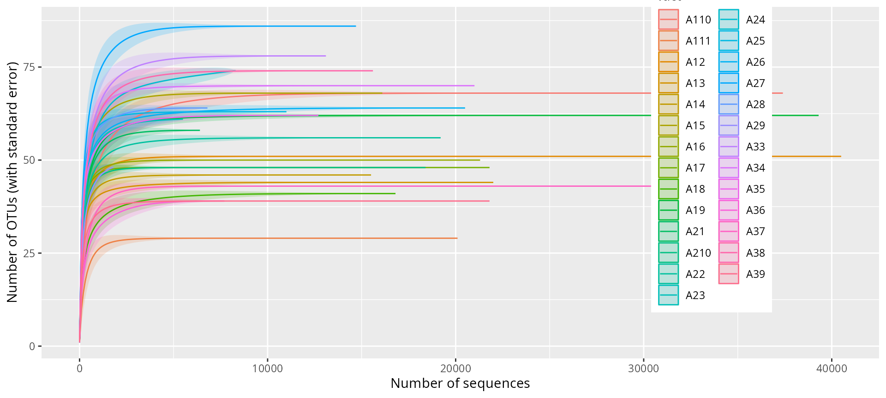

## Explore taxonomy

``` r
# library(metacoder)
# heat_tree_pq(
#   ten,
#   node_size = n_obs,
#   node_color = nb_sequences,
#   node_label = taxon_names,
#   tree_label = taxon_names,
#   node_size_trans = "log10 area"
# )
```

``` r
treemap_pq(ten, lvl1 = "Order", lvl2 = "Family")
```

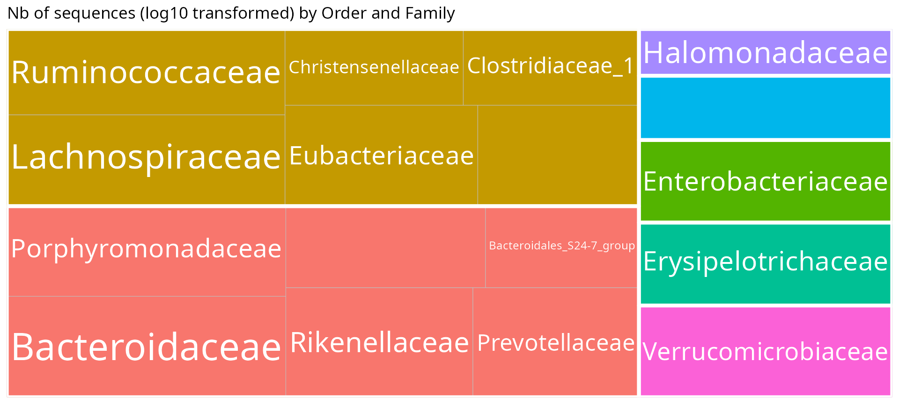

## Beta-diversity analysis : effect of patient status and cohort

``` r
circle_pq(ten, "patient_status")
```

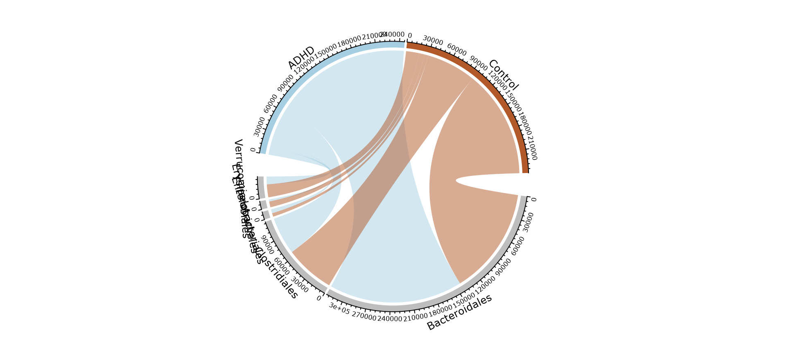

``` r
upset_pq(ten, "patient_status_vs_cohort")
#> Warning: Using `size` aesthetic for lines was deprecated in ggplot2 3.4.0.
#> ℹ Please use `linewidth` instead.
#> ℹ The deprecated feature was likely used in the ComplexUpset package.
#>   Please report the issue at
#>   <https://github.com/krassowski/complex-upset/issues>.
#> This warning is displayed once per session.
#> Call `lifecycle::last_lifecycle_warnings()` to see where this warning was
#> generated.
```

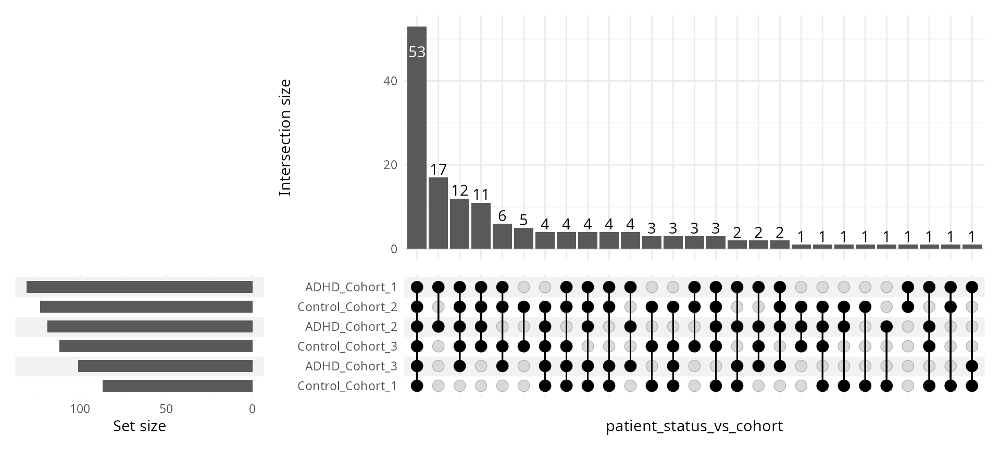

``` r
ggvenn_pq(clean_pq(ten, force_taxa_as_columns = TRUE),
  "cohort",
  rarefy_before_merging = TRUE
) +
  theme(legend.position = "none")
```

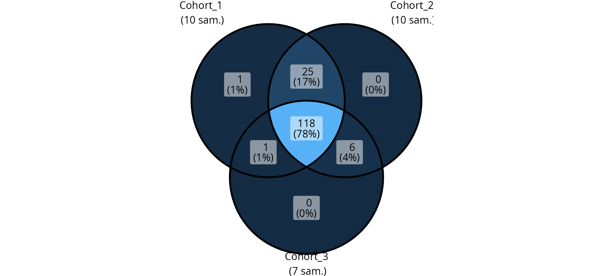

``` r
ten_control <- clean_pq(subset_samples(ten, patient_status == "Control"))
# p_control <- heat_tree_pq(
#   ten_control,
#   node_size = n_obs,
#   node_color = nb_sequences,
#   node_label = taxon_names,
#   tree_label = taxon_names,
#   node_size_trans = "log10 area"
# )

ten_ADHD <- clean_pq(subset_samples(ten, patient_status == "ADHD"))
# p_ADHD <- heat_tree_pq(
#   ten_ADHD,
#   node_size = n_obs,
#   node_color = nb_sequences,
#   node_label = taxon_names,
#   tree_label = taxon_names,
#   node_size_trans = "log10 area"
# )
#
# p_control + ggtitle("Control") + p_ADHD + ggtitle("ADHD")
```

``` r
knitr::kable(track_wkflow(list(
  "All samples" = ten,
  "Control samples" = ten_control,
  "ADHD samples" = ten_ADHD
)))
```

|                 | nb_sequences | nb_clusters | nb_samples |
|:----------------|-------------:|------------:|-----------:|
| All samples     |       485932 |         151 |         27 |
| Control samples |       239329 |         130 |         14 |
| ADHD samples    |       246603 |         142 |         13 |

``` r
adonis_pq(ten, "cohort + patient_status")
#> Permutation test for adonis under reduced model
#> Permutation: free
#> Number of permutations: 999
#> 
#> vegan::adonis2(formula = .formula, data = metadata)
#>          Df SumOfSqs      R2      F Pr(>F)  
#> Model     3   1.2425 0.18483 1.7383  0.028 *
#> Residual 23   5.4799 0.81517                
#> Total    26   6.7223 1.00000                
#> ---
#> Signif. codes:  0 '***' 0.001 '**' 0.01 '*' 0.05 '.' 0.1 ' ' 1
```

``` r
ten@tax_table <- phyloseq::tax_table(cbind(
  ten@tax_table,
  "Species" = taxa_names(ten)
))

biplot_pq(subset_taxa_pq(ten, taxa_sums(ten) > 3000),
  merge_sample_by = "patient_status",
  fact = "patient_status",
  nudge_y = 0.4
)
```

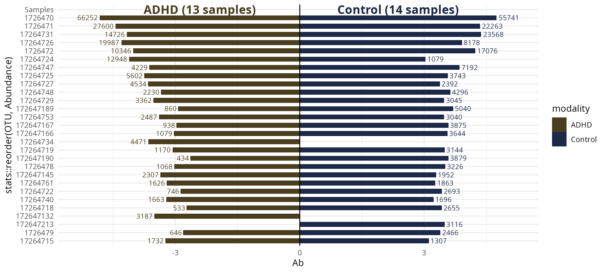

``` r
multitax_bar_pq(ten, "Phylum", "Class", "Order", "patient_status")
```

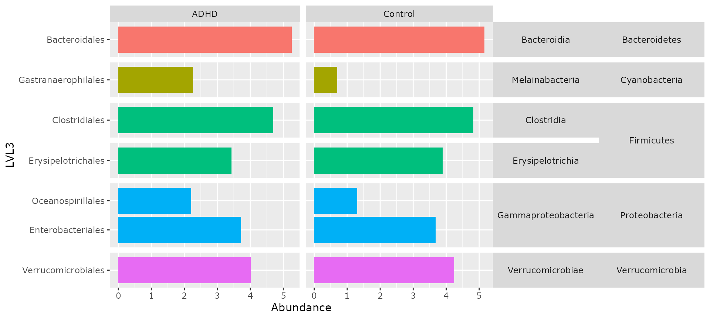

``` r
multitax_bar_pq(ten, "Phylum", "Class", "Order", "patient_status",
  nb_seq = FALSE, log10trans = FALSE
)
```

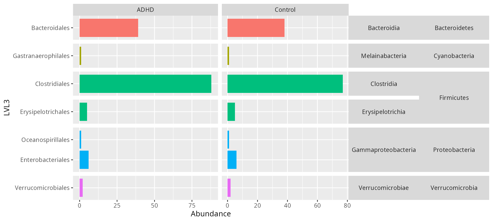

## Differential abundance analysis

``` r
plot_deseq2_pq(ten,
  contrast = c("patient_status", "ADHD", "Control"),
  taxolev = "Genus"
)
#> Warning in DESeqDataSet(se, design = design, ignoreRank): some variables in
#> design formula are characters, converting to factors
```

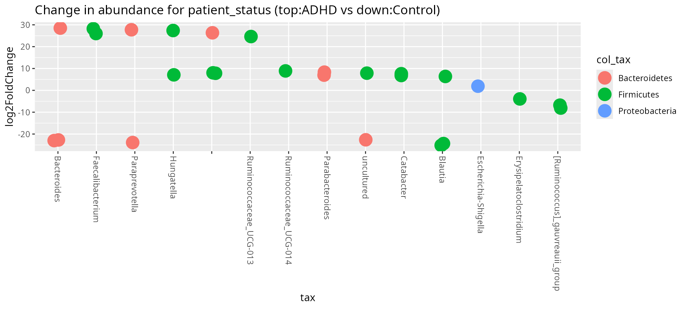

``` r
LEfSe <- diff_analysis(
  ten,
  classgroup = "patient_status",
  mlfun = "lda",
  ldascore = 2,
  p.adjust.methods = "bh"
)
library(ggplot2)
ggeffectsize(LEfSe) +
  scale_color_manual(values = c(
    "#00AED7",
    "#FD9347"
  )) +
  theme_bw()
#> Warning: `aes_()` was deprecated in ggplot2 3.0.0.
#> ℹ Please use tidy evaluation idioms with `aes()`
#> ℹ The deprecated feature was likely used in the MicrobiotaProcess package.
#>   Please report the issue at
#>   <https://github.com/YuLab-SMU/MicrobiotaProcess/issues>.
#> This warning is displayed once per session.
#> Call `lifecycle::last_lifecycle_warnings()` to see where this warning was
#> generated.
```

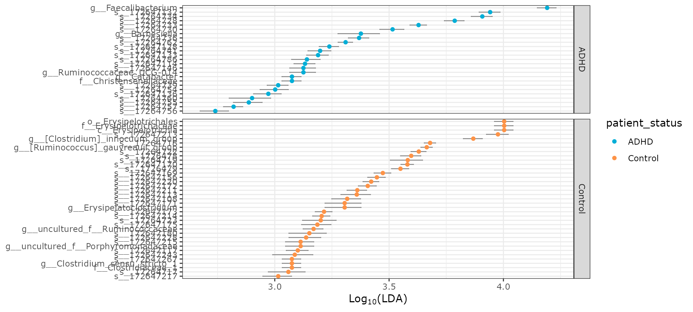

## Session information

``` r
sessionInfo()
#> R version 4.5.2 (2025-10-31)
#> Platform: x86_64-pc-linux-gnu
#> Running under: Pop!_OS 24.04 LTS
#> 
#> Matrix products: default
#> BLAS:   /usr/lib/x86_64-linux-gnu/blas/libblas.so.3.12.0 
#> LAPACK: /usr/lib/x86_64-linux-gnu/lapack/liblapack.so.3.12.0  LAPACK version 3.12.0
#> 
#> locale:
#>  [1] LC_CTYPE=en_US.UTF-8       LC_NUMERIC=C              
#>  [3] LC_TIME=en_US.UTF-8        LC_COLLATE=en_US.UTF-8    
#>  [5] LC_MONETARY=en_US.UTF-8    LC_MESSAGES=en_US.UTF-8   
#>  [7] LC_PAPER=en_US.UTF-8       LC_NAME=C                 
#>  [9] LC_ADDRESS=C               LC_TELEPHONE=C            
#> [11] LC_MEASUREMENT=en_US.UTF-8 LC_IDENTIFICATION=C       
#> 
#> time zone: Europe/Paris
#> tzcode source: system (glibc)
#> 
#> attached base packages:
#> [1] stats     graphics  grDevices utils     datasets  methods   base     
#> 
#> other attached packages:
#>  [1] iNEXT_3.0.2              patchwork_1.3.2          MiscMetabar_0.15.2      
#>  [4] divent_0.5-3             purrr_1.2.2              dplyr_1.2.1             
#>  [7] dada2_1.38.0             Rcpp_1.1.1               ggplot2_4.0.2           
#> [10] phyloseq_1.54.2          MicrobiotaProcess_1.22.1
#> 
#> loaded via a namespace (and not attached):
#>   [1] libcoin_1.0-12              RColorBrewer_1.1-3         
#>   [3] shape_1.4.6.1               jsonlite_2.0.0             
#>   [5] magrittr_2.0.5              TH.data_1.1-5              
#>   [7] modeltools_0.2-24           farver_2.1.2               
#>   [9] rmarkdown_2.31              GlobalOptions_0.1.4        
#>  [11] fs_2.0.1                    ragg_1.5.2                 
#>  [13] vctrs_0.7.3                 multtest_2.66.0            
#>  [15] Rsamtools_2.26.0            ggtree_4.0.5               
#>  [17] htmltools_0.5.9             S4Arrays_1.10.1            
#>  [19] ComplexUpset_1.3.3          Rhdf5lib_1.32.0            
#>  [21] SparseArray_1.10.10         rhdf5_2.54.1               
#>  [23] gridGraphics_0.5-1          sass_0.4.10                
#>  [25] bslib_0.10.0                htmlwidgets_1.6.4          
#>  [27] desc_1.4.3                  plyr_1.8.9                 
#>  [29] sandwich_3.1-1              zoo_1.8-15                 
#>  [31] cachem_1.1.0                ggfittext_0.10.3           
#>  [33] GenomicAlignments_1.46.0    igraph_2.2.3               
#>  [35] lifecycle_1.0.5             iterators_1.0.14           
#>  [37] pkgconfig_2.0.3             Matrix_1.7-4               
#>  [39] R6_2.6.1                    fastmap_1.2.0              
#>  [41] rbibutils_2.4.1             MatrixGenerics_1.22.0      
#>  [43] digest_0.6.39               aplot_0.2.9                
#>  [45] colorspace_2.1-2            ggnewscale_0.5.2           
#>  [47] ShortRead_1.68.0            S4Vectors_0.48.1           
#>  [49] DESeq2_1.50.2               textshaping_1.0.5          
#>  [51] GenomicRanges_1.62.1        hwriter_1.3.2.1            
#>  [53] vegan_2.7-3                 labeling_0.4.3             
#>  [55] abind_1.4-8                 mgcv_1.9-4                 
#>  [57] compiler_4.5.2              fontquiver_0.2.1           
#>  [59] withr_3.0.2                 S7_0.2.1                   
#>  [61] BiocParallel_1.44.0         ggsignif_0.6.4             
#>  [63] MASS_7.3-65                 rappdirs_0.3.4             
#>  [65] DelayedArray_0.36.1         biomformat_1.38.3          
#>  [67] permute_0.9-10              tools_4.5.2                
#>  [69] otel_0.2.0                  ape_5.8-1                  
#>  [71] glue_1.8.0                  treemapify_2.6.0           
#>  [73] nlme_3.1-168                rhdf5filters_1.22.0        
#>  [75] grid_4.5.2                  cluster_2.1.8.2            
#>  [77] reshape2_1.4.5              ade4_1.7-24                
#>  [79] generics_0.1.4              gtable_0.3.6               
#>  [81] tidyr_1.3.2                 ggVennDiagram_1.5.7        
#>  [83] data.table_1.18.2.1         coin_1.4-3                 
#>  [85] XVector_0.50.0              BiocGenerics_0.56.0        
#>  [87] ggrepel_0.9.8               foreach_1.5.2              
#>  [89] pillar_1.11.1               stringr_1.6.0              
#>  [91] yulab.utils_0.2.4           circlize_0.4.18            
#>  [93] splines_4.5.2               treeio_1.34.0              
#>  [95] lattice_0.22-9              deldir_2.0-4               
#>  [97] survival_3.8-6              tidyselect_1.2.1           
#>  [99] locfit_1.5-9.12             fontLiberation_0.1.0       
#> [101] pbapply_1.7-4               Biostrings_2.78.0          
#> [103] knitr_1.51                  fontBitstreamVera_0.1.1    
#> [105] gridExtra_2.3               IRanges_2.44.0             
#> [107] Seqinfo_1.0.0               SummarizedExperiment_1.40.0
#> [109] svglite_2.2.2               ggtreeExtra_1.21.0         
#> [111] stats4_4.5.2                xfun_0.57                  
#> [113] Biobase_2.70.0              matrixStats_1.5.0          
#> [115] stringi_1.8.7               lazyeval_0.2.3             
#> [117] ggfun_0.2.0                 yaml_2.3.12                
#> [119] evaluate_1.0.5              codetools_0.2-20           
#> [121] cigarillo_1.0.0             interp_1.1-6               
#> [123] gdtools_0.5.0               tibble_3.3.1               
#> [125] ggplotify_0.1.3             cli_3.6.6                  
#> [127] RcppParallel_5.1.11-2       Rdpack_2.6.6               
#> [129] systemfonts_1.3.2           jquerylib_0.1.4            
#> [131] png_0.1-9                   parallel_4.5.2             
#> [133] ggh4x_0.3.1                 pkgdown_2.2.0              
#> [135] jpeg_0.1-11                 latticeExtra_0.6-31        
#> [137] bitops_1.0-9                ggstar_1.0.6               
#> [139] pwalign_1.6.0               mvtnorm_1.3-6              
#> [141] tidytree_0.4.7              ggiraph_0.9.6              
#> [143] scales_1.4.0                crayon_1.5.3               
#> [145] rlang_1.2.0                 multcomp_1.4-30
```

## References

Tengeler, A.C., Dam, S.A., Wiesmann, M. et al. Gut microbiota from
persons with attention-deficit/hyperactivity disorder affects the brain
in mice. Microbiome 8, 44 (2020).
<https://microbiomejournal.biomedcentral.com/articles/10.1186/s40168-020-00816-x>
