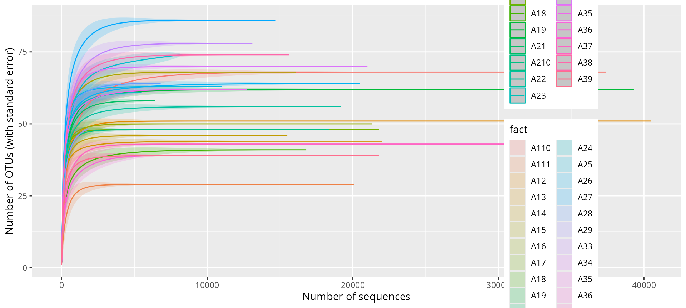
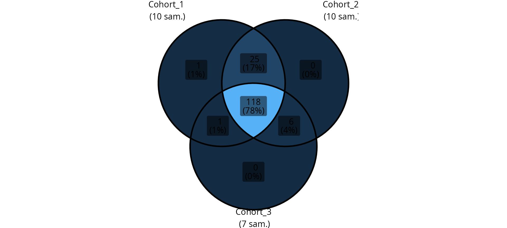
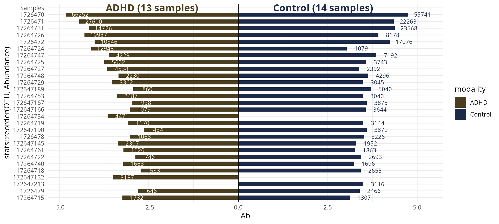
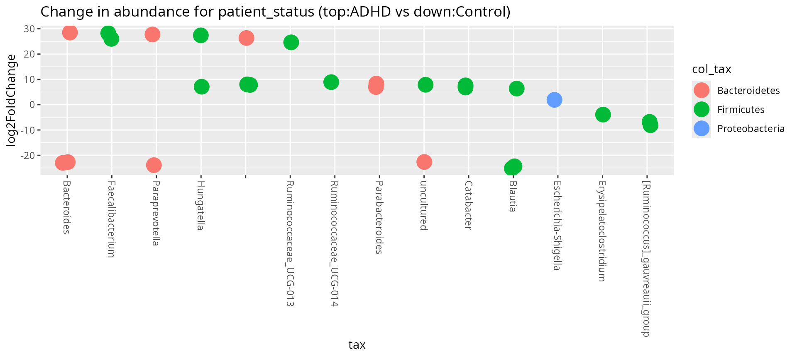
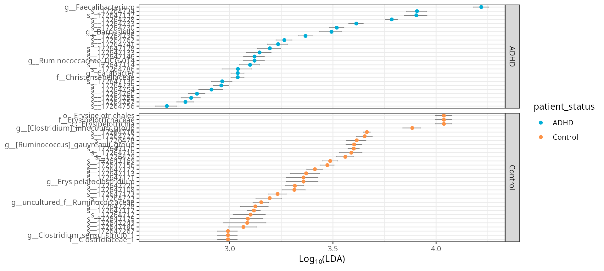

# Examples with published dataset: Tengeler

This tutorial explore a phyloseq version of the dataset from Tengeler et
al. (2020) available in the `mia` package.

## Load library

``` r
library("MicrobiotaProcess")
library("MiscMetabar")
library("ggplot2")
library("patchwork")
library("iNEXT")
```

``` r
?Tengeler2020
```

## Import dataset in phyloseq format

``` r
data(Tengeler2020_pq)
ten <- Tengeler2020_pq
summary_plot_pq(ten)
```


## Alpha-diversity analysis

``` r
hill_pq(ten, "patient_status", one_plot = TRUE)
```


``` r
res_inext <-
  iNEXT_pq(ten,
    datatype = "abundance",
    merge_sample_by = "patient_status_vs_cohort",
    nboot = 5
  )
ggiNEXT(res_inext)
#> Warning: `aes_string()` was deprecated in ggplot2 3.0.0.
#> ℹ Please use tidy evaluation idioms with `aes()`.
#> ℹ See also `vignette("ggplot2-in-packages")` for more information.
#> ℹ The deprecated feature was likely used in the iNEXT package.
#>   Please report the issue at <https://github.com/AnneChao/iNEXT/issues>.
#> This warning is displayed once every 8 hours.
#> Call `lifecycle::last_lifecycle_warnings()` to see where this warning was
#> generated.
```


``` r
accu_plot(
  ten,
  fact = "sample_name",
  add_nb_seq = TRUE,
  by.fact = TRUE,
  step = 100
) + theme(legend.position = c(.8, .6))
#> Warning in vegan::rarefy(as.matrix(unclass(x[i, ])), n, se = TRUE): most
#> observed count data have counts 1, but smallest count is 9
#> Warning in vegan::rarefy(as.matrix(unclass(x[i, ])), n, se = TRUE): most
#> observed count data have counts 1, but smallest count is 17
#> Warning in vegan::rarefy(as.matrix(unclass(x[i, ])), n, se = TRUE): most
#> observed count data have counts 1, but smallest count is 25
#> Warning in vegan::rarefy(as.matrix(unclass(x[i, ])), n, se = TRUE): most
#> observed count data have counts 1, but smallest count is 7
#> Warning in vegan::rarefy(as.matrix(unclass(x[i, ])), n, se = TRUE): most
#> observed count data have counts 1, but smallest count is 8
#> Warning in vegan::rarefy(as.matrix(unclass(x[i, ])), n, se = TRUE): most
#> observed count data have counts 1, but smallest count is 6
#> Warning in vegan::rarefy(as.matrix(unclass(x[i, ])), n, se = TRUE): most
#> observed count data have counts 1, but smallest count is 14
#> Warning in vegan::rarefy(as.matrix(unclass(x[i, ])), n, se = TRUE): most
#> observed count data have counts 1, but smallest count is 28
#> Warning in vegan::rarefy(as.matrix(unclass(x[i, ])), n, se = TRUE): most
#> observed count data have counts 1, but smallest count is 3
#> Warning in vegan::rarefy(as.matrix(unclass(x[i, ])), n, se = TRUE): most
#> observed count data have counts 1, but smallest count is 7
#> Warning in vegan::rarefy(as.matrix(unclass(x[i, ])), n, se = TRUE): most
#> observed count data have counts 1, but smallest count is 2
#> Warning in vegan::rarefy(as.matrix(unclass(x[i, ])), n, se = TRUE): most
#> observed count data have counts 1, but smallest count is 15
#> Warning in vegan::rarefy(as.matrix(unclass(x[i, ])), n, se = TRUE): most
#> observed count data have counts 1, but smallest count is 5
#> Warning in vegan::rarefy(as.matrix(unclass(x[i, ])), n, se = TRUE): most
#> observed count data have counts 1, but smallest count is 5
#> Warning in vegan::rarefy(as.matrix(unclass(x[i, ])), n, se = TRUE): most
#> observed count data have counts 1, but smallest count is 3
#> Warning in vegan::rarefy(as.matrix(unclass(x[i, ])), n, se = TRUE): most
#> observed count data have counts 1, but smallest count is 6
#> Warning in vegan::rarefy(as.matrix(unclass(x[i, ])), n, se = TRUE): most
#> observed count data have counts 1, but smallest count is 3
#> Warning in vegan::rarefy(as.matrix(unclass(x[i, ])), n, se = TRUE): most
#> observed count data have counts 1, but smallest count is 4
#> Warning in vegan::rarefy(as.matrix(unclass(x[i, ])), n, se = TRUE): most
#> observed count data have counts 1, but smallest count is 6
#> Warning in vegan::rarefy(as.matrix(unclass(x[i, ])), n, se = TRUE): most
#> observed count data have counts 1, but smallest count is 3
#> Warning in vegan::rarefy(as.matrix(unclass(x[i, ])), n, se = TRUE): most
#> observed count data have counts 1, but smallest count is 3
#> Warning in vegan::rarefy(as.matrix(unclass(x[i, ])), n, se = TRUE): most
#> observed count data have counts 1, but smallest count is 21
#> Warning in vegan::rarefy(as.matrix(unclass(x[i, ])), n, se = TRUE): most
#> observed count data have counts 1, but smallest count is 5
#> Warning in vegan::rarefy(as.matrix(unclass(x[i, ])), n, se = TRUE): most
#> observed count data have counts 1, but smallest count is 13
#> Warning: Removed 1 row containing missing values or values outside the scale range
#> (`geom_ribbon()`).
#> Warning: Removed 1 row containing missing values or values outside the scale range
#> (`geom_line()`).
```



## Explore taxonomy

``` r
# library(metacoder)
# heat_tree_pq(
#   ten,
#   node_size = n_obs,
#   node_color = nb_sequences,
#   node_label = taxon_names,
#   tree_label = taxon_names,
#   node_size_trans = "log10 area"
# )
```

``` r
treemap_pq(ten, lvl1 = "Order", lvl2 = "Family")
```


## Beta-diversity analysis : effect of patient status and cohort

``` r
circle_pq(ten, "patient_status")
```


``` r
upset_pq(ten, "patient_status_vs_cohort")
#> Warning: Using `size` aesthetic for lines was deprecated in ggplot2 3.4.0.
#> ℹ Please use `linewidth` instead.
#> ℹ The deprecated feature was likely used in the ComplexUpset package.
#>   Please report the issue at
#>   <https://github.com/krassowski/complex-upset/issues>.
#> This warning is displayed once every 8 hours.
#> Call `lifecycle::last_lifecycle_warnings()` to see where this warning was
#> generated.
```


``` r
ggvenn_pq(clean_pq(ten, force_taxa_as_columns = TRUE),
  "cohort",
  rarefy_before_merging = TRUE
) +
  theme(legend.position = "none")
```



``` r
ten_control <- clean_pq(subset_samples(ten, patient_status == "Control"))
# p_control <- heat_tree_pq(
#   ten_control,
#   node_size = n_obs,
#   node_color = nb_sequences,
#   node_label = taxon_names,
#   tree_label = taxon_names,
#   node_size_trans = "log10 area"
# )

ten_ADHD <- clean_pq(subset_samples(ten, patient_status == "ADHD"))
# p_ADHD <- heat_tree_pq(
#   ten_ADHD,
#   node_size = n_obs,
#   node_color = nb_sequences,
#   node_label = taxon_names,
#   tree_label = taxon_names,
#   node_size_trans = "log10 area"
# )
#
# p_control + ggtitle("Control") + p_ADHD + ggtitle("ADHD")
```

``` r
knitr::kable(track_wkflow(list(
  "All samples" = ten,
  "Control samples" = ten_control,
  "ADHD samples" = ten_ADHD
)))
```

|                 | nb_sequences | nb_clusters | nb_samples |
|:----------------|-------------:|------------:|-----------:|
| All samples     |       485932 |         151 |         27 |
| Control samples |       239329 |         130 |         14 |
| ADHD samples    |       246603 |         142 |         13 |

``` r
adonis_pq(ten, "cohort + patient_status")
#> Permutation test for adonis under reduced model
#> Permutation: free
#> Number of permutations: 999
#> 
#> vegan::adonis2(formula = .formula, data = metadata)
#>          Df SumOfSqs      R2      F Pr(>F)  
#> Model     3   1.2425 0.18483 1.7383  0.028 *
#> Residual 23   5.4799 0.81517                
#> Total    26   6.7223 1.00000                
#> ---
#> Signif. codes:  0 '***' 0.001 '**' 0.01 '*' 0.05 '.' 0.1 ' ' 1
```

``` r
ten@tax_table <- phyloseq::tax_table(cbind(
  ten@tax_table,
  "Species" = taxa_names(ten)
))

biplot_pq(subset_taxa_pq(ten, taxa_sums(ten) > 3000),
  merge_sample_by = "patient_status",
  fact = "patient_status",
  nudge_y = 0.4
)
```



``` r
multitax_bar_pq(ten, "Phylum", "Class", "Order", "patient_status")
```


``` r
multitax_bar_pq(ten, "Phylum", "Class", "Order", "patient_status",
  nb_seq = FALSE, log10trans = FALSE
)
```


## Differential abundance analysis

``` r
plot_deseq2_pq(ten,
  contrast = c("patient_status", "ADHD", "Control"),
  taxolev = "Genus"
)
#> Warning in DESeqDataSet(se, design = design, ignoreRank): some variables in
#> design formula are characters, converting to factors
```



``` r
LEfSe <- diff_analysis(
  ten,
  classgroup = "patient_status",
  mlfun = "lda",
  ldascore = 2,
  p.adjust.methods = "bh"
)
library(ggplot2)
ggeffectsize(LEfSe) +
  scale_color_manual(values = c(
    "#00AED7",
    "#FD9347"
  )) +
  theme_bw()
#> Warning: `aes_()` was deprecated in ggplot2 3.0.0.
#> ℹ Please use tidy evaluation idioms with `aes()`
#> ℹ The deprecated feature was likely used in the MicrobiotaProcess package.
#>   Please report the issue at
#>   <https://github.com/YuLab-SMU/MicrobiotaProcess/issues>.
#> This warning is displayed once every 8 hours.
#> Call `lifecycle::last_lifecycle_warnings()` to see where this warning was
#> generated.
```



## Session information

``` r
sessionInfo()
#> R version 4.5.1 (2025-06-13)
#> Platform: x86_64-pc-linux-gnu
#> Running under: Kali GNU/Linux Rolling
#> 
#> Matrix products: default
#> BLAS:   /usr/lib/x86_64-linux-gnu/openblas-pthread/libblas.so.3 
#> LAPACK: /usr/lib/x86_64-linux-gnu/openblas-pthread/libopenblasp-r0.3.29.so;  LAPACK version 3.12.0
#> 
#> locale:
#>  [1] LC_CTYPE=fr_FR.UTF-8       LC_NUMERIC=C              
#>  [3] LC_TIME=fr_FR.UTF-8        LC_COLLATE=fr_FR.UTF-8    
#>  [5] LC_MONETARY=fr_FR.UTF-8    LC_MESSAGES=fr_FR.UTF-8   
#>  [7] LC_PAPER=fr_FR.UTF-8       LC_NAME=C                 
#>  [9] LC_ADDRESS=C               LC_TELEPHONE=C            
#> [11] LC_MEASUREMENT=fr_FR.UTF-8 LC_IDENTIFICATION=C       
#> 
#> time zone: Europe/Paris
#> tzcode source: system (glibc)
#> 
#> attached base packages:
#> [1] stats     graphics  grDevices utils     datasets  methods   base     
#> 
#> other attached packages:
#>  [1] iNEXT_3.0.2              patchwork_1.3.2          MiscMetabar_0.14.4      
#>  [4] purrr_1.1.0              dplyr_1.1.4              dada2_1.36.0            
#>  [7] Rcpp_1.1.0               ggplot2_4.0.0            phyloseq_1.52.0         
#> [10] MicrobiotaProcess_1.20.2
#> 
#> loaded via a namespace (and not attached):
#>   [1] libcoin_1.0-10              RColorBrewer_1.1-3         
#>   [3] shape_1.4.6.1               jsonlite_2.0.0             
#>   [5] magrittr_2.0.4              TH.data_1.1-4              
#>   [7] modeltools_0.2-24           farver_2.1.2               
#>   [9] rmarkdown_2.29              GlobalOptions_0.1.2        
#>  [11] fs_1.6.6                    ragg_1.5.0                 
#>  [13] vctrs_0.6.5                 multtest_2.64.0            
#>  [15] Rsamtools_2.24.1            ggtree_3.16.3              
#>  [17] htmltools_0.5.8.1           S4Arrays_1.8.1             
#>  [19] ComplexUpset_1.3.3          Rhdf5lib_1.30.0            
#>  [21] SparseArray_1.8.1           rhdf5_2.52.1               
#>  [23] gridGraphics_0.5-1          sass_0.4.10                
#>  [25] bslib_0.9.0                 htmlwidgets_1.6.4          
#>  [27] desc_1.4.3                  plyr_1.8.9                 
#>  [29] sandwich_3.1-1              zoo_1.8-14                 
#>  [31] cachem_1.1.0                ggfittext_0.10.2           
#>  [33] uuid_1.2-1                  GenomicAlignments_1.44.0   
#>  [35] igraph_2.1.4                lifecycle_1.0.4            
#>  [37] iterators_1.0.14            pkgconfig_2.0.3            
#>  [39] Matrix_1.7-4                R6_2.6.1                   
#>  [41] fastmap_1.2.0               GenomeInfoDbData_1.2.14    
#>  [43] MatrixGenerics_1.20.0       digest_0.6.37              
#>  [45] aplot_0.2.9                 colorspace_2.1-2           
#>  [47] ggnewscale_0.5.2            ShortRead_1.66.0           
#>  [49] S4Vectors_0.46.0            DESeq2_1.48.2              
#>  [51] textshaping_1.0.3           GenomicRanges_1.60.0       
#>  [53] hwriter_1.3.2.1             vegan_2.7-1                
#>  [55] labeling_0.4.3              httr_1.4.7                 
#>  [57] abind_1.4-8                 mgcv_1.9-3                 
#>  [59] compiler_4.5.1              withr_3.0.2                
#>  [61] S7_0.2.0                    BiocParallel_1.42.2        
#>  [63] ggsignif_0.6.4              MASS_7.3-65                
#>  [65] rappdirs_0.3.3              DelayedArray_0.34.1        
#>  [67] biomformat_1.36.0           permute_0.9-8              
#>  [69] tools_4.5.1                 ape_5.8-1                  
#>  [71] glue_1.8.0                  treemapify_2.5.6           
#>  [73] nlme_3.1-168                rhdf5filters_1.20.0        
#>  [75] grid_4.5.1                  cluster_2.1.8.1            
#>  [77] reshape2_1.4.4              ade4_1.7-23                
#>  [79] generics_0.1.4              gtable_0.3.6               
#>  [81] tidyr_1.3.1                 ggVennDiagram_1.5.4        
#>  [83] data.table_1.17.8           coin_1.4-3                 
#>  [85] XVector_0.48.0              BiocGenerics_0.54.0        
#>  [87] ggrepel_0.9.6               foreach_1.5.2              
#>  [89] pillar_1.11.1               stringr_1.5.2              
#>  [91] yulab.utils_0.2.1           circlize_0.4.16            
#>  [93] splines_4.5.1               treeio_1.32.0              
#>  [95] lattice_0.22-7              deldir_2.0-4               
#>  [97] survival_3.8-3              tidyselect_1.2.1           
#>  [99] locfit_1.5-9.12             pbapply_1.7-4              
#> [101] Biostrings_2.76.0           knitr_1.50                 
#> [103] gridExtra_2.3               IRanges_2.42.0             
#> [105] SummarizedExperiment_1.38.1 ggtreeExtra_1.18.1         
#> [107] stats4_4.5.1                xfun_0.53                  
#> [109] Biobase_2.68.0              matrixStats_1.5.0          
#> [111] stringi_1.8.7               UCSC.utils_1.4.0           
#> [113] lazyeval_0.2.2              ggfun_0.2.0                
#> [115] yaml_2.3.10                 evaluate_1.0.5             
#> [117] codetools_0.2-20            interp_1.1-6               
#> [119] tibble_3.3.0                ggplotify_0.1.3            
#> [121] cli_3.6.5                   RcppParallel_5.1.11-1      
#> [123] systemfonts_1.2.3           jquerylib_0.1.4            
#> [125] GenomeInfoDb_1.44.3         png_0.1-8                  
#> [127] parallel_4.5.1              ggh4x_0.3.1                
#> [129] pkgdown_2.1.3               latticeExtra_0.6-31        
#> [131] jpeg_0.1-11                 bitops_1.0-9               
#> [133] ggstar_1.0.6                pwalign_1.4.0              
#> [135] mvtnorm_1.3-3               tidytree_0.4.6             
#> [137] ggiraph_0.9.1               scales_1.4.0               
#> [139] crayon_1.5.3                rlang_1.1.6                
#> [141] multcomp_1.4-28
```

## References

Tengeler, A.C., Dam, S.A., Wiesmann, M. et al. Gut microbiota from
persons with attention-deficit/hyperactivity disorder affects the brain
in mice. Microbiome 8, 44 (2020).
<https://microbiomejournal.biomedcentral.com/articles/10.1186/s40168-020-00816-x>
