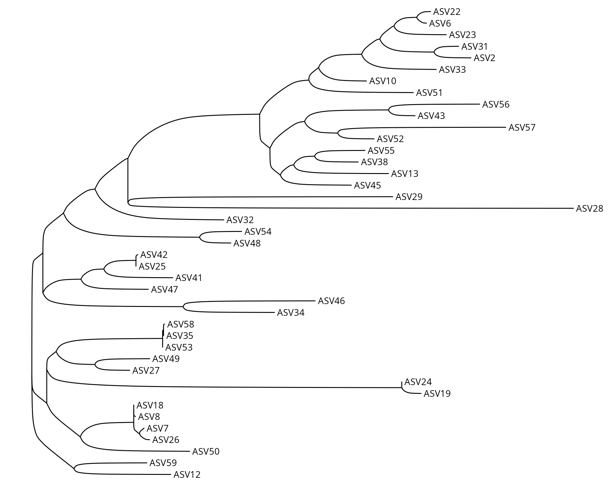
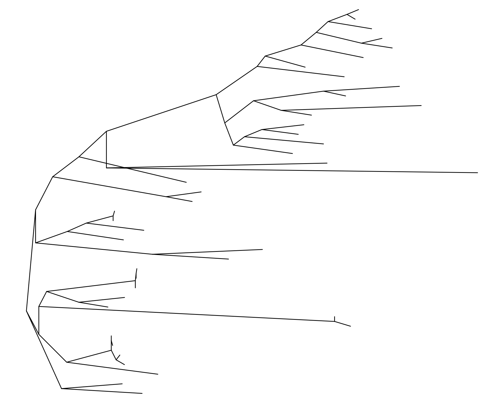
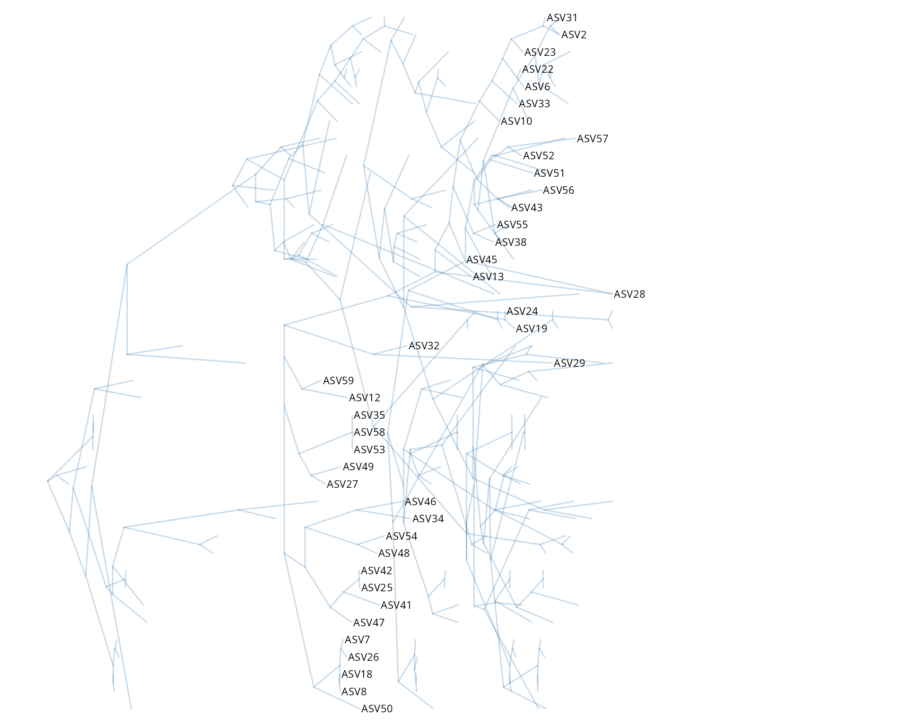
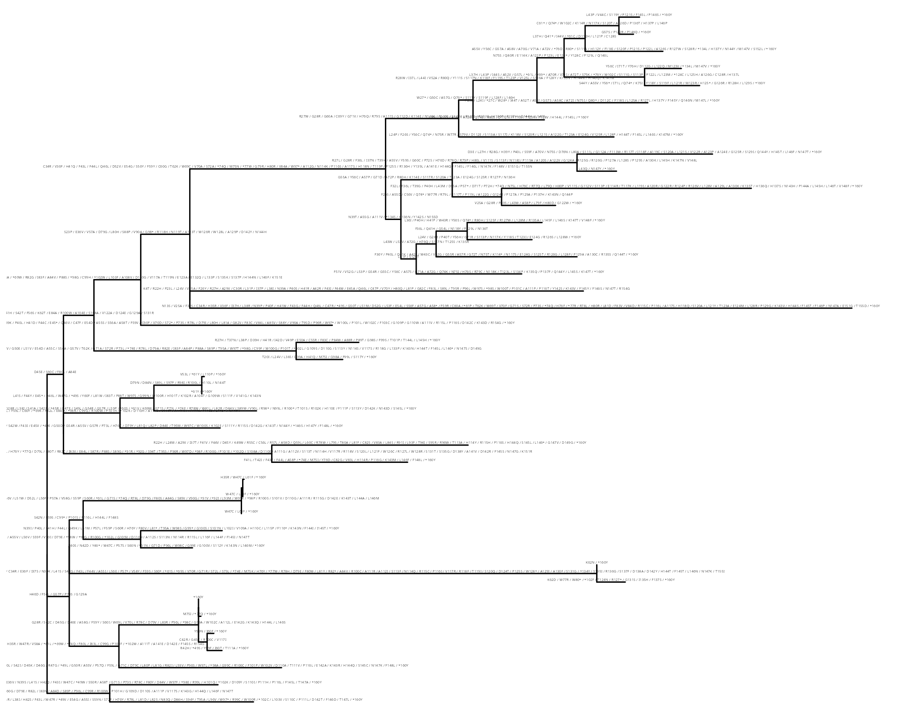
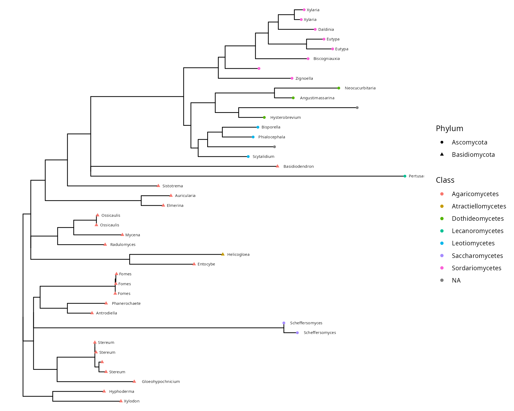
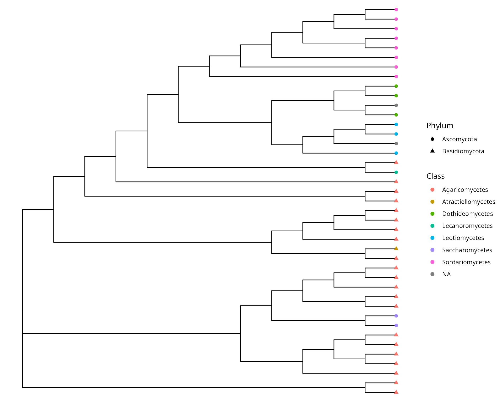

# Tree building and visualization

In introduction, you can read the review of (**zou2024?**), entitled
[“Common Methods for Phylogenetic Tree Construction and Their
Implementation in R](https://doi.org/10.3390/bioengineering11050480)“.

### Build phylogenetic tree using reference sequences

``` r
library("tidytree")
library("MiscMetabar")
library("phangorn")
data(data_fungi)
df <- subset_taxa_pq(data_fungi, taxa_sums(data_fungi) > 9000)
df_tree <- quiet(build_phytree_pq(df, nb_bootstrap = 5))
data_fungi_tree <- merge_phyloseq(df, phyloseq::phy_tree(df_tree$ML$tree))
```

``` r
library("treeio")
library("ggtree")

ggtree(data_fungi_tree@phy_tree, layout = "ellipse") + geom_tiplab()
```



``` r
ggtree(as.treedata(df_tree$ML), layout = "slanted")
```



``` r
ggdensitree(df_tree$ML_bs, alpha = .3, colour = "steelblue") +
  geom_tiplab(size = 3) + hexpand(.35)
```



``` r
ggtree(as.treedata(df_tree$ML)) +
  geom_text(aes(x = branch, label = AA_subs, vjust = -.5), size = 1)
```



``` r
tax_tab <- as.data.frame(data_fungi_tree@tax_table)
tax_tab <- data.frame("OTU" = rownames(tax_tab), tax_tab)
p <- ggtree(as.treedata(data_fungi_tree@phy_tree)) %<+%
  tax_tab
p + geom_tippoint(aes(color = Class, shape = Phylum)) +
  geom_text(aes(label = Genus), hjust = -0.2, size = 2)
```



``` r
ggtree(as.treedata(data_fungi_tree@phy_tree), branch.length = "none") %<+%
  tax_tab +
  geom_tippoint(aes(color = Class, shape = Phylum), size = 2)
```



### Build taxonomic tree

## Session information

``` r
sessionInfo()
#> R version 4.5.2 (2025-10-31)
#> Platform: x86_64-pc-linux-gnu
#> Running under: Pop!_OS 24.04 LTS
#> 
#> Matrix products: default
#> BLAS:   /usr/lib/x86_64-linux-gnu/blas/libblas.so.3.12.0 
#> LAPACK: /usr/lib/x86_64-linux-gnu/lapack/liblapack.so.3.12.0  LAPACK version 3.12.0
#> 
#> locale:
#>  [1] LC_CTYPE=fr_FR.UTF-8       LC_NUMERIC=C              
#>  [3] LC_TIME=fr_FR.UTF-8        LC_COLLATE=fr_FR.UTF-8    
#>  [5] LC_MONETARY=fr_FR.UTF-8    LC_MESSAGES=fr_FR.UTF-8   
#>  [7] LC_PAPER=fr_FR.UTF-8       LC_NAME=C                 
#>  [9] LC_ADDRESS=C               LC_TELEPHONE=C            
#> [11] LC_MEASUREMENT=fr_FR.UTF-8 LC_IDENTIFICATION=C       
#> 
#> time zone: Europe/Paris
#> tzcode source: system (glibc)
#> 
#> attached base packages:
#> [1] stats     graphics  grDevices utils     datasets  methods   base     
#> 
#> other attached packages:
#>  [1] ggtree_4.0.4       treeio_1.34.0      phangorn_2.12.1    ape_5.8-1         
#>  [5] MiscMetabar_0.14.5 purrr_1.2.1        dplyr_1.1.4        dada2_1.38.0      
#>  [9] Rcpp_1.1.1         ggplot2_4.0.1      phyloseq_1.54.0    tidytree_0.4.7    
#> 
#> loaded via a namespace (and not attached):
#>   [1] DBI_1.2.3                   bitops_1.0-9               
#>   [3] deldir_2.0-4                permute_0.9-8              
#>   [5] rlang_1.1.7                 magrittr_2.0.4             
#>   [7] ade4_1.7-23                 otel_0.2.0                 
#>   [9] matrixStats_1.5.0           compiler_4.5.2             
#>  [11] mgcv_1.9-4                  png_0.1-8                  
#>  [13] systemfonts_1.3.1           vctrs_0.6.5                
#>  [15] reshape2_1.4.5              quadprog_1.5-8             
#>  [17] stringr_1.6.0               pwalign_1.6.0              
#>  [19] pkgconfig_2.0.3             crayon_1.5.3               
#>  [21] fastmap_1.2.0               XVector_0.50.0             
#>  [23] labeling_0.4.3              Rsamtools_2.26.0           
#>  [25] rmarkdown_2.30              ragg_1.5.0                 
#>  [27] xfun_0.55                   cachem_1.1.0               
#>  [29] aplot_0.2.9                 cigarillo_1.0.0            
#>  [31] jsonlite_2.0.0              biomformat_1.38.0          
#>  [33] rhdf5filters_1.22.0         DelayedArray_0.36.0        
#>  [35] Rhdf5lib_1.32.0             BiocParallel_1.44.0        
#>  [37] jpeg_0.1-11                 parallel_4.5.2             
#>  [39] cluster_2.1.8.1             R6_2.6.1                   
#>  [41] bslib_0.9.0                 stringi_1.8.7              
#>  [43] RColorBrewer_1.1-3          GenomicRanges_1.62.1       
#>  [45] jquerylib_0.1.4             Seqinfo_1.0.0              
#>  [47] SummarizedExperiment_1.40.0 iterators_1.0.14           
#>  [49] knitr_1.51                  DECIPHER_3.6.0             
#>  [51] IRanges_2.44.0              Matrix_1.7-4               
#>  [53] splines_4.5.2               igraph_2.2.1               
#>  [55] tidyselect_1.2.1            abind_1.4-8                
#>  [57] yaml_2.3.12                 vegan_2.7-2                
#>  [59] codetools_0.2-20            hwriter_1.3.2.1            
#>  [61] lattice_0.22-7              tibble_3.3.1               
#>  [63] plyr_1.8.9                  Biobase_2.70.0             
#>  [65] withr_3.0.2                 ShortRead_1.68.0           
#>  [67] S7_0.2.1                    evaluate_1.0.5             
#>  [69] gridGraphics_0.5-1          desc_1.4.3                 
#>  [71] survival_3.8-3              RcppParallel_5.1.11-1      
#>  [73] Biostrings_2.78.0           pillar_1.11.1              
#>  [75] MatrixGenerics_1.22.0       foreach_1.5.2              
#>  [77] stats4_4.5.2                ggfun_0.2.0                
#>  [79] generics_0.1.4              S4Vectors_0.48.0           
#>  [81] scales_1.4.0                glue_1.8.0                 
#>  [83] gdtools_0.4.4               lazyeval_0.2.2             
#>  [85] tools_4.5.2                 interp_1.1-6               
#>  [87] data.table_1.18.0           GenomicAlignments_1.46.0   
#>  [89] ggiraph_0.9.2               fs_1.6.6                   
#>  [91] fastmatch_1.1-6             rhdf5_2.54.1               
#>  [93] grid_4.5.2                  tidyr_1.3.2                
#>  [95] latticeExtra_0.6-31         patchwork_1.3.2            
#>  [97] nlme_3.1-168                cli_3.6.5                  
#>  [99] rappdirs_0.3.3              textshaping_1.0.4          
#> [101] fontBitstreamVera_0.1.1     S4Arrays_1.10.1            
#> [103] gtable_0.3.6                yulab.utils_0.2.3          
#> [105] fontquiver_0.2.1            sass_0.4.10                
#> [107] digest_0.6.39               BiocGenerics_0.56.0        
#> [109] ggplotify_0.1.3             SparseArray_1.10.8         
#> [111] htmlwidgets_1.6.4           farver_2.1.2               
#> [113] htmltools_0.5.9             pkgdown_2.2.0              
#> [115] multtest_2.66.0             lifecycle_1.0.5            
#> [117] fontLiberation_0.1.0        MASS_7.3-65
```
