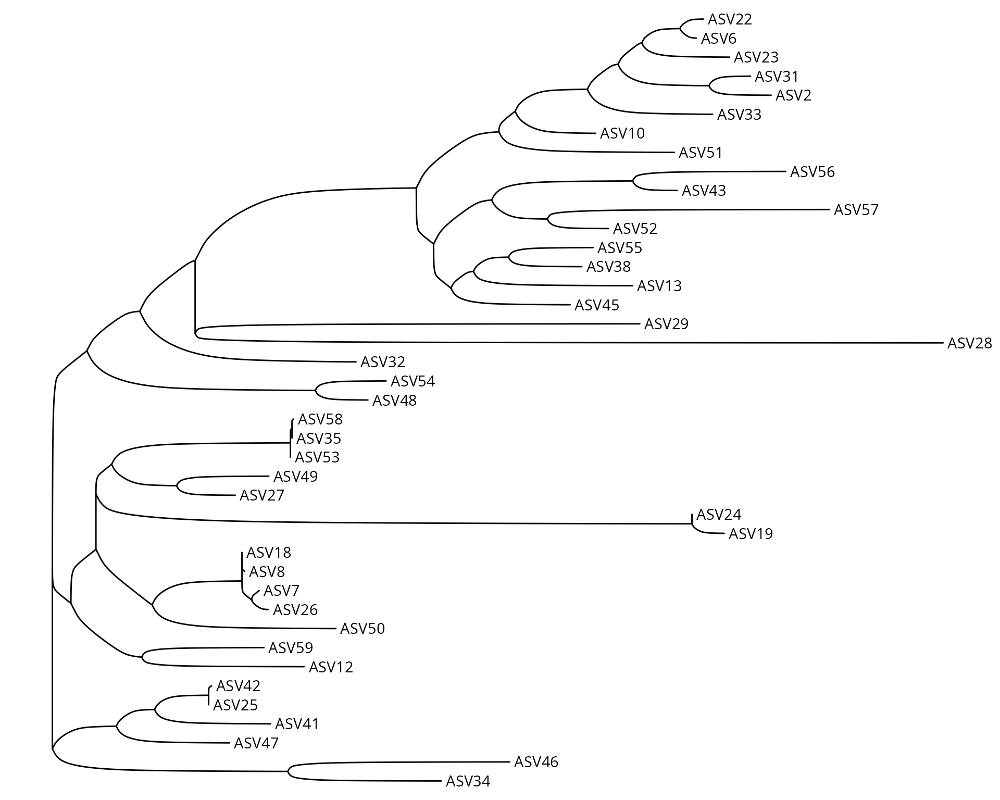
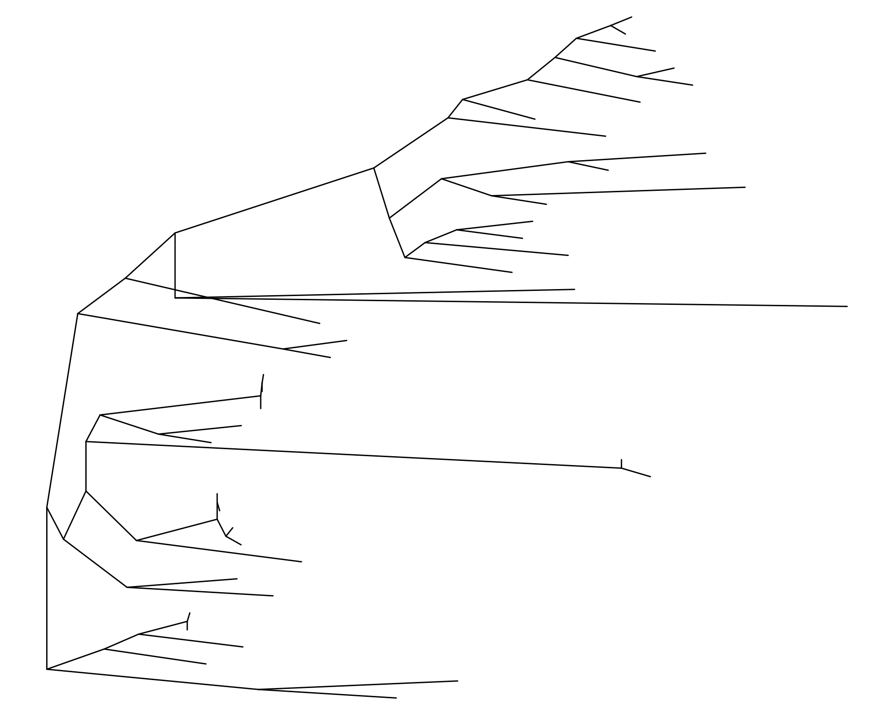
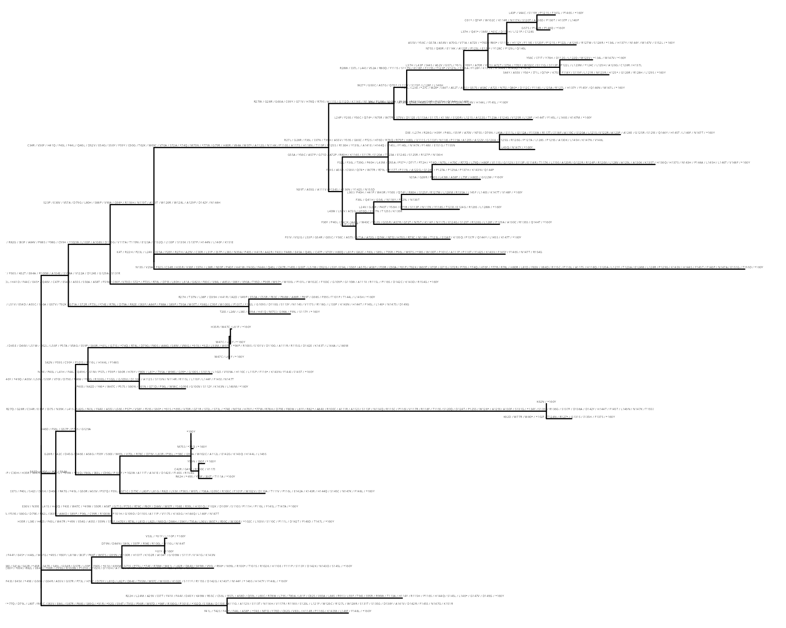
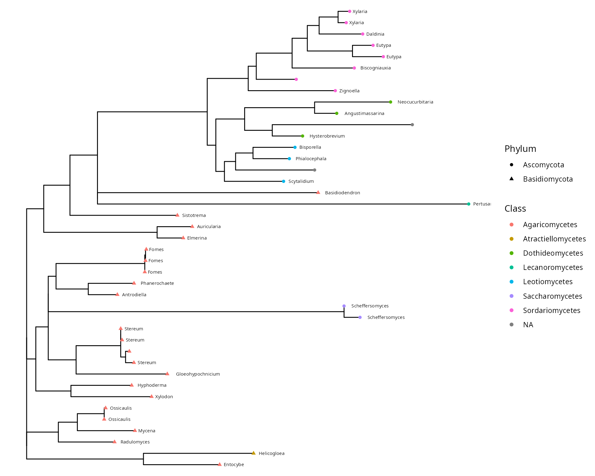
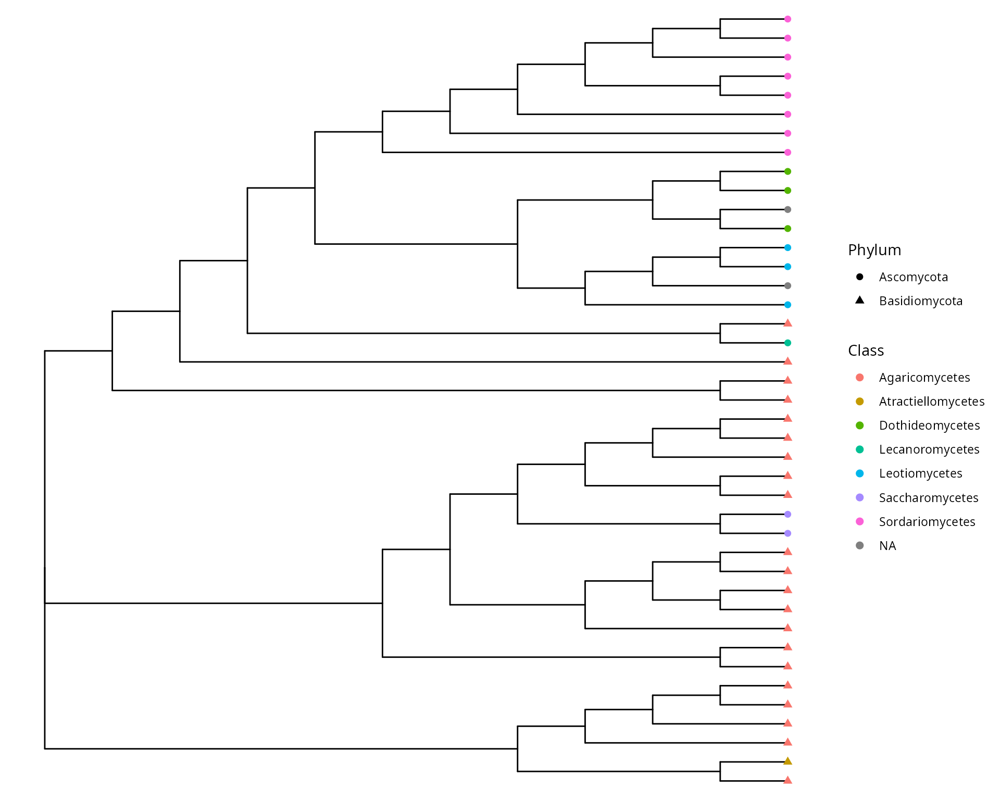

# Tree building and visualization

In introduction, you can read the review of (**zou2024?**), entitled
[“Common Methods for Phylogenetic Tree Construction and Their
Implementation in R](https://doi.org/10.3390/bioengineering11050480)“.

``` r
library("tidytree") # first load to disable warning about phylo class
library("MiscMetabar")
library("phangorn")
data(data_fungi)
df <- subset_taxa_pq(data_fungi, taxa_sums(data_fungi) > 9000)
df_tree <- quiet(build_phytree_pq(df, nb_bootstrap = 5))
data_fungi_tree <- merge_phyloseq(df, phyloseq::phy_tree(df_tree$ML$tree))
```

``` r
library("treeio")
library("ggtree")

ggtree(data_fungi_tree@phy_tree, layout = "ellipse") + geom_tiplab()
```



``` r
ggtree(as.treedata(df_tree$ML), layout = "slanted")
```



``` r
ggdensitree(df_tree$ML_bs, alpha = .3, colour = "steelblue") +
  geom_tiplab(size = 3) + hexpand(.35)
```


``` r
ggtree(as.treedata(df_tree$ML)) +
  geom_text(aes(x = branch, label = AA_subs, vjust = -.5), size = 1)
```



``` r
tax_tab <- as.data.frame(data_fungi_tree@tax_table)
tax_tab <- data.frame("OTU" = rownames(tax_tab), tax_tab)
p <- ggtree(as.treedata(data_fungi_tree@phy_tree)) %<+%
  tax_tab
p + geom_tippoint(aes(color = Class, shape = Phylum)) +
  geom_text(aes(label = Genus), hjust = -0.2, size = 2)
```



``` r
ggtree(as.treedata(data_fungi_tree@phy_tree), branch.length = "none") %<+%
  tax_tab +
  geom_tippoint(aes(color = Class, shape = Phylum), size = 2)
```



## Session information

``` r
sessionInfo()
#> R version 4.5.1 (2025-06-13)
#> Platform: x86_64-pc-linux-gnu
#> Running under: Kali GNU/Linux Rolling
#> 
#> Matrix products: default
#> BLAS:   /usr/lib/x86_64-linux-gnu/openblas-pthread/libblas.so.3 
#> LAPACK: /usr/lib/x86_64-linux-gnu/openblas-pthread/libopenblasp-r0.3.29.so;  LAPACK version 3.12.0
#> 
#> locale:
#>  [1] LC_CTYPE=fr_FR.UTF-8       LC_NUMERIC=C              
#>  [3] LC_TIME=fr_FR.UTF-8        LC_COLLATE=fr_FR.UTF-8    
#>  [5] LC_MONETARY=fr_FR.UTF-8    LC_MESSAGES=fr_FR.UTF-8   
#>  [7] LC_PAPER=fr_FR.UTF-8       LC_NAME=C                 
#>  [9] LC_ADDRESS=C               LC_TELEPHONE=C            
#> [11] LC_MEASUREMENT=fr_FR.UTF-8 LC_IDENTIFICATION=C       
#> 
#> time zone: Europe/Paris
#> tzcode source: system (glibc)
#> 
#> attached base packages:
#> [1] stats     graphics  grDevices utils     datasets  methods   base     
#> 
#> other attached packages:
#>  [1] ggtree_3.16.3      treeio_1.32.0      phangorn_2.12.1    ape_5.8-1         
#>  [5] MiscMetabar_0.14.4 purrr_1.1.0        dplyr_1.1.4        dada2_1.36.0      
#>  [9] Rcpp_1.1.0         ggplot2_4.0.0      phyloseq_1.52.0    tidytree_0.4.6    
#> 
#> loaded via a namespace (and not attached):
#>   [1] DBI_1.2.3                   bitops_1.0-9               
#>   [3] deldir_2.0-4                permute_0.9-8              
#>   [5] rlang_1.1.6                 magrittr_2.0.4             
#>   [7] ade4_1.7-23                 matrixStats_1.5.0          
#>   [9] compiler_4.5.1              mgcv_1.9-3                 
#>  [11] png_0.1-8                   systemfonts_1.2.3          
#>  [13] vctrs_0.6.5                 reshape2_1.4.4             
#>  [15] quadprog_1.5-8              stringr_1.5.2              
#>  [17] pwalign_1.4.0               pkgconfig_2.0.3            
#>  [19] crayon_1.5.3                fastmap_1.2.0              
#>  [21] XVector_0.48.0              labeling_0.4.3             
#>  [23] Rsamtools_2.24.1            rmarkdown_2.29             
#>  [25] UCSC.utils_1.4.0            ragg_1.5.0                 
#>  [27] xfun_0.53                   cachem_1.1.0               
#>  [29] aplot_0.2.9                 GenomeInfoDb_1.44.3        
#>  [31] jsonlite_2.0.0              biomformat_1.36.0          
#>  [33] rhdf5filters_1.20.0         DelayedArray_0.34.1        
#>  [35] Rhdf5lib_1.30.0             BiocParallel_1.42.2        
#>  [37] jpeg_0.1-11                 parallel_4.5.1             
#>  [39] cluster_2.1.8.1             R6_2.6.1                   
#>  [41] bslib_0.9.0                 stringi_1.8.7              
#>  [43] RColorBrewer_1.1-3          GenomicRanges_1.60.0       
#>  [45] jquerylib_0.1.4             SummarizedExperiment_1.38.1
#>  [47] iterators_1.0.14            knitr_1.50                 
#>  [49] DECIPHER_3.4.0              IRanges_2.42.0             
#>  [51] Matrix_1.7-4                splines_4.5.1              
#>  [53] igraph_2.1.4                tidyselect_1.2.1           
#>  [55] abind_1.4-8                 yaml_2.3.10                
#>  [57] vegan_2.7-1                 codetools_0.2-20           
#>  [59] hwriter_1.3.2.1             lattice_0.22-7             
#>  [61] tibble_3.3.0                plyr_1.8.9                 
#>  [63] Biobase_2.68.0              withr_3.0.2                
#>  [65] ShortRead_1.66.0            S7_0.2.0                   
#>  [67] evaluate_1.0.5              gridGraphics_0.5-1         
#>  [69] desc_1.4.3                  survival_3.8-3             
#>  [71] RcppParallel_5.1.11-1       Biostrings_2.76.0          
#>  [73] pillar_1.11.1               MatrixGenerics_1.20.0      
#>  [75] foreach_1.5.2               stats4_4.5.1               
#>  [77] ggfun_0.2.0                 generics_0.1.4             
#>  [79] S4Vectors_0.46.0            scales_1.4.0               
#>  [81] glue_1.8.0                  lazyeval_0.2.2             
#>  [83] tools_4.5.1                 interp_1.1-6               
#>  [85] data.table_1.17.8           GenomicAlignments_1.44.0   
#>  [87] fs_1.6.6                    fastmatch_1.1-6            
#>  [89] rhdf5_2.52.1                grid_4.5.1                 
#>  [91] tidyr_1.3.1                 latticeExtra_0.6-31        
#>  [93] patchwork_1.3.2             nlme_3.1-168               
#>  [95] GenomeInfoDbData_1.2.14     cli_3.6.5                  
#>  [97] rappdirs_0.3.3              textshaping_1.0.3          
#>  [99] S4Arrays_1.8.1              gtable_0.3.6               
#> [101] yulab.utils_0.2.1           sass_0.4.10                
#> [103] digest_0.6.37               BiocGenerics_0.54.0        
#> [105] ggplotify_0.1.3             SparseArray_1.8.1          
#> [107] htmlwidgets_1.6.4           farver_2.1.2               
#> [109] htmltools_0.5.8.1           pkgdown_2.1.3              
#> [111] multtest_2.64.0             lifecycle_1.0.4            
#> [113] httr_1.4.7                  MASS_7.3-65
```
