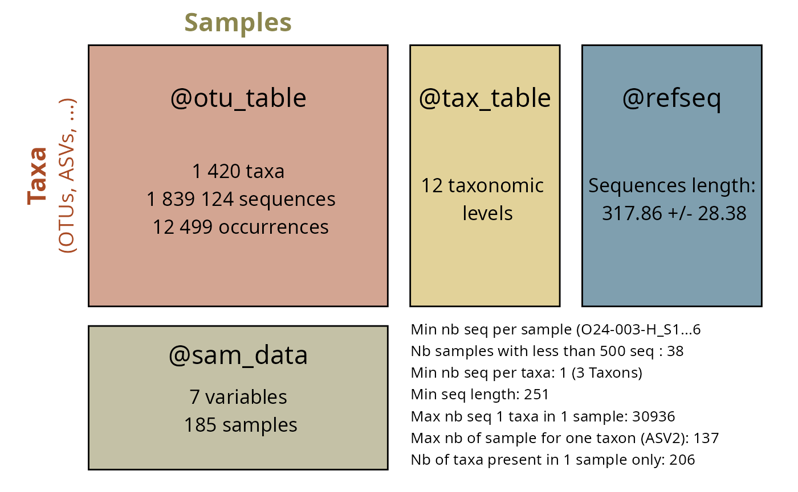

# Introduction

## Introduction to MiscMetabar: an R package to facilitate visualization and reproducibility in metabarcoding analysis

### Raison d’être

- Complete R packages dada2 and phyloseq
- Useful visualizations (`biplot_pq`, `circle_pq`, `upset_pq`,
  `ggvenn_pq`)
- Facilitate the use of targets package

### Quick overview

For an introduction to metabarcoding in R, Please visite the [state of
the
field](https://adrientaudiere.github.io/MiscMetabar/articles/states_of_fields_in_R.html)
vignettes. The [import, export and
track](https://adrientaudiere.github.io/MiscMetabar/articles/import_export_track.html)
vignette explains how import and export `phyloseq` object. Its also show
how to summarize useful information (number of sequences, samples and
clusters) across bioinformatic pipelines.

If you are interested in ecological metrics, see the vignettes
describing
[alpha-diversity](https://adrientaudiere.github.io/MiscMetabar/articles/alpha-div.html)
and
[beta-diversity](https://adrientaudiere.github.io/MiscMetabar/articles/beta-div.html)
analysis. The vignette [filter taxa and
samples](https://adrientaudiere.github.io/MiscMetabar/articles/filter.html)
describes some data-filtering processes using MiscMetabar and the
[reclustering](https://adrientaudiere.github.io/MiscMetabar/articles/Reclustering.html)
tutorial introduces the different way of clustering already-clustered
OTU/ASV. The vignette
[tengeler](https://adrientaudiere.github.io/MiscMetabar/articles/tengeler.html)
explore the dataset from Tengeler et al. (2020) using some MiscMetabar
functions.

For developers, I also wrote a vignette describing som [rules of
codes](https://adrientaudiere.github.io/MiscMetabar/articles/Rules.html).

#### Summarize a physeq object

``` r
library("MiscMetabar")
library("phyloseq")
data("data_fungi")
summary_plot_pq(data_fungi)
```



#### Create an interactive table of the tax_table

``` r
data("GlobalPatterns", package = "phyloseq")
tax_datatable(subset_taxa(
  GlobalPatterns,
  rowSums(GlobalPatterns@otu_table) > 100000
))
```

#### Sankey diagram of the tax_table

``` r
gp <- subset_taxa(GlobalPatterns, GlobalPatterns@tax_table[, 1] == "Archaea")
sankey_pq(gp, taxa = c(1:5))
```

#### Upset plot for visualize distribution of taxa in function of samples variables

``` r
if (packageVersion("ggplot2") < "4.0.0") {
  upset_pq(gp, "SampleType", taxa = "Class")
}
```

## References

Tengeler, A.C., Dam, S.A., Wiesmann, M. et al. Gut microbiota from
persons with attention-deficit/hyperactivity disorder affects the brain
in mice. Microbiome 8, 44 (2020).
<https://doi.org/10.1186/s40168-020-00816-x>

## Session inform

``` r
sessionInfo()
#> R version 4.5.2 (2025-10-31)
#> Platform: x86_64-pc-linux-gnu
#> Running under: Pop!_OS 24.04 LTS
#> 
#> Matrix products: default
#> BLAS:   /usr/lib/x86_64-linux-gnu/blas/libblas.so.3.12.0 
#> LAPACK: /usr/lib/x86_64-linux-gnu/lapack/liblapack.so.3.12.0  LAPACK version 3.12.0
#> 
#> locale:
#>  [1] LC_CTYPE=en_US.UTF-8       LC_NUMERIC=C              
#>  [3] LC_TIME=en_US.UTF-8        LC_COLLATE=en_US.UTF-8    
#>  [5] LC_MONETARY=en_US.UTF-8    LC_MESSAGES=en_US.UTF-8   
#>  [7] LC_PAPER=en_US.UTF-8       LC_NAME=C                 
#>  [9] LC_ADDRESS=C               LC_TELEPHONE=C            
#> [11] LC_MEASUREMENT=en_US.UTF-8 LC_IDENTIFICATION=C       
#> 
#> time zone: Europe/Paris
#> tzcode source: system (glibc)
#> 
#> attached base packages:
#> [1] stats     graphics  grDevices utils     datasets  methods   base     
#> 
#> other attached packages:
#> [1] MiscMetabar_0.16.1.9000 divent_0.5-3            purrr_1.2.2            
#> [4] dplyr_1.2.1             dada2_1.38.0            Rcpp_1.1.1             
#> [7] ggplot2_4.0.2           phyloseq_1.54.2        
#> 
#> loaded via a namespace (and not attached):
#>   [1] Rdpack_2.6.6                bitops_1.0-9               
#>   [3] deldir_2.0-4                permute_0.9-10             
#>   [5] rlang_1.2.0                 magrittr_2.0.5             
#>   [7] ade4_1.7-24                 otel_0.2.0                 
#>   [9] matrixStats_1.5.0           compiler_4.5.2             
#>  [11] mgcv_1.9-4                  png_0.1-9                  
#>  [13] systemfonts_1.3.2           vctrs_0.7.3                
#>  [15] reshape2_1.4.5              stringr_1.6.0              
#>  [17] pwalign_1.6.0               pkgconfig_2.0.3            
#>  [19] crayon_1.5.3                fastmap_1.2.0              
#>  [21] XVector_0.50.0              labeling_0.4.3             
#>  [23] Rsamtools_2.26.0            rmarkdown_2.31             
#>  [25] ragg_1.5.2                  xfun_0.57                  
#>  [27] cachem_1.1.0                cigarillo_1.0.0            
#>  [29] jsonlite_2.0.0              biomformat_1.38.3          
#>  [31] rhdf5filters_1.22.0         DelayedArray_0.36.1        
#>  [33] Rhdf5lib_1.32.0             BiocParallel_1.44.0        
#>  [35] jpeg_0.1-11                 data.tree_1.2.0            
#>  [37] parallel_4.5.2              cluster_2.1.8.2            
#>  [39] R6_2.6.1                    bslib_0.10.0               
#>  [41] stringi_1.8.7               RColorBrewer_1.1-3         
#>  [43] GenomicRanges_1.62.1        jquerylib_0.1.4            
#>  [45] Seqinfo_1.0.0               SummarizedExperiment_1.40.0
#>  [47] iterators_1.0.14            knitr_1.51                 
#>  [49] IRanges_2.44.0              Matrix_1.7-4               
#>  [51] splines_4.5.2               igraph_2.2.3               
#>  [53] tidyselect_1.2.1            abind_1.4-8                
#>  [55] yaml_2.3.12                 vegan_2.7-3                
#>  [57] codetools_0.2-20            hwriter_1.3.2.1            
#>  [59] lattice_0.22-9              tibble_3.3.1               
#>  [61] plyr_1.8.9                  Biobase_2.70.0             
#>  [63] withr_3.0.2                 ShortRead_1.68.0           
#>  [65] S7_0.2.1                    evaluate_1.0.5             
#>  [67] desc_1.4.3                  survival_3.8-6             
#>  [69] RcppParallel_5.1.11-2       Biostrings_2.78.0          
#>  [71] pillar_1.11.1               MatrixGenerics_1.22.0      
#>  [73] DT_0.34.0                   foreach_1.5.2              
#>  [75] stats4_4.5.2                generics_0.1.4             
#>  [77] S4Vectors_0.48.1            scales_1.4.0               
#>  [79] glue_1.8.0                  tools_4.5.2                
#>  [81] interp_1.1-6                data.table_1.18.2.1        
#>  [83] GenomicAlignments_1.46.0    fs_2.0.1                   
#>  [85] rhdf5_2.54.1                grid_4.5.2                 
#>  [87] ape_5.8-1                   crosstalk_1.2.2            
#>  [89] rbibutils_2.4.1             latticeExtra_0.6-31        
#>  [91] networkD3_0.4.1             nlme_3.1-168               
#>  [93] cli_3.6.6                   textshaping_1.0.5          
#>  [95] S4Arrays_1.10.1             gtable_0.3.6               
#>  [97] sass_0.4.10                 digest_0.6.39              
#>  [99] BiocGenerics_0.56.0         SparseArray_1.10.10        
#> [101] htmlwidgets_1.6.4           farver_2.1.2               
#> [103] htmltools_0.5.9             pkgdown_2.2.0              
#> [105] multtest_2.66.0             lifecycle_1.0.5            
#> [107] MASS_7.3-65
```
