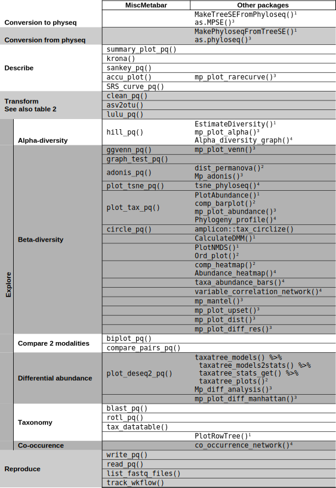

TODO

# Summary

# Statement of need

Biological studies, especially in Ecology, Health sciences and Taxonomy needs to describe the biological composition of samples. During the last twenty years, (i) development of DNA sequencing, (ii) references database, (iii) High-Throughput sequencing (HTS) and (iv) bioinformatic ressources allow to describe the communities of living being through metabarcoding. Metabarcoding involves the sequencing of millions (*meta*-) of short zone of specific DNA (*-barcoding*, [@valentini2009]) often from environmental samples (eDNA, [@taberlet2012]) such as human stomach content, lake water, soil and air.

The analysis of metabarcoding studies is difficult due to the complexity of the datasets (millions of sequences with variable quality, including chimera and sequencing error) often couple to tricky sample scheme and a large diversity of questions. Several plateforms (see table 1 in [@tedersoo2022] for a list) such as QIIME2 ([@bolyen2019]), mothur ([@schloss2020]) and Galaxy ([@jalili2020]) allow complete analysis from raw fastq sequences to statistical analysis and visualisation. However, the R ecosystem ([@XXX]), especially through the bioconductor project ([@XXX]) is very riche (See section "States of the field in R") and more flexible than this plateforms.

MiscMetabar aims at facilitate the *description*, the *transformation*, the *exploration* and the *Reproducibility* of metabarcoding analysis using R.s

# States of the field in R

Lire et utiliser https://pubmed.ncbi.nlm.nih.gov/37128855/ [@wen2023]

The Metabarcoding ecosystem in R language is mature, well constructed and rely on a very active communities in both [bioconductor](https://www.bioconductor.org/) and [cran](https://cran.r-project.org/) projects. [bioconductor](https://www.bioconductor.org/) even create specific task views in [Metagenomics](http://bioconductor.org/packages/release/BiocViews.html#___Metagenomics) and [Microbiome](http://bioconductor.org/packages/release/BiocViews.html#___Microbiome).

`dada2` [@Callahan:2016] (http://bioconductor.org/packages/release/bioc/html/dada2.html) provides a clustering method highly cited and recommended [@Pauvert:]. `dada2` also supply tools to complete pipeline of metabarcoding analysis including chimera detection and taxonomic assignation. `phyloseq` [@McMurdie:2013] (http://bioconductor.org/packages/release/bioc/html/phyloseq.html) facilitate metagenomics analysis by providing a way to stock data (the `phyloseq` class) and both graphical and statistical functions.

The phyloseq package introduce the S4-class object (class physeq). S4-class object that contains (i) a OTU-samples matrix, (ii) a taxonomic table, (iii) a sample metadata table as well as a two optionnal slot for (iv) phylogenetic tree and (v) reference sequences.

Some packages already extend the phyloseq packages. For instance the [`microbiome`](https://microbiome.github.io/) packages collection [@Lahti2017] propose some scripts and functions to manipulate microbiome data sets. The `speedyseq` package [@mclaren2020] provides faster versions of phyloseq's plotting and taxonomic merging functions, some of which are used in MiscMetabar. The package [phylosmith](https://schuyler-smith.github.io/phylosmith/) [Smith2019](https://joss.theoj.org/papers/10.21105/joss.01442) already offers some functions to extend and facilitate the use of the phyloseq packages.

Others packages ([`mia`](https://github.com/microbiome/mia/) form the [`microbiome`](https://microbiome.github.io/) packages collection and [`MicrobiotaProcess`](https://github.com/YuLab-SMU/MicrobiotaProcess) [@xu2023]) extend a recent data structure using the comprehensive Bioconductor ecosystem of the `SummarizedExperiment` family.

MiscMetabar enrich this R ecosystem by proposing functions to (i) **describe** your dataset visually, (ii) **transform** your data, (iii) **explore** the biological diversity (alpha, beta and taxonomic diversity) and (iv) simplify **reproductibility**. MiscMetabar is designed to complete and not compete others R packages previuosly cited. For ex. `mia` package is recommended for studies focusing on phylogenetic tree and `phylosmith` allow to visualize easily co-occurrence networks. Using `MicrobiotaProcess::as.MPSE` function, most of utilities in `MicrobiotaProcess` package are available in conjonction with functions form `MiscMetabar`.

We do not try to reinvent the wheel and prefer to rely on existing packages and class rather than build a new framework. MiscMetabar is based on physeq-class from phyloseq, the most-cited package in metagenomics ([@wen2023]). For a description and comparison of these integrated packages in competition with phyloseq (e.g. [microeco](https://github.com/ChiLiubio/microeco); [@liu2020], [EasyAmplicon](https://github.com/YongxinLiu/EasyAmplicon) ([@liu2023]) and [MicrobiomeAnalystR](https://www.microbiomeanalyst.ca) [@lu2023]) see [@wen2023]. Note that some limitations from phyloseq packages are circumvented thanks to [phylosmith](https://schuyler-smith.github.io/phylosmith/) [Smith2019](https://joss.theoj.org/papers/10.21105/joss.01442), [`microViz`](https://david-barnett.github.io/microViz/) ([@Barnett2021]) and [MiscMetabar](https://adrientaudiere.github.io/MiscMetabar/).

Some packages propose a shiny interface (such as [animalcules](https://github.com/compbiomed/animalcules) ([@zhao2021]) and [`microViz`](https://david-barnett.github.io/microViz/) ([@Barnett2021])) or web-based plateform ([MicrobiomeAnalystR](https://www.microbiomeanalyst.ca) [@lu2023]) useful for fast exploration and for code-beginner biologists.

# Features

## Description

Rapid graphical description of phyloseq object is available using the function `summary_plot_pq()`. This representation allows the beginner to understand the structure of a phyloseq object and contains useful informations for all users of phyloseq object.

## Transformation
### ASV (or ESV) to OTU

**ASV** (stand for *Amplicon Sequence Variant*; also called **ESV** for *Exact Amplicon Variant*) is a DNA sequences recovered from a high-throughput analysis of marker genes. **OTU** are a group of closely related individuals generated by clustering sequences based on a threshold of similarity. An ASV is a special case of OTU with a similarity threshold of 100%.

The choice between ASV and OTU is important because they lead to different results ([@joos2020], box 2 in [@tedersoo2022]). Most articles advice to make a choice depending on the question. For example, ASV may outperform OTU in describing a group of very closely related species. Moreover, ASV are comparable across different datasets (obtained using identical marker genes). On the other hand, [@tedersoo2022] report that ASV approaches overestimate richness of common fungal species (due to haplotype variation) but underestimate richness of rare species. They consequently recommend the use of OTU in fungal community metabarcoding analysis. Finally, [@kauserud2023] args that ASV term falls within the original OTU term and recommend to use only the OTU terms but with a concise and clear report how the OTUs were generated.

Recent articles ([@forster2019],[@antich2021]) proposed to used both jointly. They recommend (i) to use ASV to denoise the dataset and (ii) for some questions, clustering the ASV sequences into OTUs. This is the aim of the function `asv2otu()` using either `DECIPHER::Clusterize` function from R or the [vsearch](https://github.com/torognes/vsearch) software. 

## Exploration 

## Reproducibility

# Finding fungus in a needle stack showcase ??

# Already cited package

MiscMetabar is already used by scientific communities in different teams ([@Pleic2022], [@Vieira2021], [@McCauley2022], [@McCauley2023]).

# Acknowledgements
