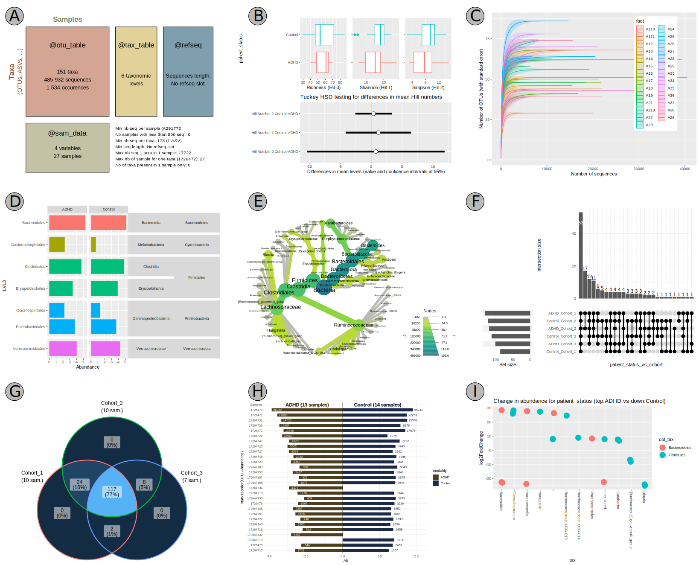

# Summary
Describing communities of living organisms increasingly relies on massive DNA sequencing from environmental samples (e-DNA). The analysis of these large amounts of sequences is well established in the R ecosystem, especially for metabarcoding, i.e. the massive sequencing of one or several given DNA regions, called markers. The `MiscMetabar` package aims to facilitate the *description*, *transformation*, *exploration*, and *reproducibility* of metabarcoding analysis. Several tutorials are available [online](https://adrientaudiere.github.io/MiscMetabar/articles/).

# Statement of Need

Biological studies, especially in ecology, health sciences and taxonomy, need to describe the biological composition of samples. During the last twenty years, the development of (i) high-throughput DNA sequencing, (ii) reference databases and (iii) bioinformatics resources have allowed the description of biological communities through metabarcoding. Metabarcoding involves the sequencing of millions (*meta*-) of short regions of specific DNA (*-barcoding*, @valentini2009) often from environmental samples (eDNA, @taberlet2012) such as human stomach contents, lake water, soil and air.

Several platforms (referenced in @tedersoo2022) such as QIIME2 [@bolyen2019], mothur [@schloss2020], and Galaxy [@jalili2020] allow complete analysis from raw fastq sequences to statistical analysis and visualization. However, the R ecosystem [@rcran], is very rich (fig. 1) and more flexible than these platforms.

`MiscMetabar` aims to facilitate the **description**, **transformation**, **exploration** and **reproducibility** of metabarcoding analysis using R. The development of `MiscMetabar` relies heavily on the R packages `dada2`, `phyloseq` and `targets`.

# State of the Field in R

The metabarcoding ecosystem in the R language is mature, well-constructed, and relies on a very active community in both the [bioconductor](https://www.bioconductor.org/) and [cran](https://cran.r-project.org/) projects. The [bioconductor](https://www.bioconductor.org/) even creates specific task views in [Metagenomics](http://bioconductor.org/packages/release/BiocViews.html#___Metagenomics) and [Microbiome](http://bioconductor.org/packages/release/BiocViews.html#___Microbiome).

R package [`dada2`](http://bioconductor.org/packages/release/bioc/html/dada2.html) [@callahan2016]  provides a highly cited and recommended clustering method [@pauvert2019]. [`phyloseq`](http://bioconductor.org/packages/release/bioc/html/phyloseq.html) [@mcmurdie2013] facilitate metagenomics analysis by providing a way to store data (the `phyloseq` class) and provides graphical and statistical functions. `MiscMetabar` is based on the `phyloseq` class from `phyloseq`, the most cited package in metagenomics [@wen2023]. For a description and comparison of other integrated packages competing with phyloseq, see @wen2023. Some packages already extend the phyloseq packages, in particular [`microbiome`](https://microbiome.github.io/) package collection [@ernst2023], the `speedyseq` package [@mclaren2020] and the package [phylosmith](https://schuyler-smith.github.io/phylosmith/) [@smith2019].

![Important functions of MiscMetabar with their equivalent when available in other R packages: 1. Mia [@ernst2023]; 2. microViz [@Barnett2021]; 3. MicrobiotaProcess [@xu2023]; 4  Phylosmith [@smith2019].](figures_svg/table1_publication.svg){width="100%"}

`MiscMetabar` enriches this R ecosystem by providing functions to (i) **describe** your dataset visually, (ii) **transform** your data, (iii) **explore** biological diversity (alpha, beta, and taxonomic diversity), and (iv) simplify **reproducibility**. `MiscMetabar` is already used by the scientific community in several teams [@Vieira2021; @Pleic2022; @McCauley2022; @McCauley2023; @bouilloud2023; @vieira2023].

# Features

## Description

A quick graphical representation of the phyloseq object is available using the `summary_plot_pq()` function (fig. 2A). 
This plot provides an information-rich structural overview of the phyloseq object. The functions `krona()` and `tax_datatable()` describe the taxonomy of organisms using krona interactive pie chart [@ondov2011] and [datatable](https://datatables.net/) libraries, respectively.

## Transformation

### Post-clustering

Several pipelines use at least two step of clustering. The function `asv2otu()`, using either the `DECIPHER::Clusterize()` function from R or the [vsearch](https://github.com/torognes/vsearch) software allow to recluster existing groups such as **ASV** (stands for *Amplicon Sequence Variant*) obtained by the `dada2::dada()` function (see the vignette [reclustering](https://adrientaudiere.github.io/MiscMetabar/articles/Reclustering.html)).  Another transformation method is implemented in `lulu_pq()`, which uses @froslev2017's method for post-clustering curation of DNA amplicon data. Note that a fast and robust C++ re-implementation of lulu called [mumu](https://github.com/frederic-mahe/mumu) [@mahe2023] is also available through the function `mumu_pq()`.

### Cleaning and filtering

The function `clean_pq()` validates a phyloseq object, mainly by removing empty taxa and samples, and checking for discrepancies between taxa and sample names in different slots.  

The filter functions `subset_samples_pq()` and `subset_taxa_pq()` complement `subset_samples()` and `subset_taxa()` from the [`phyloseq`](http://bioconductor.org/packages/release/bioc/html/phyloseq.html) package, allowing the use of a boolean vector to filter samples or taxa from a phyloseq object. 

I also implement a function to filter taxa based on their blast to a custom database (`filter_asv_blast()`). This function uses the blastn software [@altschul1990] to compare ASV sequences to a database and filter out species that are below a given threshold of e-value and/or bit-score.

## Exploration 

`MiscMetabar` provides a large number of facilities to explore the biological diversity in a phyloseq object. In most functions, a parameter enables the effect of the number of reads (sampling depth) to be controlled by rarefaction or other statistical methods, depending on the function. For example, the alpha diversity analysis (function `hill_pq()`) uses the HSD-Tuckey test on a linear model that includes the square roots of the number of reads as the first explanatory variable.

To illustrate the effect of sample variables on the taxonomy, `MiscMetabar` provides the functions `treemap_pq()`, `multitax_bar_pq()` (fig. 2D) and `heat_tree_pq()` (fig. 2E). The effect of an environmental variable (beta-diversity) on a biological organism can be explored by upset plot (`pset_pq()`; fig. 2F), venn diagram (`ggvenn_pq()`; fig. 2G), and circle plot (`circle_pq()`). This effect can be tested with PERMANOVA (`adonis_pq()`) and the network test (`graph_test_pq()`). If only two modalities are compared, `biplot_pq()` is very useful (fig. 2H). Differential abundance analysis can be performed directly using the `plot_deseq2_pq()` function (fig. 2I). 

## Reproducibility

The targets R package [@landau2021] improves the efficiency and reproducibility of the pipeline in R. It orchestrates the stage of the pipeline and stores the objects to skip tasks that are already up to date. Given the complexity, runtime, and parameter sensitivity of bioinformatic analysis, the use of targets is particularly relevant for metabarcoding. I developed functions to list fastq files in a directory (`list_fastq_files()`) and to track the number of sequences, clusters and samples through the pipeline (`track_wkflow()`) for a variety of objects. Function `write_pq()` save an object of class phyloseq and `read_pq()` read a phyloseq object from files. 

# Acknowledgements

I thank Will Landau, Paul McMurdie, and Benjamin Callahan for their excellent R packages on which `MiscMetabar` rests. I also want to acknowledge Franck Richard, Lise Roy, Élisa Taschen and the [Mycea](https://mycea.fr/) team for the discussion and work around metabarcoding.

# References